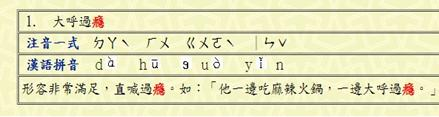

# GN3310600E 某個字詞若不知其發音，就算依據前後文脈絡來判讀而仍會造成混淆時，即列舉詞彙、提供發音或發音資訊

- **稽核評量碼**：GN3310600E
- **對應成功準則**：3.1.6
- **對應認證等級**：AAA
- **對應國際技術碼**：G62
- **類別**：General
- **訊息**：某個字詞若不知其發音，就算依據前後文脈絡來判讀而仍會造成混淆時，即列舉詞彙、提供發音或發音資訊。
- **英文訊息**：G62: Providing a glossary / G120: Providing the pronunciation immediately following the word / G121: Linking to pronunciations / G163: Using standard diacritical marks that can be turned off / H62: Using the ruby element

## 規則說明
所有網頁容易造成混淆的字詞，有提供發音及資訊都必須遵守此指引。

## 檢測說明
測量頁面文字的可讀性。 若網頁有列舉不知發音詞彙，進一步檢查是否有提供發音或發音資訊。 例：網頁文字中有"癮"為難字詞，則須在網頁部分註明發音資訊。

## 說明
無

## 範例

**圖片說明：** 詞彙說明表格截圖，以表格形式呈現「大呼過癮」詞彙的發音資訊：第1列為「1. 大呼過癮」（其中「癮」字以紅框標示為難字詞）；第2列「注音一式」欄位列出注音符號：ㄉㄚˋ ㄏㄨ ㄍㄨㄛˋ ㄧㄣˇ；第3列「漢語拼音」欄位列出拼音：dà hū guò yǐn；下方並附有例句「形容非常滿足，直喊過癮。如：『他一邊吃麻辣火鍋，一邊大呼過癮。』」（其中「癮」字以紅框標示）。示範針對可能造成讀音混淆的難字詞，提供注音符號與漢語拼音等發音資訊，協助使用者正確讀出該字詞。
