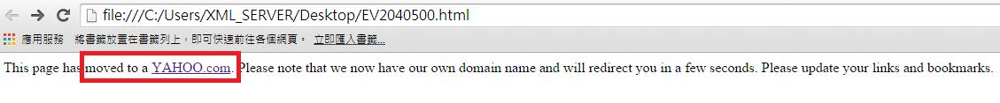
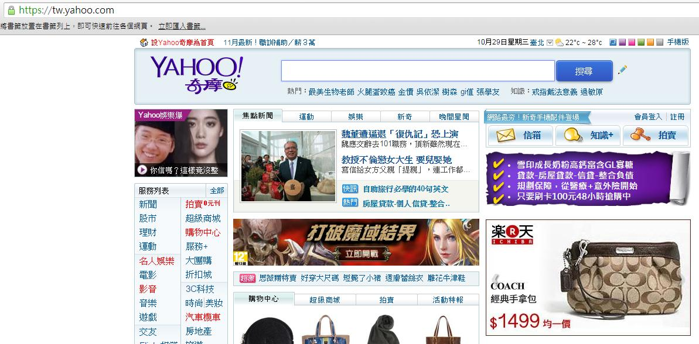
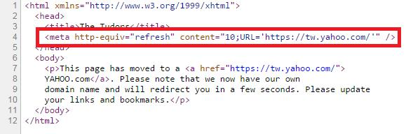

# GN3320500E 除非使用即刻使用者端重新導向，否則不要自動更新內容，而是提供可以請求內容更新的機制

- **稽核評量碼**：GN3320500E
- **對應成功準則**：3.2.5
- **對應認證等級**：AAA
- **對應國際技術碼**：G76
- **類別**：General
- **訊息**：除非使用即刻用戶端重新導向，否則不要自動更新內容，而是提供可以請求內容更新的機制。
- **英文訊息**：G76: Providing a mechanism to request an update of the content instead of updating automatically / G110: Using an instant client-side redirect / H76: Using meta refresh to create an instant client-side redirect / SCR19: Using an onchange event on a select element without causing a change of context

## 規則說明
網頁內容可以自動導向另一頁面。

## 檢測說明
網頁準備自動重新導向另一頁面。 自動導向雅虎首頁。 點選右鍵檢視網頁原始碼，10秒後自動轉入雅虎首頁。

## 說明
無

## 範例

**圖片說明：** 瀏覽器開啟「EV2040500.html」範例頁面，頁面顯示一行通知文字，以紅框標示「moved to a YAHOO.com」鏈結：「This page has moved to a YAHOO.com. Please note that we now have our own domain name and will redirect you in a few seconds. Please update your links and bookmarks.」示範頁面在自動重新導向前，先提供說明文字告知使用者頁面已移至新網址，並提供可手動點擊的鏈結，讓使用者了解即將發生的重新導向。

**圖片說明：** 幾秒後瀏覽器自動跳轉至 YAHOO! 奇摩首頁（https://tw.yahoo.com）截圖，顯示 Yahoo 奇摩搜尋列、焦點新聞、服務列表（新聞、股市、理財、運動、名人娛樂、電影、影音、音樂、遊戲、交友等）、購物中心廣告及楽天市場廣告等完整首頁內容。示範使用 meta refresh 重新導向後，使用者的頁面成功切換至目標網址。

**圖片說明：** 「EV2040500.html」的 HTML 原始碼，第4行以紅框標示 meta refresh 標籤：`<meta http-equiv="refresh" content="10;URL='https://tw.yahoo.com/'" />`，設定10秒後自動導向至 YAHOO 奇摩首頁。第7至10行的 `
` 元素提供說明文字及手動點擊的鏈結（href="https://tw.yahoo.com/"）。示範使用 `content="10"` 設定延遲秒數讓使用者有時間閱讀說明，並同時提供手動鏈結作為備用機制。
