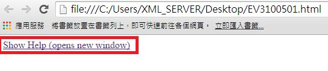
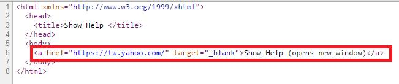

# GN3320501E 在使用者請求的情況下才開出新視窗，並在鏈結文字中指出此行為

- **稽核評量碼**：GN3320501E
- **對應成功準則**：3.2.5
- **對應認證等級**：AAA
- **對應國際技術碼**：H83
- **類別**：General
- **訊息**：在使用者請求的情況下才開出新視窗，並在鏈結文字中指出此行為。
- **英文訊息**：G201: Giving users advanced warning when opening a new window / H83: Using the target attribute to open a new window on user request and indicating this in link text

## 規則說明
網頁內容需要使用者要求才可開啟新視窗。

## 檢測說明
鏈結文字可以開出新視窗。 開啟新視窗。 使用Google Chrome「檢視原始碼」顯示連結(按下右鍵→檢視原始碼)，檢查是否有開啟新視窗的原始碼。

## 說明
無

## 範例

**圖片說明：** 瀏覽器開啟「EV3100501.html」範例頁面，以紅框標示「Show Help (opens new window)」藍色鏈結文字。鏈結文字本身已明確包含「(opens new window)」說明，告知使用者點擊後將在新視窗中開啟說明頁面，示範在鏈結文字中直接指出開新視窗的行為。

**圖片說明：** 使用者點擊「Show Help (opens new window)」鏈結後，瀏覽器在新視窗（分頁）開啟 YAHOO! 奇摩首頁（https://tw.yahoo.com）的截圖，顯示 Yahoo 奇摩搜尋列、焦點新聞等完整首頁內容。示範點擊附有開新視窗提示的鏈結後，目標頁面在新視窗中開啟，讓使用者預期操作結果。

**圖片說明：** 「EV3100501.html」的 HTML 原始碼，第6行以紅框標示完整鏈結程式碼：`<a href="https://tw.yahoo.com/" target="_blank">Show Help (opens new window)</a>`。`target="_blank"` 屬性設定在新視窗（或新分頁）中開啟鏈結，鏈結文字「Show Help (opens new window)」已明確說明將開啟新視窗。示範同時使用 `target="_blank"` 與在鏈結文字中標示「opens new window」的正確實作，在使用者請求情況下才開出新視窗並預先告知。
