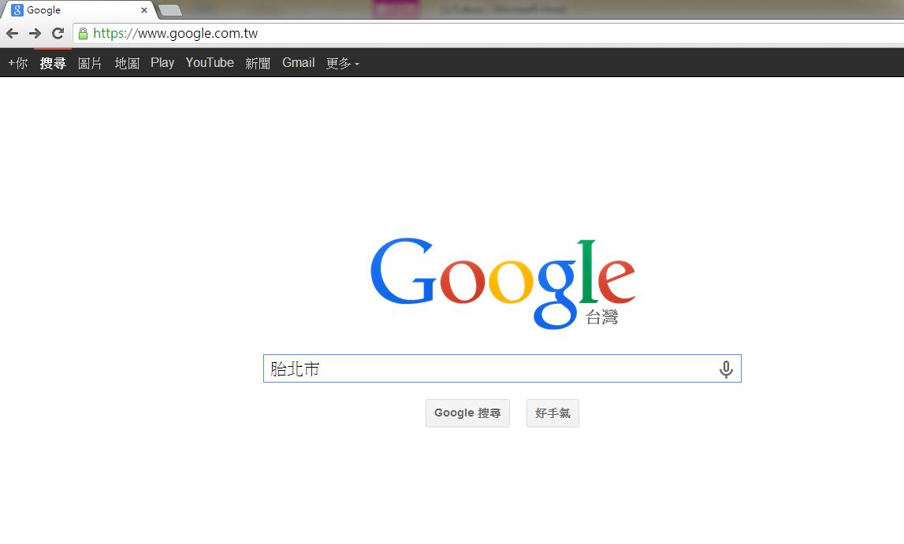
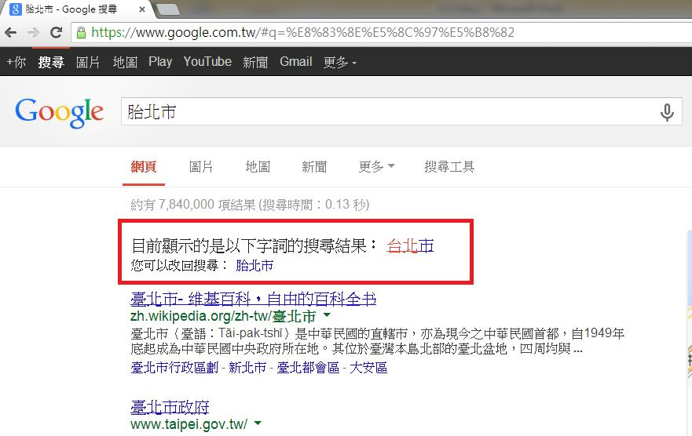

# GN3330501E 在文字輸入區域提供拼寫檢查與建議

- **稽核評量碼**：GN3330501E
- **對應成功準則**：3.3.5
- **對應認證等級**：AAA
- **對應國際技術碼**：G194
- **類別**：General
- **訊息**：在文字輸入區域提供拼寫檢查與建議
- **英文訊息**：G194: Providing spell checking and suggestions for text input

## 規則說明
任何運用文字輸入區域提供拼寫檢查與建議的網頁，都必須要遵守此指引。

## 檢測說明
用chrome瀏覽器打開https://www.google.com的網頁，假如以"台北市"為例子，故意輸入錯誤的字"胎北市"。 搜尋結果會更正你的輸入，問你是否要輸入的是"台北市"。

## 說明
無

## 範例

**圖片說明：** Google 台灣搜尋首頁（https://www.google.com.tw）截圖，搜尋框中輸入故意拼寫錯誤的字詞「胎北市」（正確應為「台北市」），頁面下方顯示「Google 搜尋」與「好手氣」兩個按鈕。示範在文字輸入區域故意輸入拼寫錯誤的詞彙，以測試搜尋引擎的拼寫檢查與建議功能。

**圖片說明：** Google 台灣搜尋結果頁面截圖，搜尋框顯示輸入的錯誤字詞「胎北市」，搜尋結果頂部以紅框標示拼寫建議訊息：「目前顯示的是以下字詞的搜尋結果：台北市」，並提示「您可以回搜尋：胎北市」，連結文字「台北市」以紅色字體顯示。下方搜尋結果顯示「臺北市 - 維基百科，自由的百科全書」與「臺北市政府」等相關頁面。示範搜尋引擎在使用者輸入錯誤拼寫後，自動提供拼寫建議並顯示正確字詞的搜尋結果，協助使用者修正輸入錯誤。
