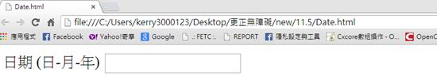
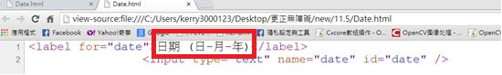

# GN3330502E 利用標題屬性來提供針對脈絡而作的協助說明

- **稽核評量碼**：GN3330502E
- **對應成功準則**：3.3.5
- **對應認證等級**：AAA
- **對應國際技術碼**：G89
- **類別**：General
- **訊息**：利用標題屬性來提供針對脈絡而作的協助說明
- **英文訊息**：G89: Providing expected data format and example

## 規則說明
任何蒐集使用者資訊的頁面，且此頁面可以限制使用者輸入格式的網頁，都必須要遵守此指引。

## 檢測說明
用chrome開啟檔案，此頁面設定要以輸入日期-月份-年，當作例子。 檢視原始碼，下面的HTML表單顯示了在標籤上的日期必須是在日-月-年的格式，而不是月-日-年，在美國的許多用戶都須使用此指引。

## 說明
無

## 範例

**圖片說明：** 瀏覽器開啟本機檔案「Date.html」的截圖，頁面標題為「Date.html」，位址列顯示「file:///C:/Users/kerry3000123/Desktop/更正無障礙/new/11.5/Date.html」。頁面內容顯示表單欄位標籤「日期（日-月-年）」，旁邊有一個文字輸入框，要求使用者以「日-月-年」的格式輸入日期。示範在表單標籤上直接標示所需的輸入格式，提供脈絡性的協助說明，讓使用者了解正確的日期輸入順序。

**圖片說明：** 瀏覽器以「檢視原始碼」模式開啟「Date.html」的截圖，位址列顯示原始碼路徑。畫面以紅框標示 HTML 程式碼，第1行顯示 `<label for="date">日期（日-月-年）</label>`，第2行顯示 `<input type="text" name="date" id="date" />`。示範使用 `<label>` 標籤的文字內容直接說明所需的輸入格式（日-月-年），以標題屬性提供脈絡性協助說明，指引使用者輸入符合要求的日期格式。
