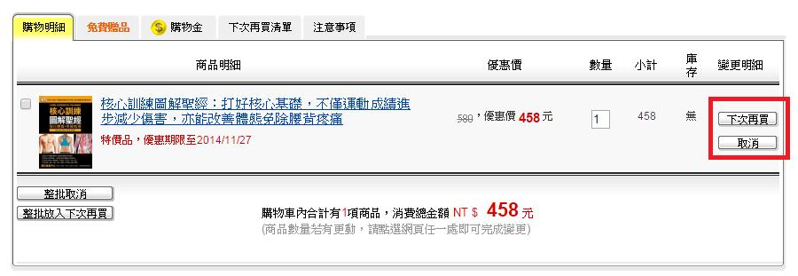

# GN3330601E 在所有情況中，均提供表單遞交後何時可由使用者更新或取消的時段說明

- **稽核評量碼**：GN3330601E
- **對應成功準則**：3.3.6
- **對應認證等級**：AAA
- **對應國際技術碼**：G164
- **類別**：General
- **訊息**：在所有情況中，均提供表單遞交後何時可由使用者更新或取消的時段說明
- **英文訊息**：G164: Providing a stated time within which an online request (or transaction) may be amended or canceled by the user after making the request

## 規則說明
檢查是否可以在所有網站規定的時間內更新或取消表單。

## 檢測說明
檢查網頁描述的時間來取消或更改訂單。 檢查該網頁描述取消或更改訂單的過程。

## 說明
無

## 範例

**圖片說明：** 購物網站「購物明細」頁面截圖，頁面包含「購物明細」、「免費贈品」、「購物金」、「下次再買清單」、「注意事項」等分頁標籤。商品列表顯示「核心訓練圖解聖經：打好核心基礎，不僅運動成績進步減少傷害，亦能改善體態免除腰背疼痛」一書（特價品，優惠期限至2014/11/27），原價 580 元，優惠價 458 元，數量 1，小計 458，庫存「無」。右側以紅框標示「下次再買」與「取消」兩個操作按鈕，頁面底部顯示「整批取消」與「整批放入下次再買」按鈕，以及「購物車內合計有1項商品，消費總金額 NT$458元」。示範在所有情況下，表單遞交後均提供可供使用者更新或取消的機制，並說明可在規定時段內取消或更改訂單。
