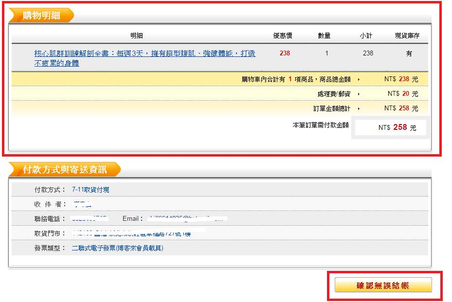

# GN3330602E 在所有情況中，均提供使用者在送出答覆前加以檢查及更正的能力

- **稽核評量碼**：GN3330602E
- **對應成功準則**：3.3.6
- **對應認證等級**：AAA
- **對應國際技術碼**：G98
- **類別**：General
- **訊息**：在所有情況中，均提供使用者在送出答覆前加以檢查及更正的能力。
- **英文訊息**：G98: Providing the ability for the user to review and correct answers before submitting

## 規則說明
所有網站是否有要求確認後才能繼續所選的功能。

## 檢測說明
網站是否有再次審查資料的功能。

## 說明
無

## 範例

**圖片說明：** 購物網站結帳前的確認頁面截圖，分為兩個區塊：上方「購物明細」（以紅框標示）顯示商品「核心肌群訓練解剖全書：每週3天，擁有超型腹肌、強健體能，打造不疲累的身體」，優惠價 238 元，數量 1，小計 238，以及費用摘要（商品總金額 NT$238、處理費/郵資 NT$20、訂單金額總計 NT$258，本筆訂單需付款金額 NT$258）；下方「付款方式與寄送資訊」區塊顯示付款方式（7-11取貨付現）、收件者、聯絡電話、Email、取貨門市及發票類型（二聯式電子發票）等詳細資訊。右下角以紅框標示「確認無誤結帳」橘色按鈕。示範在所有情況下，表單送出前均提供完整的訂單資訊審查頁面，讓使用者確認並更正所有資料後才點擊送出，具備事前檢查及更正的能力。
