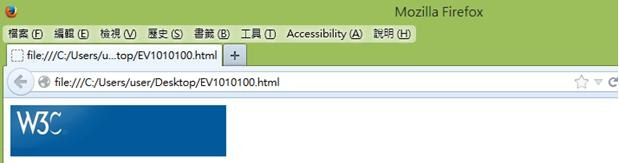
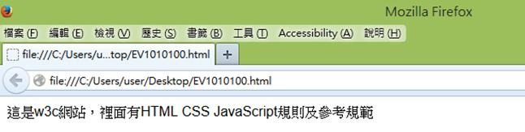

# HM1110100E 圖片需要加上有意義、可代替圖片在文件上下文中的功能及內容的替代文字

- **稽核評量碼**：HM1110100E
- **對應成功準則**：1.1.1
- **對應認證等級**：A
- **對應國際技術碼**：H37、ARIA10
- **類別**：HTML
- **訊息**：圖片需要加上有意義、可代替圖片在文件上下文中的功能及內容的替代文字
- **英文訊息**：H37: Using alt attributes on img elements / ARIA10: Using aria-labelledby to provide a text alternative for non-text content

## 規則說明

在 HTML 或 XHTML 中，若需使圖片加上有意義、可代替圖片在文件中的功能及內容的替代文字，需遵循 alt 屬性的用法。使用 aria-labelledby 屬性提供圖片的替代文字說明。

## 檢測說明

開啟瀏覽器如 Firefox，並搭配外掛擴充元件如「Firefox Accessibility Extension」。點選選單列中的 Accessibility → Text Equivalents → Show Text Equivalents，顯示此圖片的替代文字。

## 範例

範例：圖片的替代文字

開啟瀏覽器如Firefox，並搭配外掛擴充元件如「Firefox Accessibility Extension」。

點選選單列中的Accessibility→Text Equivalents→Show Text Equivalents 顯示此圖片的替代文字。

**圖片說明：** Firefox 瀏覽器視窗展示，上方選單列中有「Accessibility (A)」菜單選項，下方顯示一個簡單的 HTML 測試頁面，包含 W3C 標誌。此圖片演示如何在 Firefox 中存取無障礙檢查工具，展示瀏覽器選單中的「Accessibility」選項位置。

**圖片說明：** Firefox 瀏覽器中點選「Accessibility」菜單後，下拉選單顯示「Text Equivalents」、「Inspect (A)」及「Settings (H)」選項。網頁內容區域顯示中文文字「這是W3C網站，網頁有HTML CSS JavaScript規則」，說明測試頁面包含多種元素。此圖片展示如何透過無障礙菜單的「Text Equivalents」功能檢視圖片替代文字。
