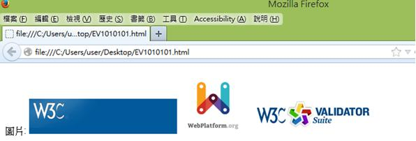
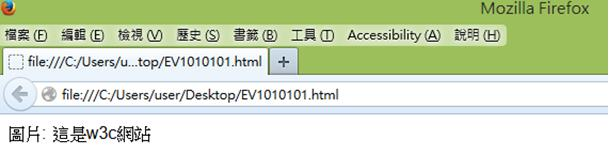
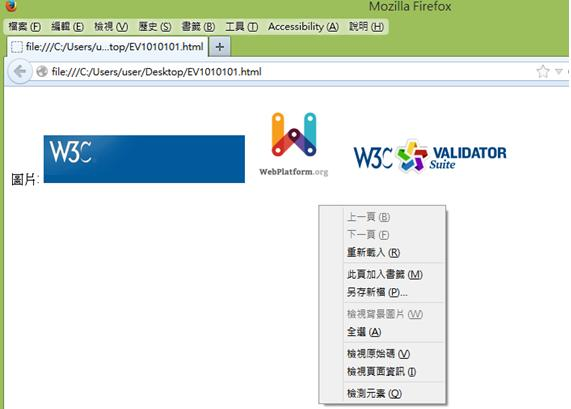
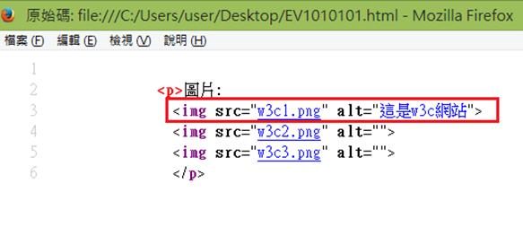

# HM1110101E 僅在一組緊連圖片中的其中一個項目使用替代文字，描述該組圖片的所有項目

- **稽核評量碼**：HM1110101E
- **對應成功準則**：1.1.1
- **對應認證等級**：A
- **對應國際技術碼**：G196
- **類別**：HTML
- **訊息**：僅在一組緊連圖片中的其中一個項目使用替代文字，描述該組圖片的所有項目
- **英文訊息**：G196: Using a text alternative on one item within a group of images that describes all items in the group

## 規則說明

在 HTML 或 XHTML 中，若在一組連續的圖片中，只有一個圖片項目用替代文字來描述該組圖片的所有項目時，都必須要遵守此指引。

## 檢測說明

1. 開啟瀏覽器如 Firefox，並搭配外掛擴充元件如「Firefox Accessibility Extension」。
2. 點選選單列中的 Accessibility → Text Equivalents → Show Text Equivalents 來顯示此圖片的替代文字。
3. 點選網頁右鍵「檢視原始碼」。
4. 可以對照程式碼中，只有第一張圖（`img src="w3c1.png"`）有替代文字（`alt="這是w3c網站"`），其他圖片項目的替代文字都是空值（`alt=""`）。

## 範例

**圖片說明：** Firefox 瀏覽器顯示包含三個圖片的網頁：W3C 標誌（藍色方形）、WebPlatform.org 標誌（彩色設計圖案）和 W3C 驗證工具套件標誌（彩色文字和圖案）。左側顯示中文文字「圖片：」標籤。此為展示一組相連圖片的視覺呈現。

**圖片說明：** Firefox 瀏覽器顯示網頁，左側標籤「圖片：」後，無任何可見的圖片。此圖片說明當圖片未正確載入或被隱藏時的網頁外觀，展示替代文字的重要性。

**圖片說明：** Firefox 瀏覽器顯示網頁，左側標籤「圖片：」，三個圖片（W3C、WebPlatform.org、W3C Suite）並排展示，右側出現右鍵快捷選單，選項包括「上一頁」、「下一頁」、「重新載入」、「必要時檢視書籤」等瀏覽器操作選項。此圖展示在無障礙檢查時的右鍵選單。

**圖片說明：** Firefox 原始碼檢視視窗，顯示 HTML 程式碼片段。第 3 行的 `` 標籤包含 `alt="這是w3c網站"` 替代文字（用紅框突出），而第 4-5 行的其他圖片標籤的 `alt=""` 為空值。此示範一組相連圖片中僅第一張有替代文字，描述整組圖片的正確做法。
