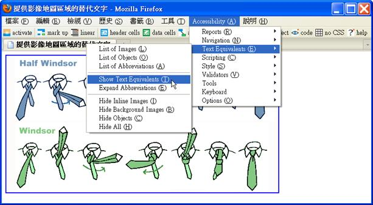
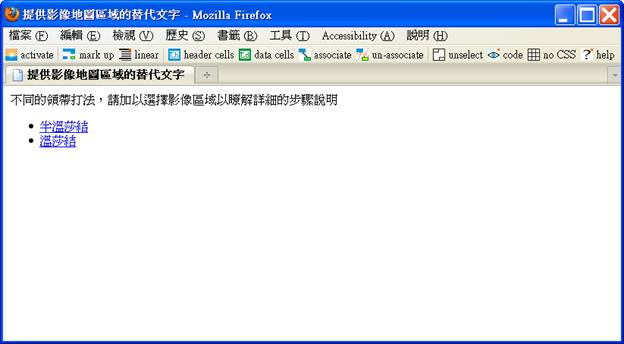
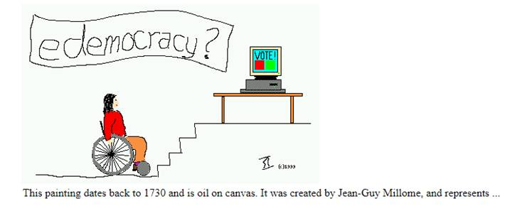

# HM1110102E 提供影像地圖區域的替代文字，並要能確實表達這些地圖區域的功能與目的

- **稽核評量碼**：HM1110102E
- **對應成功準則**：1.1.1
- **對應認證等級**：A
- **對應國際技術碼**：H24、ARIA6、ARIA15
- **類別**：HTML
- **訊息**：提供影像地圖區域的替代文字，並要能確實表達這些地圖區域的功能與目的
- **英文訊息**：H24: Providing text alternatives for the area elements of image maps / ARIA6: Using aria-label to provide labels for objects / ARIA15: Using aria-describedby to provide descriptions of images

## 規則說明

提供影像地圖區域的替代文字，並要能確實表達這些地圖區域的功能與目的。

## 檢測說明

**範例1：提供描述影像地圖區域用途的文字**

開啟瀏覽器如 Firefox，並搭配外掛擴充元件如「Firefox Accessibility Extension」，顯示替代文字（Accessibility → Text Equivalents → Show Text Equivalents），檢查所有的替代文字是否與其圖片區域原本要表達的功能及意義吻合，必要時並參考區域的鏈結目的地來驗證。

**範例2：利用 aria-describedby 提供在同一頁面上的詳盡描述**

```html

<p id="p1">This painting dates back to 1730 and is oil on canvas.
It was created by Jean-Guy Millome, and represents ...</p>
```

## 範例



**圖片說明：** Firefox 瀏覽器顯示一個影像地圖範例，圖中包含跳舞人物圖案區分為「Half Windsor」和「Windsor」兩個區域。Accessibility 菜單開啟，「Show Text Equivalents」選項被選中（用藍色框突出），展示如何檢視影像地圖各區域的替代文字。此圖演示使用 Firefox Accessibility Extension 檢查影像地圖的替代文字。



**圖片說明：** Firefox 瀏覽器顯示影像地圖的詳細說明頁面。頁面包含中文文字「提供影像地圖區域的替代文字，請描述區域表現說明及功能詳細步驟說明」，下方列出兩個藍色超連結「半溫莎結」和「溫莎結」，分別代表影像地圖中不同區域的鏈結目的地。此圖展示影像地圖區域如何提供有意義的替代文字和鏈結。



**圖片說明：** 一幅手繪風格的圖片，呈現「edemocracy?」標題，描繪一個坐輪椅的人物手指向電腦投票機，電腦螢幕顯示投票選項，下方标註「I'll help」。圖片下方有英文描述：「This painting dates back to 1730 and is oil on canvas. It was created by Jean-Guy Millome, and represents ...」此示範使用 aria-describedby 屬性提供詳盡的圖片描述，關聯同一頁面上的詳細文本。