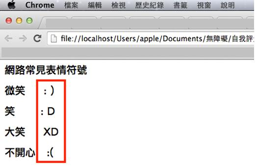
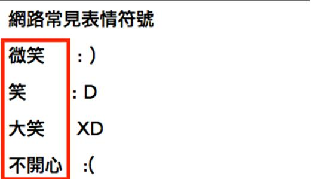

# HM1110104E 提供字符圖案、表情符號、其他挪用文字外型作為表意功能之語言形式的替代文字

- **稽核評量碼**：HM1110104E
- **對應成功準則**：1.1.1
- **對應認證等級**：A
- **對應國際技術碼**：H86
- **類別**：HTML
- **訊息**：提供字符圖案、表情符號、其他挪用文字外型作為表意功能之語言形式的替代文字，且其替代文字需有意義、可代替前述內容之目的與功能
- **英文訊息**：H86: Providing text alternatives for ASCII art, emoticons, and leetspeak

## 規則說明

表情符號或 ASCII 藝術字可能為任何字元湊成的形狀，故主要用觀察法評鑑。

## 檢測說明

1. 先判斷出在網頁上由字元湊成的表情符號或 ASCII 藝術字。
2. 接著檢查在表情符號的前後方必須要有等同於符號所要表達意義之文字說明。

## 範例

**圖片說明：** Chrome 瀏覽器顯示一個網頁，標題為「網路常見表情符號」。頁面以表格形式呈現表情符號的中文名稱與文字符號對應關係，內容包括：「微笑」對應 `:)` 、「笑」對應 `:D`、「大笑」對應 `XD`、「不開心」對應 `:(`。右側有紅色方框突出表情符號部分，展示純文字符號組成的表情。

**圖片說明：** 頁面詳細視圖，標題「網路常見表情符號」，左側紅色方框突出中文標籤區域（「微笑」、「笑」、「大笑」、「不開心」），右側對應的表情符號（`:)`、`:D`、`XD`、`:(`）。此圖強調符號與其文字描述的對應關係，說明表情符號前後必須有等同於符號所表達意義之文字說明。