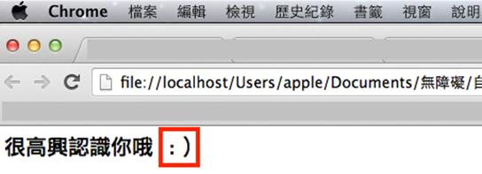
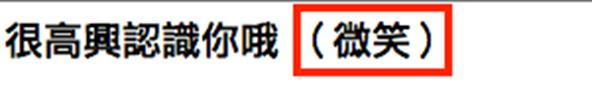

# HM1110105E 圖片以外的非文字內容需要有替代文字或長描述

- **稽核評量碼**：HM1110105E
- **對應成功準則**：1.1.1
- **對應認證等級**：A
- **對應國際技術碼**：G82、G92、G94、G95、G100
- **類別**：HTML
- **訊息**：圖片以外的非文字內容需要有替代文字或長描述，並需具有與該內容或物件相同目的、呈現相同資訊，或者可提供概略描述、俗名、描述性名稱
- **英文訊息**：G82: Providing a text alternative that identifies the purpose of the non-text content / G92: Providing long description for non-text content / G94: Providing short text alternative for non-text content / G95: Providing short text alternatives that provide a brief description / G100: Providing a short text alternative which is the accepted name or a descriptive name

## 規則說明

圖片以外的輔助說明，包含表情符號或動畫或影片皆可以此方式檢測。

## 檢測說明

1. 先判斷出在網頁上由字元湊成的表情符號或 ASCII 藝術字。
2. 用程式碼修改的方式，移除字元表情符號，確認結果呈現正確。
3. 用程式碼修改的方式，以相等意義之文字取代，確認結果呈現正確。

## 範例

**圖片說明：** Chrome 瀏覽器顯示網頁，中文文字「很高興認識你呢」後跟著一個紅色方框突出的表情符號 `:)` 。此為不佳範例，展示純文字符號表情而無相應的文字替代說明，違反無障礙準則。

**圖片說明：** 網頁顯示「網路常見表情符號」對應表，左側中文標籤包括「微笑」、「笑」、「大笑」、「不開心」，右側對應的符號為 `:)`、`:D`、`XD`、`:(`。紅色方框突出符號部分，說明符號與其文字描述的對應方式。

**圖片說明：** 網頁顯示中文文字「很高興認識你呢」後跟著紅色方框突出的「（微笑）」文字替代說明，取代了純符號 `:)` 的表示方式。此為改良後的無障礙版本，透過有意義的文字描述替代非文字內容，確保視覺障礙使用者能理解內容。