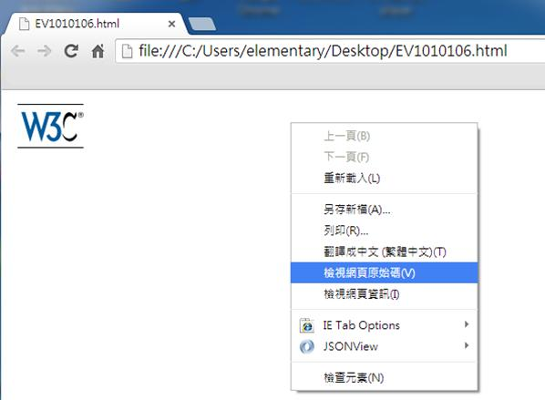
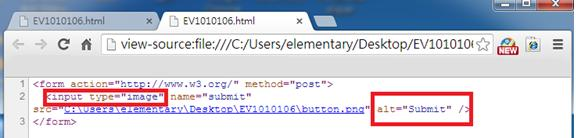

# HM1110106E 作為「送出」按鈕之用的圖片需提供替代文字，且此替代文字需能充分表達此按鈕之意義與功能

- **稽核評量碼**：HM1110106E
- **對應成功準則**：1.1.1
- **對應認證等級**：A
- **對應國際技術碼**：H36
- **類別**：HTML
- **訊息**：作為「送出」按鈕之用的圖片需提供替代文字，且此替代文字需能充分表達此按鈕之意義與功能
- **英文訊息**：H36: Using alt attributes on images used as submit buttons

## 規則說明

任何運用 HTML 或 XHTML 表單元件技術的網頁，都必須要遵守此指引。

## 檢測說明

1. 網頁上按右鍵 → 檢視網頁原始碼。
2. 檢查 input 標籤的 type 屬性是否為 "image"（圖片檔）。
3. 檢查是否存在 alt 屬性，用來表示以圖片做為按鈕的功能。
4. 此範例 alt 屬性表示傳送按鈕，點擊圖片按鈕後會將頁面轉換到所指定的網頁位址。

## 範例

**圖片說明：** Chrome 瀏覽器顯示一個網頁，包含 W3C 標誌。頁面有右鍵快捷選單，選項包括「上一頁」、「下一頁」、「重新載入」、「查看無障礙樹」等。選單中「檢視網頁原始碼」被選中（藍色突出），用於查看HTML 源代碼以檢查圖片按鈕的替代文字。

**圖片說明：** 瀏覽器顯示 HTML 原始碼視窗，第 2 行可見 `<input type="image">` 標籤，第 3 行顯示 `alt="Submit"` 屬性被紅色方框突出。此範例展示作為送出按鈕的圖片輸入元素如何提供 alt 替代文字，讓用戶明確瞭解此圖片按鈕的功能是提交表單。