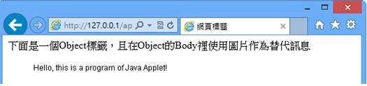
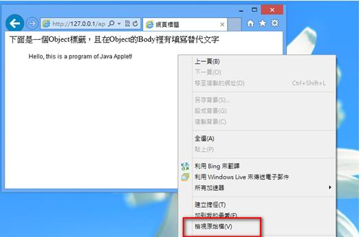
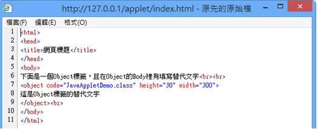
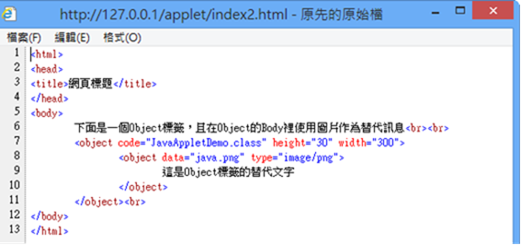

# HM1110108E 提供物件的文字替代內容與非文字替代內容，且要能完整表達該物件的意義與功能

- **稽核評量碼**：HM1110108E
- **對應成功準則**：1.1.1
- **對應認證等級**：A
- **對應國際技術碼**：H35、H46、H53
- **類別**：HTML
- **訊息**：提供物件的文字替代內容與非文字替代內容，且要能完整表達該物件的意義與功能
- **英文訊息**：H35: Providing text alternatives on applet elements / H46: Using noembed with embed / H53: Using the body of the object element

## 規則說明

任何使用 Object 標籤的網頁，都必須要遵守此指引。

## 檢測說明

1. 檢查網頁原始碼，找出使用 Object 標籤的地方。
2. 檢查是否在 Object 標籤的原始碼程式裡，填寫描述 Object 的替代文字，且符合 Object 的內容。
3. 在 `<Object>` 與 `</Object>` 之間，應有替代文字，或是利用其他方式（例如巢狀 Object 結構）顯示替代圖片。

## 範例

**圖片說明：** 瀏覽器視窗顯示網頁頁面，上方中文標籤說明「下面是一個Object標籤，且在Object的Body裡使用圖片作為替代訊息」。頁面下方顯示 Applet 程式執行的文字訊息「Hello, this is a program of Java Applet!」。此為不使用搜尋無障礙替代文字的狀態。

**圖片說明：** 瀏覽器視窗顯示同一網頁，右側出現右鍵快捷選單。選單中「檢視網頁原始碼」被選中（紅色方框突出）。此步驟用於查看 HTML 原始碼，以檢查 Object 標籤中的替代文字實作。

**圖片說明：** Firefox 原始碼檢視視窗，顯示 HTML 程式碼。第 7 行可見 `<object code="JavaAppletDemo.class" height="30" width="300">` Object 標籤，第 8-9 行為替代文字內容 `下面是一個object標籤，且在object的body裡使用圖片代替文字`，此為簡單的文字替代方式。

**圖片說明：** Firefox 原始碼檢視視窗顯示改進版 HTML。第 6 行同樣有標籤說明文字，第 8 行 Object 標籤設定高度寬度屬性，第 9 行內含巢狀 Object 結構 `<object data="java.png" type="image/png">`，第 12 行標籤說明下面是object標籤的替代文字，第 10-11 行正確關閉 Object 標籤。此範例展示透過巢狀 Object 和非文字替代內容（圖片）的正確做法。