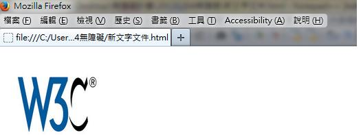
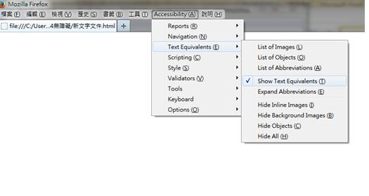
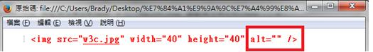

# HM1110112E 對於輔助科技應當要忽略的圖片，使用空字串作為替代文字，並且不可使用標題屬性

- **稽核評量碼**：HM1110112E
- **對應成功準則**：1.1.1
- **對應認證等級**：A
- **對應國際技術碼**：H67
- **類別**：HTML
- **訊息**：對於輔助科技應當要忽略的圖片，使用空字串作為替代文字，並且不可使用標題屬性
- **英文訊息**：H67: Using null alt text and no title attribute on img elements for images that AT should ignore

## 規則說明

任何網頁關於輔助科技想要忽略的圖片，即需使用空字串作為替代文字，並且不可使用標題屬性，皆須遵守此指引。

## 檢測說明

開啟瀏覽器如Firefox，並搭配外掛擴充元件如「Firefox Accessibility Extension」。

點選選單列中的Accessibility→Text Equivalents→Show Text Equivalents 來顯示此圖片的替代文字，而此處使用空字串當它的替代文字，所以會顯示為空白。

檢視原始碼，alt屬性為使用替代文字部分，此處為空字串，且指引規定不可使用標題(title)屬性，故此處沒有使用title。

## 說明

無

## 範例

**圖片說明：** Mozilla Firefox 瀏覽器開啟本機 HTML 檔案「新文字文件.html」的截圖，頁面內容顯示 W3C® 標誌圖片（藍色 W3C 文字搭配旋轉弧線設計）。此圖片為純裝飾性用途，應使用空字串替代文字（alt=""）並且不可加上標題屬性，以便輔助科技忽略此圖片。

**圖片說明：** Mozilla Firefox 瀏覽器的 Accessibility 外掛擴充元件選單截圖，選單列展開「Accessibility」選項，子選單顯示「Text Equivalents」項目已展開，右側二級子選單包含「List of Images」、「List of Objects」、「List of Abbreviations」、「Show Text Equivalents」（已勾選）、「Expand Abbreviations」、「Hide Inline Images」、「Hide Background Images」、「Hide Objects」、「Hide All」等選項。示範使用 Firefox Accessibility Extension 的「Show Text Equivalents」功能來顯示圖片的替代文字內容。

**圖片說明：** Firefox 瀏覽器以「原始碼」模式顯示 HTML 程式碼截圖，以紅框標示 `` 程式碼，其中 `alt=""` 為空字串替代文字，且沒有 `title` 屬性。示範對於輔助科技應忽略的裝飾性圖片，正確使用空字串作為替代文字（`alt=""`）且不加標題屬性的實作方式，使螢幕報讀器略過此圖片。