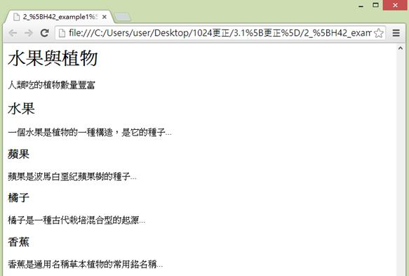
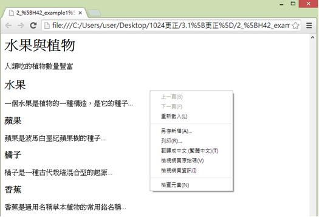
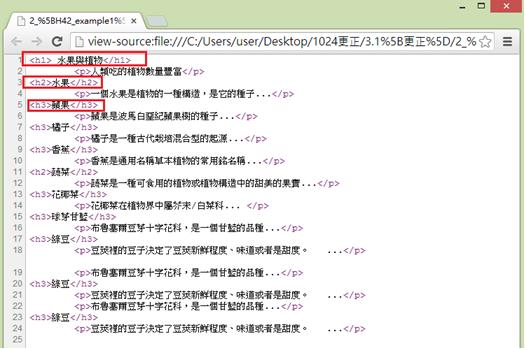
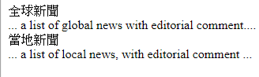

# HM1130104E 適當使用巢狀標題呈現文件結構

- **稽核評量碼**：HM1130104E
- **對應成功準則**：1.3.1
- **對應認證等級**：A
- **對應國際技術碼**：H42、ARIA12、ARIA20、H97
- **類別**：HTML
- **訊息**：適當使用巢狀標頭呈現文件結構
- **英文訊息**：H42: Using h1-h6 to identify headings / ARIA12: Using role=heading to identify headings / ARIA20: Using the region role to identify a region of the page / H97: Grouping related links using the nav element

## 規則說明

在HTML和XHTML任何有使用巢狀標頭時(巢狀標頭通常用來呈現網頁中的章節的層次結構，例如將每個段落標頭，如下列範例中水果、蘋果等設為不同階層的標題)讓文章看起來有段落層次的結構，皆須遵守此指引。

## 檢測說明

**範例1：使用H1到H6編寫網頁內容的標題順序**

使用Google Chrome瀏覽器開啟檔案。

按滑鼠右鍵，點選檢視網頁原始碼。

對照呈現的網頁受巢狀標題`<h1>` `<h2>` `<h3>`顯示層級結構。

**範例2：使用role="heading" 實現簡易標題**

```html
<div role="heading">全球新聞</div>
... a list of global news with editorial comment....
<div role="heading">當地新聞</div>
... a list of local news, with editorial comment ...
```

## 說明

無

## 範例



**圖片說明：** 展示網頁內容，標題「水果與植物」以較大字體顯示，下方是一個副標題「人類吃的植物數量豐富」，然後是多個層級的結構化內容：「水果」是第一個主要分類（下方敘述「一個水果是種植物……種植該子……」），「蘋果」是水果下的子項目，「柳子」和「香蕉」也是水果下的子項。此圖展示巢狀結構的視覺呈現，其中不同層級的標題有不同的字體大小，營造出層次感。



**圖片說明：** 展示同一網頁的右鍵內容菜單，顯示「上一頁(B)」、「下一頁(F)」、「重新載入(L)」、「另存新頁(A)...」、「另存(R)...」、「書籤←=→ (星標=圖)(T)」、「檢視網頁原始碼(V)」、「檢視網頁資訊(I)」、「檢查元素(N)」等選項。此圖說明使用者可通過右鍵檢查HTML代碼，以驗證巢狀標題標籤的正確使用。



**圖片說明：** 展示HTML原始碼檢視。代碼包含多層級的標題標籤，以紅色方框標示，包括：「<h2>水果與植物</h2>」和「<h3>人類吃的植物數量豐富</h3>」，以及「<h3>水果</h3>」、「<h4>蘋果……</h4>」等，表示多層級的結構。下方還有多個<p>標籤包含各分類的描述文字，並標註水果類別下的子項目如「蘋果」「香蕉」等。此代碼結構展示正確的巢狀標題實現方式，層級從h2遞進至h3和h4。



**圖片說明：** 展示全球新聞和當地新聞的簡化示例。上方顯示「全球新聞」標題和「… a list of global news with editorial comment ….」的說明，下方顯示「當地新聞」標題和「… a list of local news, with editorial comment …」的說明。此圖展示使用role="heading"屬性實現標題功能的替代方案，使不具有原生語意標題標籤（h1-h6）的div元素也能被識別為標題。
