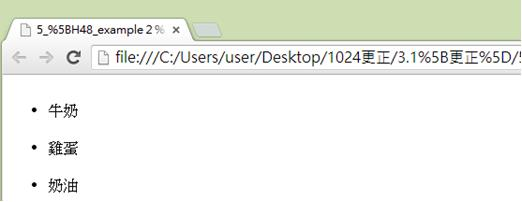
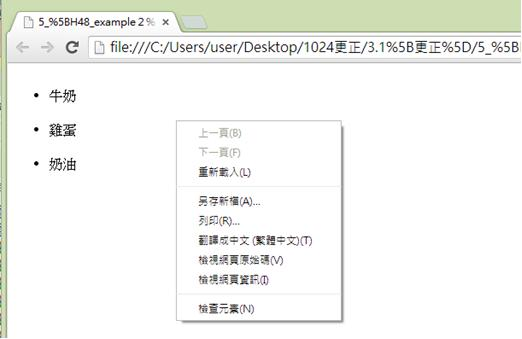
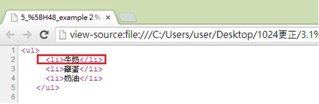

# HM1130105E 使用語意組件來標記結構

- **稽核評量碼**：HM1130105E
- **對應成功準則**：1.3.1
- **對應認證等級**：A
- **對應國際技術碼**：H48
- **類別**：HTML
- **訊息**：使用語意組件來標記結構
- **英文訊息**：G115: Using semantic elements to mark up structure / H48: Using ol, ul and dl for lists or groups of links

## 規則說明

在HTML和XHTML中需要用語意組件來標記結構時，皆須遵守此指引。

## 檢測說明

使用Google Chrome瀏覽器開啟檔案。

按滑鼠右鍵，點選檢視網頁原始碼。

表示購買的商品用清單表示其語意結構，`<li>`標籤表示清單結構。`<li>`標籤可用在有序列表標籤(`<ol>`) 和無序列表標籤(`<ul>`)中，若用在`<ol>`有順序的列表時會出現1. 2. 3… 排列，但在此是用在無順序的列表中。

## 說明

無

## 範例

**圖片說明：** 展示商品購買清單網頁。頁面顯示三個列表項目：「牛奶」、「雞蛋」、「奶油」，每項前面都有項目符號（圓點），表示這是一個無序列表。此圖展示購買商品清單的視覺呈現，其中使用清單結構來標記多個相關項目。

**圖片說明：** 展示右鍵內容菜單，包含「上一頁(B)」、「下一頁(F)」、「重新載入(L)」、「另存新頁(A)...」、「另存(R)...」、「書籤←=→ (星標=圖)(T)」、「檢視網頁原始碼(V)」、「檢視網頁資訊(I)」、「檢查元素(N)」等選項。此圖說明使用者可通過右鍵檢查HTML代碼，以驗證清單結構的實現。

**圖片說明：** 展示HTML原始碼檢視。代碼結構如下：「<ul>」無序列表開始標籤，然後是「<li>牛奶</li>」（第一項，被紅色方框強調），「<li>雞蛋</li>」（第二項），「<li>奶油</li>」（第三項），最後是「</ul>」無序列表結束標籤。此代碼結構展示使用語意組件<ul>和<li>正確標記購物清單的方式，使屏幕閱讀器能夠正確識別列表結構，提供更好的無障礙支持。
