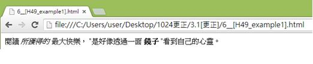
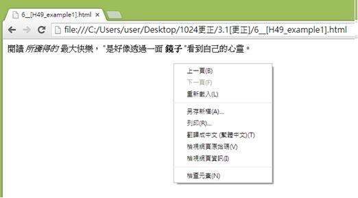
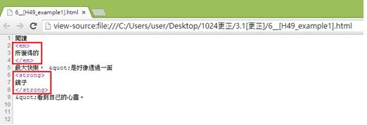

# HM1130106E 使用具語意的標記來標出強調的文字或特殊文字

- **稽核評量碼**：HM1130106E
- **對應成功準則**：1.3.1
- **對應認證等級**：A
- **對應國際技術碼**：H49
- **類別**：HTML
- **訊息**：使用具語意的標記來標出強調的文字或特殊文字
- **英文訊息**：H49: Using semantic markup to mark emphasized or special text

## 規則說明

在HTML和XHTML中，有使用具有語言意義的標記來強調的文字或特殊文字時，皆須遵守此指引。

## 檢測說明

使用Google Chrome瀏覽器開啟檔案。

點選右鍵檢查標籤。

對照程式碼是否有因標記來突顯語意中的特殊文字，下方以`<em>`標籤表示斜體字，`<strong>`標籤表示粗體字，例如：「所獲得的」為斜體字，「鏡子」為粗體字。

## 說明

無

## 範例

**圖片說明：** 展示網頁內容，文字敘述「閱讀 所謂得的最大快樂，『是好像選一一個 鏡子 』看到白日的小盒。」其中「所謂得的」呈現為斜體效果，「鏡子」呈現為粗體效果，分別強調頁面中的特殊和重要信息。此圖展示在視覺上強調特定文字的做法。

**圖片說明：** 展示右鍵內容菜單，包含「上一頁(B)」、「下一頁(F)」、「重新載入(L)」、「另存新頁(A)...」、「另存(R)...」、「書籤←=→ (星標=圖)(T)」、「檢視網頁原始碼(V)」、「檢視網頁資訊(I)」、「檢查元素(N)」等選項。此圖說明使用者可通過右鍵檢查HTML代碼，以驗證語意標籤的使用。

**圖片說明：** 展示HTML原始碼檢視。代碼片段顯示：「
閱讀 <em>所謂得的</em>最大快樂，『是好像選一一個 <strong>鏡子</strong> 』看到白日的小盒。」其中「<em>所謂得的</em>」和「<strong>鏡子</strong>」被紅色方框標示。此代碼結構展示正確使用語意標籤的方式：<em>標籤用於強調斜體文字（表示強調），<strong>標籤用於粗體文字（表示強烈強調），而非僅使用視覺樣式，確保屏幕閱讀器能夠正確識別強調的內容。
