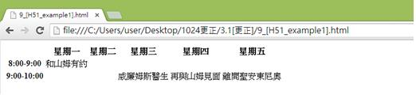
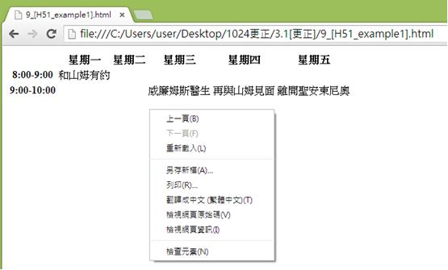
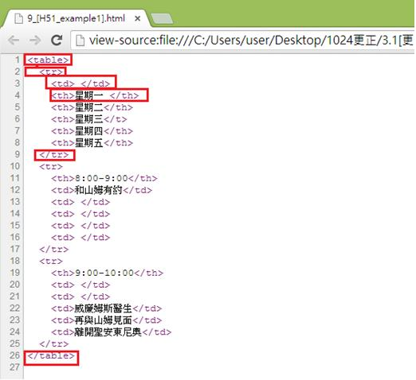

# HM1130107E 使用表格標記來呈現表格資訊

- **稽核評量碼**：HM1130107E
- **對應成功準則**：1.3.1
- **對應認證等級**：A
- **對應國際技術碼**：H51
- **類別**：HTML
- **訊息**：使用表格標記來呈現表格資訊
- **英文訊息**：H51: Using table markup to present tabular information

## 規則說明

在HTML和XHTML中，需要使用表格的標記來呈現出表格內的資訊時，皆須遵守此指引。

## 檢測說明

使用Google Chrome瀏覽器開啟檔案。

點選右鍵檢視網頁原始碼。

對照程式碼是否以表格標記來呈現此網頁資訊(上例為無框線的表格)，以下使用到`<table>`、`<tr>`、`<td>`、`<th>`等相關的表格標記。`<table>`表示表格的標籤，`<tr>`定義表格中的行，`<td>`為每個單元格，`<th>`表示表格的標頭名稱。

## 說明

無

## 範例

**圖片說明：** 展示一個課程時間表網頁。表格顯示五個星期（星期一到星期五）作為列標題，左側顯示時間段：「8:00-9:00 和山埤有約」和「9:00-10:00」等時間槽。表格單元格內容包含課程信息，以視覺方式組織成矩陣形式，方便查看不同時間和星期的課程安排。

**圖片說明：** 展示右鍵內容菜單，包含「上一頁(B)」、「下一頁(F)」、「重新載入(L)」、「另存新頁(A)...」、「另存(R)...」、「書籤←=→ (星標=圖)(T)」、「檢視網頁原始碼(V)」、「檢視網頁資訊(I)」、「檢查元素(N)」等選項。此圖說明使用者可通過右鍵檢查HTML代碼，以驗證表格標籤的正確使用。

**圖片說明：** 展示HTML表格原始碼檢視。代碼片段包含：第1行「<table border='1'>」（表格開始，被紅色方框標示），第2行「<tr>」（表格行開始），第3-8行多個「<th>」標籤表示表頭單元格，包含「星期一」、「星期二」、「星期三」、「星期四」、「星期五」等，第9行「</tr>」表格行結束。下方還有多個「<tr>」行，第11-16行顯示「<th>8:00-9:00</th>」（時間標頭），後跟多個「<td>」數據單元格。第18行開始新的「<tr>」，包含「9:00-10:00」時間和對應的課程數據。最後第26行「</table>」（表格結束，被紅色方框標示）。此代碼結構展示正確使用<table>、<tr>、<th>、<td>等表格標籤的方式，<th>用於表頭單元格，<td>用於數據單元格，確保屏幕閱讀器能夠正確識別表格結構。
