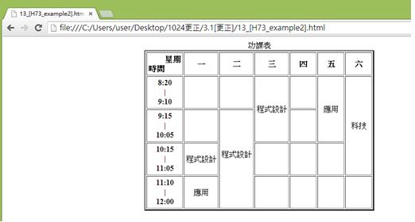
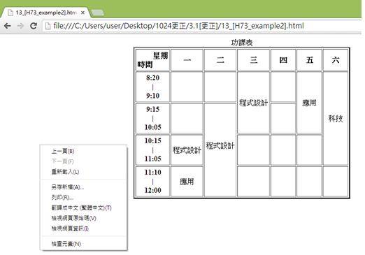
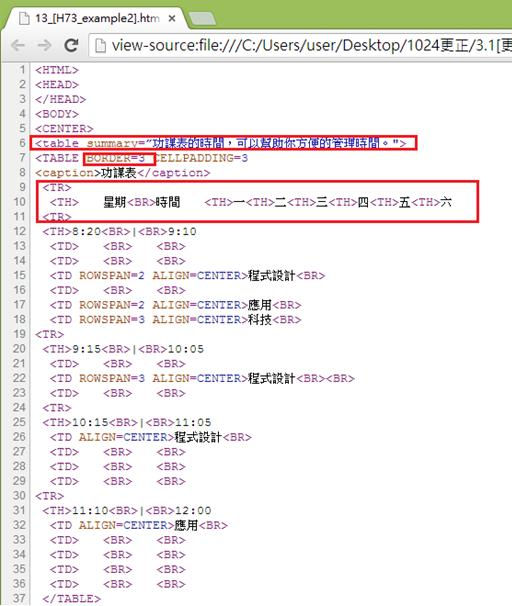

# HM1130108E 以有意義的標記來提供資料表格的概觀

- **稽核評量碼**：HM1130108E
- **對應成功準則**：1.3.1
- **對應認證等級**：A
- **對應國際技術碼**：H73
- **類別**：HTML
- **訊息**：以有意義的標記來提供資料表格的概觀
- **英文訊息**：H73: Using the summary attribute of the table element to give an overview of data tables

## 規則說明

有意義的標記來提供資料表格的概觀適用於HTML標準，皆須遵守此指引。

## 檢測說明

使用Google Chrome瀏覽器開啟檔案。

點選右鍵檢視網頁原始碼。

檢查原始碼是否以有意義的標記來提供資料表格的概觀（`<tr>`標籤(table row)表示為行，第一行為星期一到五，第一列為時間，內容對照時間及星期來呈現表格的概觀；有意義的標記如summary屬性來為提供詳細的表格說明，`<td>`標籤是指表格中的一個單元格可用來擺放內容，`<th>`標籤則用來宣告表頭的方格例如星期及時間，border屬性為邊框，可設定寬度。）

## 說明

無

## 範例

**圖片說明：** 展示複雜的課程時間表網頁。表格包含星期一到星期六的列標題，以及多個時間段（8:20、9:10、9:15、10:05、10:15、11:05、11:10、12:00）的行標題。表格內容顯示不同時間段和星期的課程安排，例如「程式設計」和「應用」分別出現在不同的單元格中。右側標題「科技」標示課程分類。此圖展示複雜表格的視覺呈現。

**圖片說明：** 展示同一網頁的右鍵內容菜單，包含「上一頁(B)」、「下一頁(F)」、「重新載入(L)」、「另存新頁(A)...」、「另存(R)...」、「書籤←=→ (星標=圖)(T)」、「檢視網頁原始碼(V)」、「檢視網頁資訊(I)」、「檢查元素(N)」等選項。此圖說明使用者可通過右鍵檢查HTML代碼。

**圖片說明：** 展示HTML表格原始碼檢視。重點以紅色方框標示第6行「<table summary='功課表說明:可於此時間安排功課表並且說明表格的內容 ...」，展示表格的summary屬性用於提供表格概觀。代碼還包含第7行「<TABLE BGCOLOR='#FFFFFF'>」，第8行「<caption>功課表</caption>」（表格標題），第10-11行顯示表頭行「<TH>星期 <TH>一<TH>二<TH>三<TH>四<TH>五<TH>六」，以及下面的數據行包含時間和課程內容。此代碼結構展示使用summary屬性、<caption>、<th>和<td>等有意義的標籤來組織複雜表格結構。
