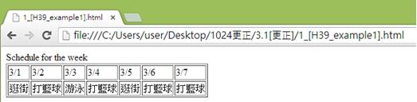
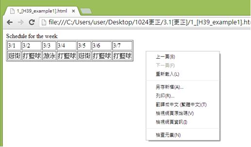
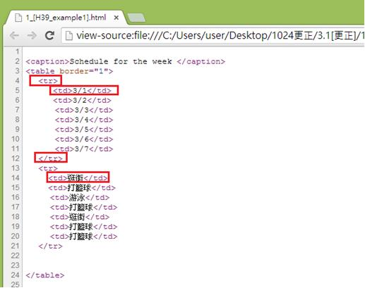

# HM1130109E 以有意義的標記來建立表格行列標題與資料表格的關連

- **稽核評量碼**：HM1130109E
- **對應成功準則**：1.3.1
- **對應認證等級**：A
- **對應國際技術碼**：H39
- **類別**：HTML
- **訊息**：以有意義的標記來建立表格標題與資料表格的關連
- **英文訊息**：H39: Using caption elements to associate data table captions with data tables

## 規則說明

在HTML中，當需要建立表格及資料表時需要用有意義的標籤表示時，皆須遵守此指引。

## 檢測說明

使用Google Chrome瀏覽器開啟檔案。

點選右鍵檢視網頁原始碼。

檢查原始碼是否以有意義的標籤來建立表格標題與資料表格的關連（`<tr>`標籤表示為行，第一行為日期，第二行為關聯到第一行的行程內容，`<td>`標籤為單元格用於顯示資料內容）

## 說明

無

## 範例

**圖片說明：** 展示簡單的週間日程表網頁。表格顯示「Schedule for the week」，列出7個日期（3:1到3:7），下方為對應的日期和相關活動或課程說明。表格清晰地將日期作為列標題，活動信息作為數據行的內容。此圖展示簡單表格結構中標題與數據的關聯。

**圖片說明：** 展示右鍵內容菜單，包含「上一頁(B)」、「下一頁(F)」、「重新載入(L)」、「另存新頁(A)...」、「另存(R)...」、「書籤←=→ (星標=圖)(T)」、「檢視網頁原始碼(V)」、「檢視網頁資訊(I)」、「檢查元素(N)」等選項。此圖說明使用者可通過右鍵檢查HTML代碼。

**圖片說明：** 展示HTML表格原始碼檢視。代碼包含：第2行「<caption>Schedule for the week </caption>」（表格標題，被紅色方框標示），第3行「<table border="1">」，第4-5行「<tr>」表示表格行（被紅色方框標示），第5行「<td>3/1</td><td>...」等表示表格數據單元格，顯示日期。第12行「</tr>」結束第一行，第13行開始新的「<tr>」（被紅色方框標示），第14-20行包含「<td>簽回</td>」（被紅色方框標示）、「<td>打藍球</td>」、「<td>游泳</td>」、「<td>掃街</td>」、「<td>打籃球</td>」、「<td>打籃球</td>」等數據單元格。第24行「</table>」表示表格結束。此代碼結構展示使用<caption>元素與表格關聯標題，並用<tr>和<td>建立行列關係的正確方式。
