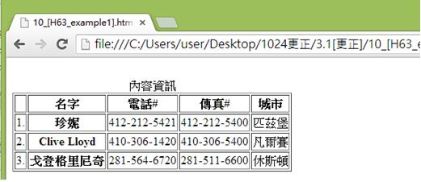
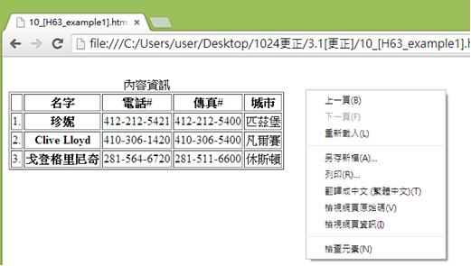
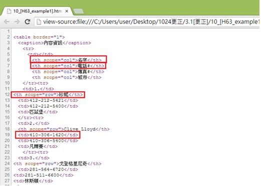

# HM1130110E 對於複雜表格，以有意義的標記來建立表格行列標題儲存格與資料儲存格之間的關連

- **稽核評量碼**：HM1130110E
- **對應成功準則**：1.3.1
- **對應認證等級**：A
- **對應國際技術碼**：H43、H63
- **類別**：HTML
- **訊息**：對於複雜表格，以有意義的標記來建立表格標頭儲存格與資料儲存格之間的關連
- **英文訊息**：H43: Using id and headers attributes to associate data cells with header cells in data tables / H63: Using the scope attribute to associate header cells and data cells in data tables

## 規則說明

在HTML中，使用有意義的標籤來建立表格標頭儲存格與資料儲存格之間的關係，皆須遵守此指引。

## 檢測說明

使用Google Chrome瀏覽器開啟檔案。

點選右鍵檢視網頁原始碼。

可看到表格標頭儲存格與資料儲存格之間的關係，例如：表格列標頭指的是名字，電話，傳真、城市，珍妮、Clive Lloyd、戈登格里尼奇則為行標頭，其他資料是指除了表格標頭以外的資料，如412-212-5421、412-212-5400、匹茲堡等。以上範例表示表格行列標頭與資料間的關係，在`<th scope="col">名字</th>`程式碼中scope屬性標示該標頭的範圍，其他如電話，傳真，城市為每一列的標頭都會關聯到其他資料儲存格，像是名字會對照到珍妮，電話會對照到412-212-5421以此類推。

## 說明

無

## 範例

**圖片說明：** 展示一個複雜的聯絡人資訊表格。表格標題「內容資訊」位於上方，列出4個列標題：「名字」、「電話」、「傳真#」、「城市」。表格包含3行數據：第一行「珍妮」、「412-212-5421」、「412-212-5400」、「匹茲堡」；第二行「Clive Lloyd」、「410-306-1420」、「410-306-5400」、「貝蒂摩爾」；第三行「克合格里尼奇」、「281-564-6720」、「281-511-6600」、「休斯頓」。此圖展示複雜表格的結構，其中行和列標題與數據的關係需要在HTML代碼中明確標記。

**圖片說明：** 展示右鍵內容菜單，包含「上一頁(B)」、「下一頁(F)」、「重新載入(L)」、「另存新頁(A)...」、「另存(R)...」、「書籤←=→ (星標=圖)(T)」、「檢視網頁原始碼(V)」、「檢視網頁資訊(I)」、「檢查元素(N)」等選項。此圖說明使用者可通過右鍵檢查HTML代碼。

**圖片說明：** 展示HTML表格原始碼檢視。代碼包含：第3行「<caption>內容資訊</caption>」（表格標題），第4-9行表頭行，其中「<th scope="col">名字</th>」（被紅色方框標示）、「<th scope="col">電話</th>」、「<th scope="col">傳真</th>」、「<th scope="col">城市</th>」等列標題帶有scope="col"屬性，表示這些是列標題。第11-27行包含多個數據行，其中「<th scope="row">珍妮</th>」（被紅色方框標示）作為行標題，後跟該行的數據單元格。此代碼結構展示使用scope屬性建立表格標頭儲存格與數據儲存格之間關係的正確方式，scope="col"用於列標題，scope="row"用於行標題。
