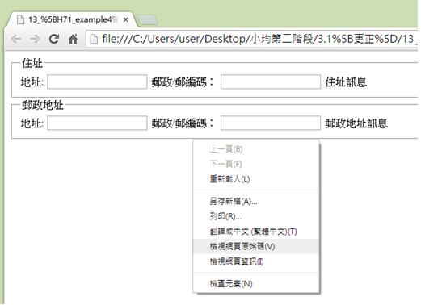
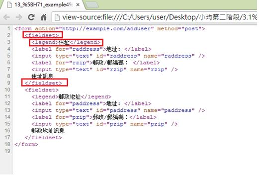

# HM1130111E 將表單控制元件及表單內的選項予以適當地分群並提供相關的描述

- **稽核評量碼**：HM1130111E
- **對應成功準則**：1.3.1
- **對應認證等級**：A
- **對應國際技術碼**：H71、H85、ARIA17
- **類別**：HTML
- **訊息**：將表單控制元件及表單內的選項予以適當地分群並提供相關的描述
- **英文訊息**：H71: Providing a description for groups of form controls using fieldset and legend elements / H85: Using OPTGROUP to group OPTION elements inside a SELECT / ARIA17: Using grouping roles to identify related form controls

## 規則說明

在HTML和XHTML中，若需使用表單控制元件及表單內的選項要做適當的分組時，皆須遵守此指引。

## 檢測說明

使用Google Chrome瀏覽器開啟頁面。

點選右鍵檢視網頁原始碼。

在原始碼中以`<fieldset>`標籤來設置表單中的方框來分組，此方框可當作分隔表單的區域，接下來以`<legend>`作為這個區域的標題，如下列範例：住址為方框的標題。

## 說明

無

## 範例

**圖片說明：** 展示一個地址表單頁面。頁面包含兩個分組的表單區域。第一個分組標題為「住址」，包含兩個表單欄位：「地址：」輸入框和「郵政郵編號：」輸入框，右側標籤為「住址說明」。第二個分組標題為「郵政地址」，同樣包含「地址：」和「郵政/郵編號：」兩個輸入框，右側標籤為「郵政地址說明」。此圖展示使用<fieldset>和<legend>元素對表單控制元件進行分組和標註。

**圖片說明：** 展示HTML表單原始碼檢視。代碼包含：第1行「<form action="http://example.com/address" method="post">」表單開始，第2行「<fieldset>」開始第一個分組（被紅色方框標示），第3行「<legend>住址</legend>」設定分組標題（被紅色方框標示），第4-7行包含<label>和<input>元素定義表單欄位，例如「<label for="address">地址：</label>」和「<input type="text" id="address" name="address" />」。第9行「</fieldset>」結束第一個分組（被紅色方框標示），第10行開始新的「<fieldset>」（被紅色方框標示），第11行「<legend>郵政地址</legend>」設定第二個分組標題。下方重複類似的標籤結構定義第二組表單欄位。此代碼結構展示使用<fieldset>和<legend>元素對表單進行邏輯分組，使屏幕閱讀器能夠正確識別相關表單控制元件之間的關係。
