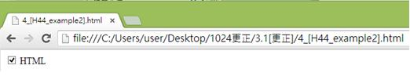
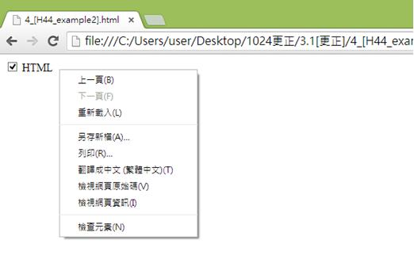
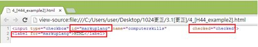

# HM1130112E 使用標籤組件將文字標籤與表單控制元件建立關連

- **稽核評量碼**：HM1130112E
- **對應成功準則**：1.3.1
- **對應認證等級**：A
- **對應國際技術碼**：H44、ARIA1
- **類別**：HTML
- **訊息**：使用標籤組件將文字標籤與表單控制元件建立關連
- **英文訊息**：H44: Using label elements to associate text labels with form controls / ARIA1: Using the aria-describedby property to provide a descriptive label for user interface controls

## 規則說明

使用標籤的方式將文字標籤與表單控制元件建立關連時，適用於HTML，皆須遵守此指引。

使用aria-describedby屬性描述按鈕的操作。

## 檢測說明

使用Google Chrome瀏覽器開啟頁面。

點選右鍵檢視網頁原始碼。

在下面的例子中以核取方塊的勾選作為表單的控制元件(表單控制元件表示在表單中出現的控制元件如核取方塊或是選項按鈕等)，文字標籤為HTML，程式碼中`type="checkbox" id="markuplang"`代表id為markuplang的核取方塊"checkbox"，以及程式碼中`<label for="markuplang">HTML</label>` id同樣設為markuplang的 HTML文字標籤產生關聯，代表著核取方塊的勾選或不勾選來表示和文字標籤為HTML間的關聯。

## 說明

無

## 範例

**圖片說明：** 展示一個簡單的表單頁面。頁面显示一個核取方塊「HTML」，核取方塊被勾選（顯示為✓），表示HTML項目被選中。此圖展示表單控制元件（核取方塊）與其文字標籤的視覺關聯。

**圖片說明：** 展示右鍵內容菜單，包含「上一頁(B)」、「下一頁(F)」、「重新載入(L)」、「另存新頁(A)...」、「另存(R)...」、「書籤←=→ (星標=圖)(T)」、「檢視網頁原始碼(V)」、「檢視網頁資訊(I)」、「檢查元素(N)」等選項。此圖說明使用者可通過右鍵檢查HTML代碼。

**圖片說明：** 展示HTML表單原始碼。代碼片段被紅色方框標示，包含：「<input type="checkbox" id="markuplang" name="markuplang" checked="checked">」和「<label for="markuplang">HTML</label>」。此代碼結構展示正確建立<label>與<input>表單控制元件之間的關聯方式：input元素設定id="markuplang"，label元素設定for="markuplang"屬性指向該id，實現標籤與核取方塊的邏輯關聯，使屏幕閱讀器能夠讀出「HTML」標籤與核取方塊的關聯。

