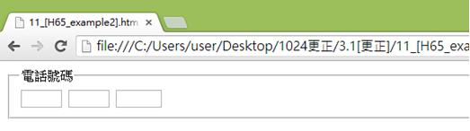
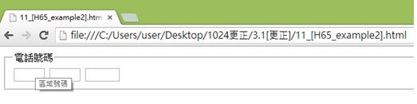
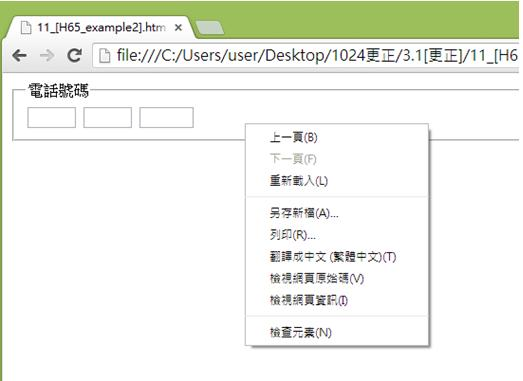
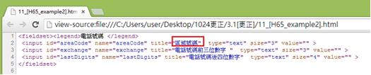

# HM1130113E 無法使用標籤組件的情況下，用標題屬性來指明表單控制元件

- **稽核評量碼**：HM1130113E
- **對應成功準則**：1.3.1
- **對應認證等級**：A
- **對應國際技術碼**：H65、ARIA1
- **類別**：HTML
- **訊息**：無法使用標籤組件的情況下，用標題屬性來指明表單控制元件
- **英文訊息**：H65: Using the title attribute to identify form controls when the label element cannot be used / ARIA1: Using the aria-describedby property to provide a descriptive label for user interface controls

## 規則說明

在HTML網頁下無法辨識value、alt等標籤內容時可以使用標題屬性來表示表單控制元件，皆須遵守此指引。

使用aria-describedby說明與表單字段相關聯。

## 檢測說明

使用Google Chrome瀏覽器開啟頁面。

當游標移置方框中會有文字訊息的提示(以下範例為：將游標移至第一個方框(欄位)中)。

點選右鍵檢視網頁原始碼。

當有些視覺設計時不能容納標籤時，我們可以使用title屬性來標籤表單控制元件(表單控制元件表示在表單中出現的控制元件如文字欄位、核取方塊或是選項按鈕等)，當游標移至方框中時會出現文字訊息的提示，使我們不會困惑此欄位方框需填入什麼訊息。例如，下方title屬性設為"區域號碼"時，游標移至此欄位時可看到區域號碼的提示訊息，代表此欄位需填入區域號碼，以此類推。

## 說明

無

## 範例

**圖片說明：** 展示電話號碼表單頁面。標題「電話號碼」顯示在表單上方。下方有一行三個輸入方框，用於分別輸入電話號碼的不同部分（例如區域代碼、交換碼、線路號碼）。此圖展示表單控制元件的視覺呈現。

**圖片說明：** 展示右鍵內容菜單，包含「上一頁(B)」、「下一頁(F)」、「重新載入(L)」、「另存新頁(A)...」、「另存(R)...」、「書籤←=→ (星標=圖)(T)」、「檢視網頁原始碼(V)」、「檢視網頁資訊(I)」、「檢查元素(N)」等選項。此圖說明使用者可通過右鍵檢查HTML代碼。

**圖片說明：** 展示相同表單的右鍵內容菜單視圖。當游標移至第一個輸入方框時會顯示提示文字「區域號碼」，表示該欄位需填入區域號碼信息。此圖展示title屬性提供的工具提示功能。

**圖片說明：** 展示HTML表單原始碼。代碼包含<fieldset>和<legend>標籤結構，其中「<legend>電話號碼</legend>」設定分組標題。下方顯示多個<input>元素，其中「<input type="text" id="areaCode" name="areaCode" title="區域號碼" />」被紅色方框標示，展示使用title屬性來提供表單控制元件的描述性文字。當無法使用<label>元素時（例如由於視覺設計限制），可以使用title屬性來標記表單欄位，使屏幕閱讀器和浮動提示都能識別該欄位的用途。
