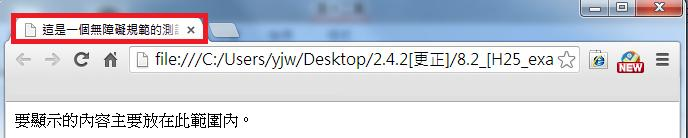
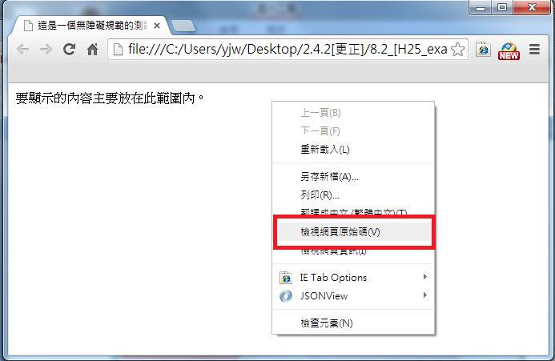
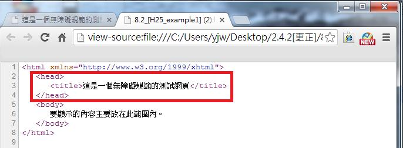

# HM1240200E 提供網頁的描述性標題

- **稽核評量碼**：HM1240200E
- **對應成功準則**：2.4.2
- **對應認證等級**：A
- **對應國際技術碼**：G88
- **類別**：General
- **訊息**：提供網頁的描述性標題
- **英文訊息**：G88: Providing descriptive titles for Web pages / H25: Providing a title using the title element

## 規則說明

任何運用HTML或XHTML技術的網頁，皆能以此方法來做檢測。

## 檢測說明

1. 檢測瀏覽器網頁上所顯示描述性的標題。
2. 按右鍵->選擇檢視網頁原始碼。
3. 檢查`<title>`標籤即可看到網頁的描述性標題內容。

## 說明

無

## 範例

**圖片說明：** 瀏覽器開啟範例頁面，瀏覽器分頁標籤（以紅框標示）顯示「這是一個無障礙規範的測…」的描述性標題（因寬度截斷），頁面內容僅有「要顯示的內容主要放在此範圍內。」一行文字。示範網頁標題應明確描述頁面內容，讓使用者在瀏覽器分頁列即可識別頁面用途。

**圖片說明：** 同一範例頁面，顯示右鍵選單，以紅框標示「檢視網頁原始碼」選項，示範透過此方式可查看 `<title>` 標籤內容，確認網頁是否提供描述性標題。

**圖片說明：** 「檢視網頁原始碼」顯示的 HTML 程式碼，以紅框標示第3行 `<title>這是一個無障礙規範的測試網頁</title>`，此描述性標題清楚說明頁面用途。右側另開啟一個分頁顯示原始碼檔案，兩個分頁標題均可見網頁標題文字。示範使用 `<title>` 元素提供描述性網頁標題的正確 HTML 實作。
