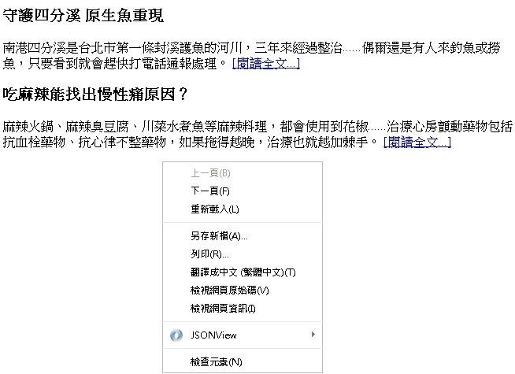

# HM1240400E 使用鏈結文字及前後的脈絡情境來指明鏈結目的

- **稽核評量碼**：HM1240400E
- **對應成功準則**：2.4.4
- **對應認證等級**：A
- **對應國際技術碼**：H77
- **類別**：HTML
- **訊息**：使用鏈結文字及前後的脈絡情境來指明鏈結目的
- **英文訊息**：G53: Identifying the purpose of a link using link text combined with the text of the enclosing sentence / H77: Identifying the purpose of a link using link text combined with its enclosing list item / H78: Identifying the purpose of a link using link text combined with its enclosing paragraph / H79: Identifying the purpose of a link using link text combined with its enclosing table cell and associated table headings / H80: Identifying the purpose of a link using link text combined with the preceding heading element / H81: Identifying the purpose of a link in a nested list using link text combined with the parent list item under which the list is nested / ARIA8: Using aria-label for link purpose

## 規則說明

任何在HTML或XHTML的網頁內存在鏈結，都需要遵守此指引。

## 檢測說明

1. 使用Google Chrome「檢視原始碼」顯示連結(按下右鍵→檢視原始碼)。
2. 檢查是否有提供前後的脈絡情境描述鏈結目的的文字，並點擊連結來驗證。

## 說明

無

## 範例

**圖片說明：** 新聞頁面截圖，顯示兩則新聞文章摘要：「守護四分溪 原生魚重現」與「吃麻辣能找出慢性痛原因？」，每則文章末尾均有「[閱讀全文...]」鏈結。頁面上彈出右鍵選單，顯示「檢視網頁原始碼」等選項。此範例示範使用鏈結文字結合前後脈絡情境（文章標題與內文）來指明「閱讀全文」鏈結的目的，讓使用者能從段落情境中理解鏈結所指向的具體文章。
