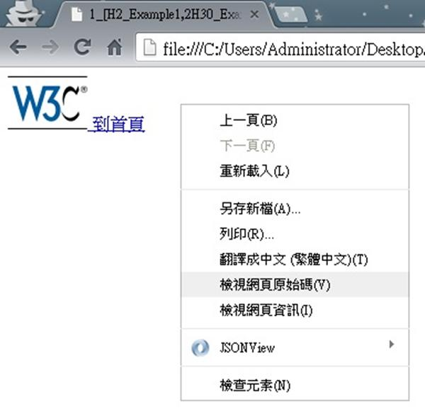
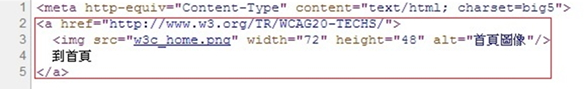

# HM1240402E 合併相同資源的毗鄰圖片與文字鏈結

- **稽核評量碼**：HM1240402E
- **對應成功準則**：2.4.4
- **對應認證等級**：A
- **對應國際技術碼**：H2
- **類別**：HTML
- **訊息**：合併相同資源的毗鄰圖片與文字鏈結
- **英文訊息**：H2: Combining adjacent image and text links for the same resource

## 規則說明

任何在HTML或XHTML的網頁內，有相鄰的文字及圖片之鏈結目的為相同時，都必須要遵守此指引。

## 檢測說明

1. 使用Google Chrome「檢視原始碼」顯示連結(按下右鍵→檢視原始碼)。
2. 檢查敘述文字和圖片來源是否有被包含在``連結區塊內，並點擊文字及圖片鏈結來驗證。

## 說明

無

## 範例

**圖片說明：** 瀏覽器開啟範例頁面，頁面顯示 W3C 標誌圖片與「到首頁」文字相鄰排列，兩者均為指向同一目的地的鏈結。頁面彈出右鍵選單，顯示「檢視網頁原始碼」選項，示範可透過原始碼確認圖片與文字鏈結是否合併為同一個 `<a>` 元素。

**圖片說明：** 「檢視網頁原始碼」顯示的 HTML 程式碼，以紅框標示第2至5行：同一個 `<a href="http://www.w3.org/TR/WCAG20-TECHS/">` 鏈結標籤內同時包含圖片 `` 與文字「到首頁」，兩者被合併在同一鏈結區塊內。示範將相同目的地的毗鄰圖片與文字合併為單一鏈結的正確實作方式，避免螢幕報讀器重複朗讀兩個指向相同資源的鏈結。
