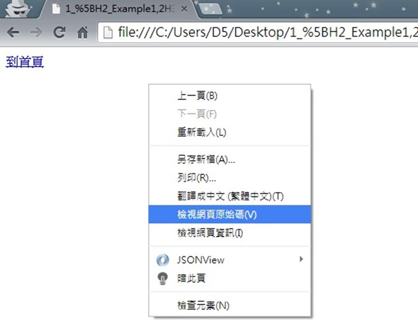
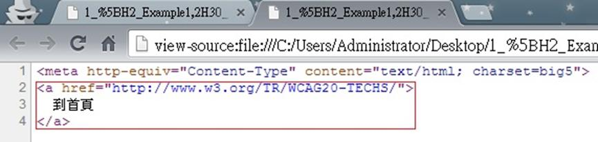

# HM1240403E 提供描述鏈結組件鏈結目的的鏈結文字

- **稽核評量碼**：HM1240403E
- **對應成功準則**：2.4.4
- **對應認證等級**：A
- **對應國際技術碼**：H30
- **類別**：HTML
- **訊息**：提供描述鏈結組件鏈結目的的鏈結文字
- **英文訊息**：H30: Providing link text that describes the purpose of a link for anchor elements

## 規則說明

任何在HTML或XHTML的網頁內存在鏈結，都需要遵守此指引。

## 檢測說明

1. 使用Google Chrome「檢視原始碼」顯示連結(按下右鍵→檢視原始碼)。
2. 檢查是否使用Anchor標籤，且``連結區塊內是否有提供描述鏈結目的的文字，並點擊連結來驗證。

## 說明

無

## 範例

**圖片說明：** 瀏覽器開啟範例頁面，頁面左上角顯示「到首頁」藍色鏈結文字，清楚描述鏈結的目的（前往首頁）。頁面彈出右鍵選單，「檢視網頁原始碼」選項以藍色反白標示，示範可透過原始碼確認鏈結文字是否清楚描述鏈結目的。

**圖片說明：** 「檢視網頁原始碼」顯示的 HTML 程式碼，第2至4行以紅框標示：`<a href="http://www.w3.org/TR/WCAG20-TECHS/">` 鏈結標籤內包含「到首頁」文字，`</a>` 結束標籤閉合鏈結區塊。示範在 Anchor 元素內提供清楚描述鏈結目的的文字，讓使用者（包括螢幕報讀器使用者）能從鏈結文字本身了解鏈結的目的地。
