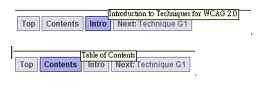
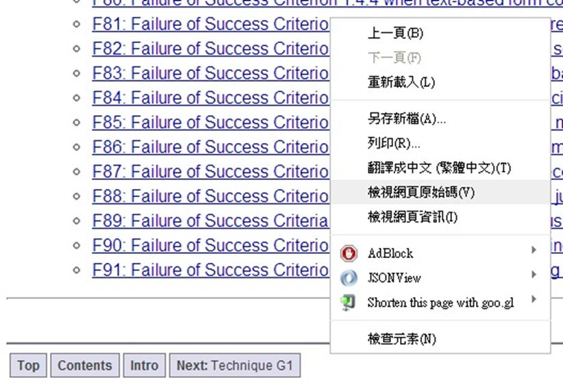
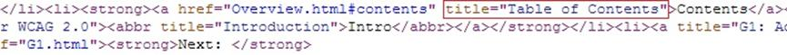

# HM1240404E 針對脈絡中的鏈結，用標題屬性來補充鏈結文字

- **稽核評量碼**：HM1240404E
- **對應成功準則**：2.4.4
- **對應認證等級**：A
- **對應國際技術碼**：H33
- **類別**：HTML
- **訊息**：針對脈絡中的鏈結，用標題屬性來補充鏈結文字
- **英文訊息**：H33: Supplementing link text with the title attribute

## 規則說明

任何在HTML或XHTML的網頁內，當鏈結文字描述鏈結目的不夠明確時，須加上標題屬性來補充鏈結文字。

## 檢測說明

1. 滑鼠移到鏈結上，檢查是否有出現說明文字。
2. 使用Google Chrome「檢視原始碼」顯示連結 (按下右鍵→檢視原始碼)。
3. 檢查`<a href="…">`連結區塊內是否有title屬性的補充說明文字。

## 說明

無

## 範例

**圖片說明：** 範例頁面截圖，顯示兩個導覽列工具列：上方工具列中「Intro」按鈕以藍色標示為目前頁面，滑鼠懸停時顯示「Introduction to Techniques for WCAG 2.0」提示文字；下方工具列中「Contents」按鈕以藍色標示，顯示「Table of Contents」提示文字。示範當鏈結文字（如「Intro」、「Contents」）不夠明確時，透過 `title` 屬性提供補充說明，讓使用者能了解鏈結的完整目的。

**圖片說明：** 瀏覽器開啟 WCAG 2.0 技術文件頁面，顯示多個「Failure of Success Criterion」鏈結清單（F80–F91），以及頁面底部的導覽按鈕列（Top、Contents、Intro、Next: Technique G1）。頁面彈出右鍵選單，「檢視網頁原始碼」選項反白顯示，示範可透過原始碼確認鏈結是否使用 `title` 屬性補充說明。

**圖片說明：** 「檢視網頁原始碼」顯示的 HTML 程式碼，以紅框標示 `title="Table of Contents"` 屬性：`<a href="Overview.html#contents" title="Table of Contents">Contents</a>`，並包含 `<abbr title="Introduction">Intro</abbr>` 縮寫元素。示範透過 `title` 屬性補充鏈結文字「Contents」的完整說明「Table of Contents」，讓短鏈結文字配合 `title` 屬性提供清楚的鏈結目的描述。
