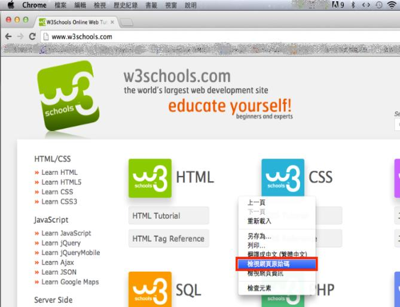
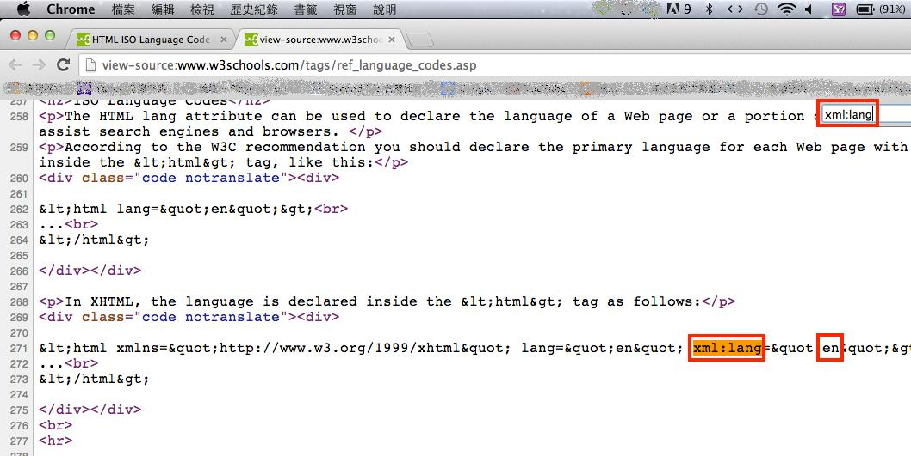

# HM2310200E 明確地指出網頁內容中人類語言的轉換

- **稽核評量碼**：HM2310200E
- **對應成功準則**：3.1.2
- **對應認證等級**：AA
- **對應國際技術碼**：H58
- **類別**：HTML
- **訊息**：明確地指出網頁內容中人類語言的轉換
- **英文訊息**：H58: Using language attributes to identify changes in the human language

## 規則說明
可知道網頁使用何種語言。 當A語言為主的網頁中有一段B語言時，可以用此方式檢測。

## 檢測說明
以google chrome瀏覽器為例，在網頁上按右鍵選擇"檢視網頁原始碼"。 搜尋xml:lang=""，即可查看""裡的語言為何，例如：Zh-tw為繁體中文、de為德語、fr為法語等。

## 說明
無

## 範例

**圖片說明：** Mac 版 Chrome 瀏覽器開啟 w3schools.com 首頁截圖，顯示 w3schools 標誌與「educate yourself!」標語，左側有 HTML/CSS、JavaScript 等課程分類鏈結，右側有 HTML、CSS 等技術圖示與按鈕。頁面彈出右鍵選單，「檢視網頁原始碼」選項以藍色反白標示，示範可透過原始碼確認網頁語言屬性的設定。

**圖片說明：** w3schools.com 網站的 HTML 原始碼截圖（view-source:www.w3schools.com/tags/ref_language_codes.asp），第258行以紅框標示 `xml:lang` 關鍵字，第271行顯示 XHTML 語言宣告範例：`<html xmlns="http://www.w3.org/1999/xhtml" lang="en" xml:lang="en">`，其中 `xml:lang` 與 `en` 均以紅框標示。示範在 XHTML 文件中同時使用 `lang` 與 `xml:lang` 屬性明確指出語言，當網頁主語言之外出現其他語言片段時，可在對應元素上加上 `lang` 屬性標示語言轉換。
