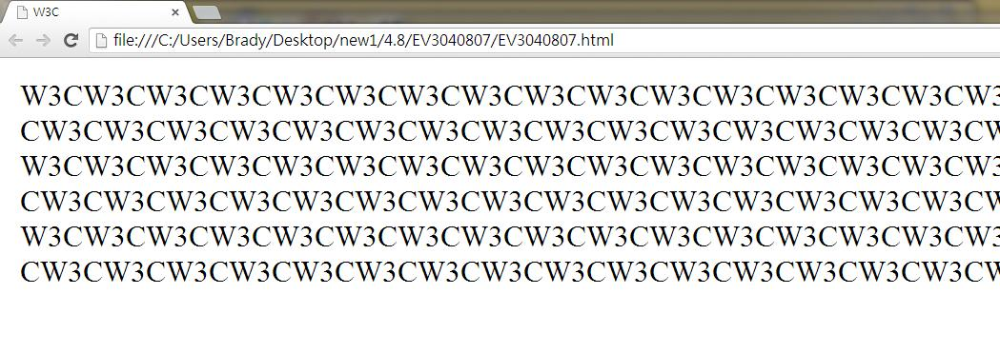
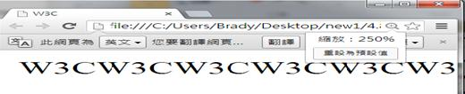
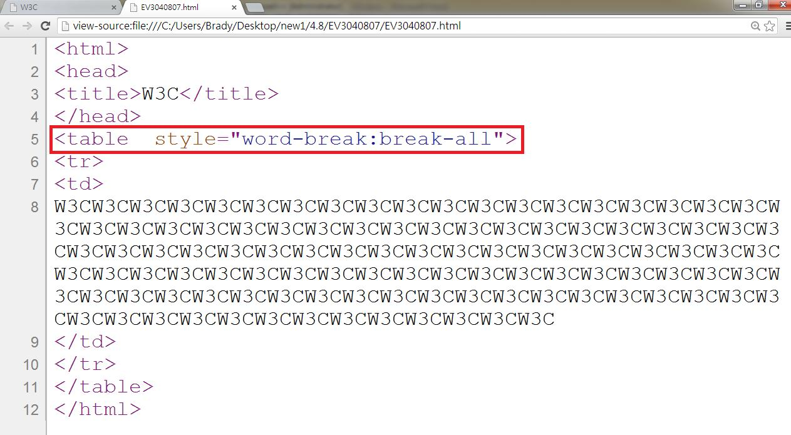

# HM3140806E 除非是要在內容當中提供選項讓使用者可以切換到無需水平捲動即可閱讀整行文字的版面，否則當檢視視窗變窄時，不要干預使用者代理的文字重新流向

- **稽核評量碼**：HM3140806E
- **對應成功準則**：1.4.8
- **對應認證等級**：AAA
- **對應國際技術碼**：G204、G206
- **類別**：HTML
- **訊息**：除非是要在內容當中提供選項，讓使用者可以切換到無需水平捲動即可閱讀整行文字的版面，否則當檢視視窗變窄時，不要干預使用者代理的文字重新流向
- **英文訊息**：G204: Not interfering with the user agent's reflow of text as the viewing window is narrowed / G206: Providing options within the content to switch to a layout that does not require the user to scroll horizontally to read a line of text

## 規則說明

任何在HTML和XHTML中讓使用者可以切換到無需水平捲動即可閱讀整行文字版面的網頁，都必須要遵守此指引。

## 檢測說明

用chrome打開檔案，會自動換行，此原因為程式碼內有此行程式(此行程式碼只限英文字母上可使用)：`<table style="word-break:break-all">`，可執行自動換行的指令，若去掉此行程式碼則沒有換行功能。

若去掉這行程式碼，則無法自動換行，如此當視窗變窄時，即須拉動卷軸。

檢視原始碼。

## 說明

無
## 範例

**圖片說明：** 介面元素或設計示例的中等規模截圖。

**圖片說明：** 文字或標籤的簡潔示例截圖。

**圖片說明：** 網頁原始碼的瀏覽器檢視截圖，展示HTML標記和CSS樣式定義。