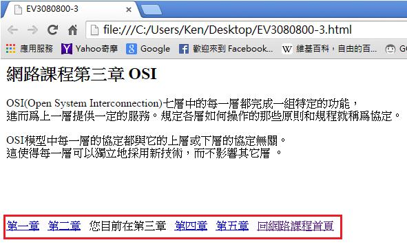
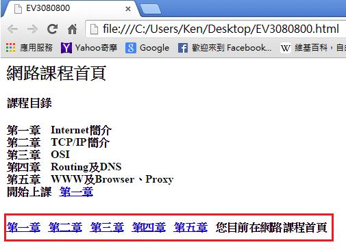

# HM3240800E 使用導覽工具，指明目前所在網頁在一整組網頁或整個網站中的位置，以及與其他網頁之間的關連性

- **稽核評量碼**：HM3240800E
- **對應成功準則**：2.4.8
- **對應認證等級**：AAA
- **對應國際技術碼**：H59
- **類別**：HTML
- **訊息**：使用導覽工具，指明目前所在網頁在一整組網頁或整個網站中的位置，以及與其他網頁之間的關連性
- **英文訊息**：G63: Providing a site map G65: Providing a breadcrumb trail G127: Identifying a Web page's relationship to a larger collection of Web pages G128: Indicating current location within navigation bars H59: Using the link element and navigation tools

## 規則說明
使用者能透過該網頁所提供的指示來了解，目前所在網頁在整個網站的位置及關連性。

## 檢測說明
使用Google Chrome瀏覽器開啟檔案。此範例中，網際網路課程共五章，而使用者目前位置是在第三章。 點選右下角的指引"回網路課程首頁"後，就會回到課程首頁。

## 說明
無

## 範例

**圖片說明：** 瀏覽器開啟「EV3080800-3.html」頁面，顯示「網路課程第三章 OSI」主標題及課程內容說明文字。頁面底部以紅框標示導覽列，包含「第一章」、「第二章」、「您目前在第三章」、「第四章」、「第五章」、「回網路課程首頁」等鏈結，其中「您目前在第三章」為文字說明（非鏈結），清楚指示使用者目前所在位置。示範使用導覽工具指明目前網頁在整組網頁中的位置及關連性。

**圖片說明：** 瀏覽器開啟「EV3080800.html」網路課程首頁，顯示「課程目錄」列出第一章至第五章的課程名稱（Internet簡介、TCP/IP簡介、OSI、Routing及DNS、WWW及Browser、Proxy），並有「開始上課 第一章」鏈結。頁面底部以紅框標示導覽列：「第一章」、「第二章」、「第三章」、「第四章」、「第五章」、「您目前在網路課程首頁」，清楚指示使用者目前位於課程首頁。示範在網站各層級頁面中提供位置指示導覽，幫助使用者了解與其他網頁的關連性。
