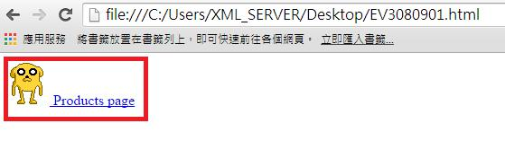
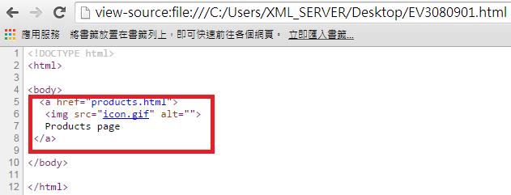

# HM3240901E 針對單獨存在的鏈結，合併相同資源的毗鄰圖片與文字鏈結

- **稽核評量碼**：HM3240901E
- **對應成功準則**：2.4.9
- **對應認證等級**：AAA
- **對應國際技術碼**：H2
- **類別**：HTML
- **訊息**：針對單獨存在的鏈結，合併相同資源的毗鄰圖片與文字鏈結。
- **英文訊息**：H2: Combining adjacent image and text links for the same resource

## 規則說明
這種技術是提供文本和圖片在共為一個鏈結的時候，不會讓鍵盤或輔具使用者在操作網頁上感到混淆或困難。

## 檢測說明
使用Google Chrome瀏覽器開啟檔案。此範例中，具有相同鏈結的圖片及文字。 可點選右鍵檢視網頁原始碼。

## 說明
無

## 範例

**圖片說明：** 瀏覽器開啟「EV3080901.html」範例頁面，以紅框標示一個包含卡通狗圖示與「Products page」文字的組合鏈結，圖片與文字被合併在同一個鏈結區塊內，點擊圖片或文字均會前往同一目的地。示範將指向相同資源的毗鄰圖片與文字合併為單一鏈結，避免螢幕報讀器重複朗讀兩個相同目的地的鏈結。

**圖片說明：** 「EV3080901.html」的 HTML 原始碼，第5至8行以紅框標示：同一個 `<a href="products.html">` 鏈結標籤內包含 `` 圖片元素（alt 屬性設為空字串，因為文字鏈結已提供描述）與文字「Products page」，兩者合併在同一個 `</a>` 閉合的鏈結區塊內。示範將毗鄰圖片與文字鏈結合併為單一鏈結的正確實作方式，圖片 alt 設為空字串以避免螢幕報讀器重複朗讀。
