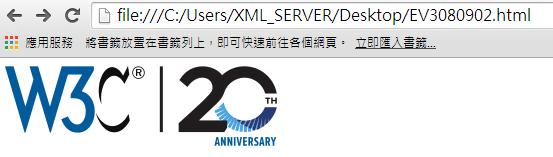
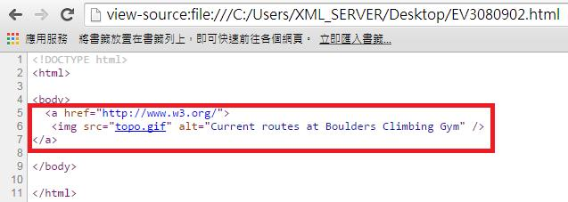

# HM3240902E 針對單獨存在的鏈結，提供描述鏈結組件鏈結目的的鏈結文字

- **稽核評量碼**：HM3240902E
- **對應成功準則**：2.4.9
- **對應認證等級**：AAA
- **對應國際技術碼**：H30
- **類別**：HTML
- **訊息**：針對單獨存在的鏈結，提供描述鏈結組件鏈結目的的鏈結文字
- **英文訊息**：H30: Providing link text that describes the purpose of a link for anchor elements

## 規則說明
圖片超連結的替代文字具有描述鏈結目的的功能。

## 檢測說明
使用Google Chrome瀏覽器開啟檔案。此範例中，圖片具有鏈結功能。 可點選右鍵檢視網頁原始碼。使用alt屬性的img標籤來描述一個圖形鏈結的目的。

## 說明
無

## 範例

**圖片說明：** 瀏覽器開啟「EV3080902.html」範例頁面，顯示 W3C 標誌與「20TH ANNIVERSARY」紀念圖片的組合圖示，整個圖片為一個可點擊的超連結。示範使用圖片作為鏈結組件時，須透過 alt 屬性提供描述鏈結目的的替代文字，讓螢幕報讀器使用者能了解鏈結的目的地。

**圖片說明：** 「EV3080902.html」的 HTML 原始碼，第5至7行以紅框標示：`<a href="http://www.w3.org/">` 鏈結標籤內包含 ``，圖片的 `alt` 屬性設為「Current routes at Boulders Climbing Gym」以描述鏈結目的地。示範當鏈結僅包含圖片時，使用 `img` 標籤的 `alt` 屬性提供描述鏈結目的的文字，確保圖形鏈結對螢幕報讀器使用者具有可識別的鏈結說明。
