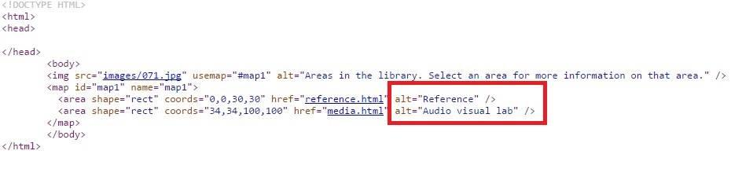

# HM3240904E 針對單獨存在的影像地圖區域，提供有意義的替代文字

- **稽核評量碼**：HM3240904E
- **對應成功準則**：2.4.9
- **對應認證等級**：AAA
- **對應國際技術碼**：H24
- **類別**：HTML
- **訊息**：針對單獨存在的影像地圖區域，提供有意義的替代文字
- **英文訊息**：H24: Providing text alternatives for the area elements of image maps

## 規則說明
所有單獨存在的影像地圖區域都必須遵守此指引。

## 檢測說明
檢視網頁原始碼。 若單獨存在影像地圖的標籤，要有替代文字alt屬性，對其作敘述。

## 說明
無

## 範例

**圖片說明：** 範例頁面顯示「IMAGETODAY Design source」設計素材圖片，圖片包含彩色花卉、蝴蝶及幾何圓形等圖案，為一張影像地圖（image map）的展示素材。圖片上有不同的可點擊區域（area），各區域連結至不同的目的地頁面。

**圖片說明：** 範例頁面的 HTML 原始碼，顯示影像地圖實作：``，以及 `<map id="map1" name="map1">` 內的兩個 `<area>` 元素，以紅框標示其 `alt` 屬性：第一個 `<area shape="rect" coords="0,0,30,30" href="reference.html" alt="Reference" />`，第二個 `<area shape="rect" coords="34,34,100,100" href="media.html" alt="Audio visual lab" />`。示範為影像地圖的每個 `<area>` 元素提供有意義的替代文字，讓螢幕報讀器使用者能了解各可點擊區域的鏈結目的。
