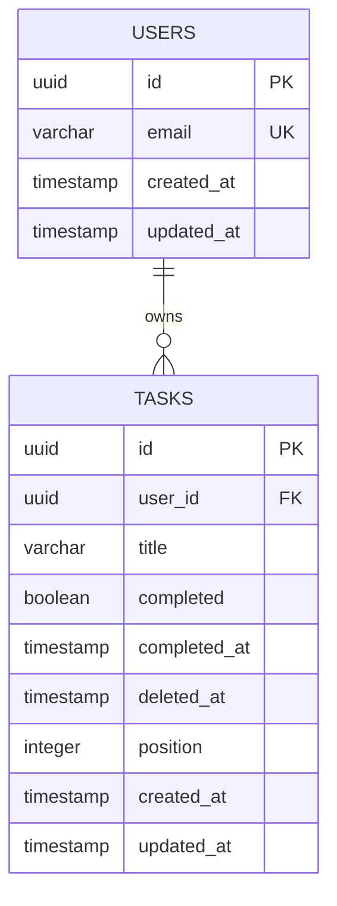
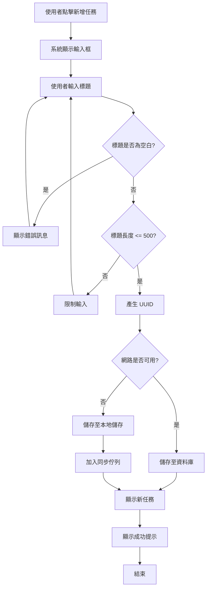
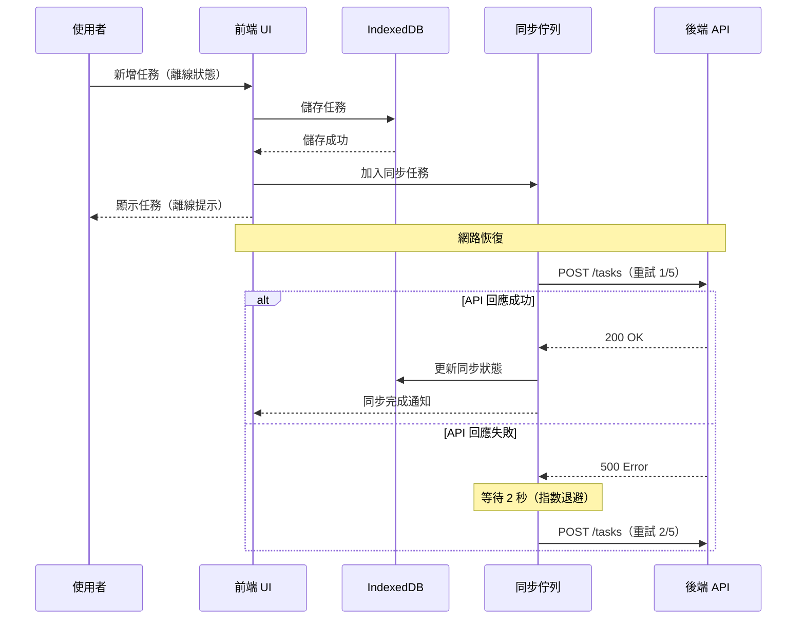

# 多語言支援測試 - System Analyst (繁體中文)

## 測試場景
測試 devteam System Analyst 角色在繁體中文對話環境下的表現，基於之前的需求文件生成系統分析文件。

## 模擬對話情境
**使用者**：「請根據需求文件產生系統分析文件。」
**輸入**：Product Manager 產出的需求文件（待辦事項應用程式）

## System Analyst 回應（AI 依偵測語言生成：繁體中文）

---

# 系統分析文件

## 需求追溯性

| 需求 ID | 來源 | 系統元件 | 優先級 |
|---------|------|----------|--------|
| REQ-001 | FR-001 任務建立 | 任務管理模組 | 必須具備 |
| REQ-002 | FR-002 任務編輯 | 任務管理模組 | 必須具備 |
| REQ-003 | FR-003 任務刪除 | 任務管理模組 | 必須具備 |
| REQ-004 | FR-004 任務狀態切換 | 任務管理模組 | 應該具備 |
| REQ-005 | NFR-001 效能需求 | 全系統 | 必須具備 |
| REQ-006 | NFR-002 易用性需求 | 前端 UI | 必須具備 |
| REQ-007 | NFR-003 資料完整性 | 資料層 | 必須具備 |

---

## 使用案例

### UC-001：建立任務
**參與者**：使用者  
**目標**：快速新增待辦任務

**前置條件**：
- 使用者已登入系統
- 使用者具備新增任務權限

**主要流程**：
1. 使用者在任務清單頁面點擊「新增任務」按鈕
2. 系統顯示任務輸入框（焦點自動進入）
3. 使用者輸入任務標題（1-500 字元）
4. 使用者按下 Enter 鍵或點擊「儲存」按鈕
5. 系統驗證標題不為空白
6. 系統產生新任務 UUID
7. 系統儲存任務至資料庫（包含建立時間戳記）
8. 系統在清單頂部顯示新任務（< 200ms）
9. 系統顯示成功提示訊息（2 秒後自動消失）

**替代流程**：
- **3a. 使用者輸入空白標題**
  - 系統顯示錯誤訊息：「任務標題不可為空白」
  - 輸入框顯示紅色邊框
  - 焦點保持在輸入框
  - 返回步驟 3

- **3b. 使用者輸入超過 500 字元**
  - 系統在第 500 字元處停止接受輸入
  - 顯示字元計數器：「500/500」
  - 使用者可刪除字元以繼續編輯

- **7a. 資料庫儲存失敗（網路錯誤）**
  - 系統將任務儲存至本地儲存（IndexedDB）
  - 系統顯示離線提示：「已儲存至本地，上線後將自動同步」
  - 系統將任務加入同步佇列
  - 當網路恢復時，系統自動重試上傳（最多 5 次，指數退避）

**後置條件**：
- 新任務已儲存（資料庫或本地儲存）
- 任務顯示在使用者的清單中
- 任務具備唯一 UUID 與建立時間戳記

**非功能需求**：
- 任務新增操作必須在 200ms 內完成（前端回應）
- 若資料庫操作超過 500ms，顯示 loading 狀態

---

### UC-002：編輯任務
**參與者**：使用者  
**目標**：修改現有任務的標題

**前置條件**：
- 使用者已登入系統
- 至少存在一個任務
- 任務未被刪除（deleted_at IS NULL）

**主要流程**：
1. 使用者在清單中點擊任務標題
2. 系統進入編輯模式（標題變成可編輯輸入框）
3. 系統全選現有文字
4. 使用者修改標題
5. 使用者按 Enter 鍵或點擊外部區域（失去焦點）
6. 系統驗證新標題不為空白
7. 系統比較新舊標題，若相同則跳過儲存
8. 系統更新資料庫（updated_at 時間戳記）
9. 系統退出編輯模式，顯示更新後的標題
10. 系統記錄編輯歷史（用於 5 秒內復原功能）

**替代流程**：
- **5a. 使用者按 Esc 鍵**
  - 系統取消編輯，恢復原始標題
  - 退出編輯模式

- **6a. 使用者輸入空白標題**
  - 系統顯示錯誤訊息：「任務標題不可為空白」
  - 保持編輯模式，焦點在輸入框
  - 返回步驟 4

- **8a. 資料庫更新失敗**
  - 系統恢復原始標題（UI 回滾）
  - 顯示錯誤提示：「更新失敗，請稍後再試」
  - 提供「重試」按鈕

**後置條件**：
- 任務標題已更新
- updated_at 時間戳記已更新
- 編輯歷史已記錄（供復原功能使用）

**復原功能**：
- 編輯完成後，顯示「復原」按鈕（5 秒）
- 點擊復原後，恢復至編輯前的標題
- 5 秒後自動隱藏復原按鈕

---

### UC-003：刪除任務
**參與者**：使用者  
**目標**：移除不需要的任務

**前置條件**：
- 使用者已登入系統
- 至少存在一個任務
- 任務未被刪除（deleted_at IS NULL）

**主要流程**：
1. 使用者將滑鼠懸停在任務上
2. 系統顯示刪除按鈕（垃圾桶圖示）
3. 使用者點擊刪除按鈕
4. 系統顯示確認對話框：「確定要刪除此任務嗎？刪除後可在 30 天內復原。」
5. 使用者點擊「確定」按鈕
6. 系統執行軟刪除（設定 deleted_at = NOW()）
7. 系統從清單中移除該任務（淡出動畫，300ms）
8. 系統顯示「已刪除」提示訊息（含「復原」連結，5 秒）

**替代流程**：
- **5a. 使用者點擊「取消」按鈕**
  - 系統關閉確認對話框
  - 任務保持不變

- **6a. 資料庫更新失敗**
  - 系統不移除任務
  - 顯示錯誤提示：「刪除失敗，請檢查網路連線」

- **8a. 使用者點擊「復原」連結（5 秒內）**
  - 系統清除 deleted_at（設為 NULL）
  - 任務重新出現在清單中（淡入動畫）
  - 顯示「已復原」提示訊息

**批次刪除流程**：
1. 使用者勾選多個任務（顯示勾選框）
2. 系統顯示「刪除選取的 X 個任務」按鈕
3. 使用者點擊批次刪除按鈕
4. 系統顯示確認對話框：「確定要刪除 X 個任務嗎？」
5. 使用者確認後，系統批次執行軟刪除
6. 所有選取的任務從清單中移除

**後置條件**：
- 任務已軟刪除（deleted_at 有值）
- 任務不顯示在預設清單中
- 使用者可在「回收桶」中檢視已刪除任務（30 天內）
- 30 天後，系統自動執行硬刪除（定期任務）

---

### UC-004：切換任務狀態
**參與者**：使用者  
**目標**：標記任務為完成或待辦

**前置條件**：
- 使用者已登入系統
- 至少存在一個任務
- 任務未被刪除

**主要流程**：
1. 使用者點擊任務前方的勾選框
2. 系統切換 completed 狀態（true ↔ false）
3. 系統更新資料庫
4. 若標記為完成：
   - 設定 completed_at = NOW()
   - 任務文字顯示刪除線樣式
   - 任務透明度變為 60%
5. 若取消完成：
   - 設定 completed_at = NULL
   - 移除刪除線樣式
   - 任務透明度恢復 100%
6. 系統記錄狀態變更歷史

**替代流程**：
- **3a. 資料庫更新失敗**
  - 系統回滾勾選框狀態
  - 顯示錯誤提示
  - 任務樣式不變

**後置條件**：
- 任務 completed 欄位已更新
- completed_at 時間戳記已設定或清除
- 任務樣式已更新（刪除線、透明度）

**篩選功能**：
- 使用者可透過篩選器切換顯示：
  - 全部任務
  - 僅待辦任務（completed = false）
  - 僅已完成任務（completed = true）

---

## 資料模型

### ERD（實體關係圖）



### 資料字典

#### `users` 資料表
| 欄位 | 型別 | 限制 | 說明 |
|------|------|------|------|
| id | UUID | PRIMARY KEY, NOT NULL | 使用者唯一識別碼 |
| email | VARCHAR(255) | UNIQUE, NOT NULL | 使用者電子郵件（登入帳號） |
| created_at | TIMESTAMP | DEFAULT NOW() | 帳號建立時間 |
| updated_at | TIMESTAMP | DEFAULT NOW() | 帳號最後更新時間 |

#### `tasks` 資料表
| 欄位 | 型別 | 限制 | 說明 |
|------|------|------|------|
| id | UUID | PRIMARY KEY, NOT NULL | 任務唯一識別碼 |
| user_id | UUID | FOREIGN KEY, NOT NULL | 任務擁有者（關聯 users.id） |
| title | VARCHAR(500) | NOT NULL | 任務標題（1-500 字元） |
| completed | BOOLEAN | DEFAULT FALSE | 任務完成狀態 |
| completed_at | TIMESTAMP | NULLABLE | 任務完成時間戳記 |
| deleted_at | TIMESTAMP | NULLABLE | 軟刪除時間戳記（NULL = 未刪除） |
| position | INTEGER | NULLABLE | 使用者自訂排序（用於拖放排序） |
| created_at | TIMESTAMP | DEFAULT NOW() | 任務建立時間 |
| updated_at | TIMESTAMP | DEFAULT NOW() | 任務最後更新時間 |

**索引設計**：
```sql
-- 提升查詢效能的索引
CREATE INDEX idx_user_tasks ON tasks(user_id, deleted_at, position);
CREATE INDEX idx_task_status ON tasks(completed, completed_at);
```

**外鍵約束**：
```sql
ALTER TABLE tasks 
ADD CONSTRAINT fk_task_user 
FOREIGN KEY (user_id) REFERENCES users(id) ON DELETE CASCADE;
```
說明：當使用者被刪除時，其所有任務也會被刪除（CASCADE）

---

## 業務規則

### BR-001：任務標題驗證
- **規則**：任務標題長度必須在 1-500 字元之間
- **驗證時機**：建立任務、編輯任務時
- **錯誤訊息**：「任務標題不可為空白」或「任務標題不可超過 500 字元」

### BR-002：軟刪除機制
- **規則**：刪除任務時設定 deleted_at 時間戳記，不實際刪除記錄
- **復原期限**：30 天
- **硬刪除時機**：定期任務（每日 2:00 AM）清理 30 天前的軟刪除記錄

### BR-003：任務擁有權
- **規則**：使用者只能存取自己的任務
- **實作方式**：PostgreSQL Row Level Security (RLS)
- **政策**：
  ```sql
  CREATE POLICY "Users can only see their own tasks"
  ON tasks FOR SELECT
  USING (auth.uid() = user_id);
  ```

### BR-004：完成狀態時間戳記
- **規則**：
  - 當任務標記為完成（completed = true）時，設定 completed_at = NOW()
  - 當任務取消完成（completed = false）時，清除 completed_at = NULL
- **用途**：追蹤任務完成時間，產生統計報表

### BR-005：自動儲存機制
- **規則**：使用者編輯任務時，每 2 秒自動儲存一次
- **實作方式**：前端 debounce 函數
- **優先級**：使用者主動儲存（Enter 鍵）> 自動儲存

### BR-006：離線同步策略
- **規則**：離線時的變更儲存至本地，上線後自動同步
- **衝突處理**：Last-Write-Wins（最後寫入優先）
- **重試機制**：失敗後指數退避重試（最多 5 次）

---

## 流程圖

### 任務建立流程（Activity Diagram）



### 離線同步流程（Sequence Diagram）



---

## API 規格

### API-001：建立任務
**端點**：`POST /rest/v1/tasks`  
**認證**：Bearer Token（Supabase Auth）

**請求格式**：
```json
{
  "title": "完成系統分析文件",
  "position": 0
}
```

**回應格式（成功）**：
```json
{
  "id": "550e8400-e29b-41d4-a716-446655440000",
  "user_id": "7c9e6679-7425-40de-944b-e07fc1f90ae7",
  "title": "完成系統分析文件",
  "completed": false,
  "completed_at": null,
  "deleted_at": null,
  "position": 0,
  "created_at": "2026-01-31T10:30:00Z",
  "updated_at": "2026-01-31T10:30:00Z"
}
```

**錯誤回應**：
| 狀態碼 | 錯誤訊息 | 情境 |
|--------|---------|------|
| 400 | Title is required | 標題為空白 |
| 400 | Title too long (max 500 chars) | 標題超過 500 字元 |
| 401 | Unauthorized | Token 無效或過期 |
| 500 | Internal server error | 資料庫連線失敗 |

---

### API-002：更新任務
**端點**：`PATCH /rest/v1/tasks?id=eq.{uuid}`  
**認證**：Bearer Token

**請求格式**：
```json
{
  "title": "完成系統分析文件（已修訂）",
  "completed": true
}
```

**回應格式（成功）**：
```json
{
  "id": "550e8400-e29b-41d4-a716-446655440000",
  "title": "完成系統分析文件（已修訂）",
  "completed": true,
  "completed_at": "2026-01-31T10:45:00Z",
  "updated_at": "2026-01-31T10:45:00Z"
}
```

---

### API-003：刪除任務（軟刪除）
**端點**：`PATCH /rest/v1/tasks?id=eq.{uuid}`  
**認證**：Bearer Token

**請求格式**：
```json
{
  "deleted_at": "2026-01-31T10:50:00Z"
}
```

---

### API-004：取得任務清單
**端點**：`GET /rest/v1/tasks?select=*&order=position.asc`  
**認證**：Bearer Token

**查詢參數**：
- `deleted_at=is.null`：排除已刪除任務
- `completed=eq.false`：僅顯示待辦任務
- `completed=eq.true`：僅顯示已完成任務

**回應格式**：
```json
[
  {
    "id": "550e8400-e29b-41d4-a716-446655440000",
    "title": "任務 1",
    "completed": false,
    "position": 0
  },
  {
    "id": "6ba7b810-9dad-11d1-80b4-00c04fd430c8",
    "title": "任務 2",
    "completed": true,
    "position": 1
  }
]
```

---

## 測試驗證

✅ **語言偵測**：文件以繁體中文生成  
✅ **結構完整性**：包含需求追溯性、使用案例、資料模型、業務規則、流程圖、API 規格  
✅ **使用案例品質**：
- 詳細的主要流程與替代流程
- 明確的前置/後置條件
- 涵蓋錯誤情境（空白標題、網路失敗、資料庫錯誤）

✅ **資料模型**：
- Mermaid ERD 圖清晰易懂
- 資料字典完整（欄位、型別、限制、說明）
- 索引與外鍵約束已定義

✅ **業務規則**：
- 驗證規則明確（1-500 字元）
- 軟刪除機制詳細（30 天復原期）
- 安全規則（RLS 政策）

✅ **流程圖**：
- Mermaid Activity Diagram（任務建立流程）
- Mermaid Sequence Diagram（離線同步流程）

✅ **API 規格**：
- 完整的請求/回應格式
- 錯誤情境與狀態碼
- 查詢參數說明

✅ **Persona 模擬**：
- 結構化與詳細（使用表格、圖表）
- 視覺化（Mermaid 圖表）
- 可追溯性（需求 ID 關聯）

✅ **批判性思考**：
- 識別邊界情況（空白標題、超長標題、網路失敗）
- 挑戰假設（離線情境、資料庫失敗）
- 完整性驗證（所有需求都有對應規格）

---

**結論**：System Analyst JD 成功引導 AI 生成高品質的繁體中文系統分析文件，包含完整的使用案例、資料模型、業務規則、流程圖與 API 規格。
