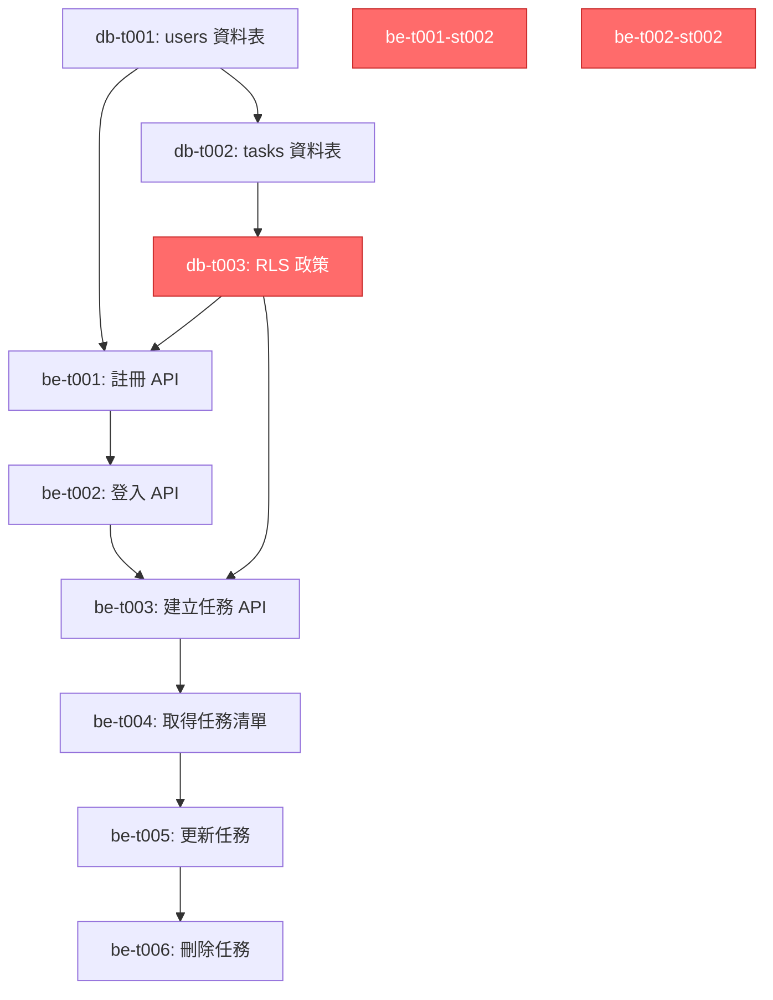

# 多語言支援測試 - Dev Lead (繁體中文)

## 測試場景
測試優化後的 Dev Lead JD 是否能引導 AI 產生高品質的任務拆解文件，重點驗證：
1. 原子化拆解（每個任務 ≤ 1-2 天）
2. 安全思維整合（CISSP）
3. Forbidden Patterns 遵守

## 模擬對話情境
**使用者**：「請根據系統分析文件產生詳細的任務拆解。」
**輸入**：
- Product Manager 產出的需求文件
- System Architect 產出的系統架構
- System Analyst 產出的系統分析文件（chinese-analyst-test.md）

## Dev Lead 回應（AI 依偵測語言生成：繁體中文）

---

# 任務拆解概述

## 專案資訊
- **專案名稱**：待辦事項應用程式（Todo List Application）
- **MVP 範圍**：任務建立、編輯、刪除、狀態切換 + 離線同步
- **目標交付時間**：6 週
- **技術棧**：Vue 3 + Nuxt 4 + Supabase + PostgreSQL + Tailwind CSS

---

## 階段劃分

### Phase 1：基礎建設（第 1-2 週）
**目標**：完成資料庫、驗證系統、基本 CRUD API

**里程碑驗收標準**：
- 使用者可註冊、登入
- 基本任務 CRUD 功能可用（API 層級）
- 單元測試覆蓋率 > 80%

---

### Phase 2：前端實作（第 3-4 週）
**目標**：完成 UI/UX、響應式設計、離線功能

**里程碑驗收標準**：
- 使用者可在瀏覽器中操作所有功能
- UI 符合 WCAG 2.1 AA 標準
- 離線模式可正常運作

---

### Phase 3：測試與部署（第 5-6 週）
**目標**：完整測試、效能優化、正式部署

**里程碑驗收標準**：
- E2E 測試覆蓋率 > 90%
- 效能符合 NFR 要求（< 2s 頁面載入）
- 正式環境部署完成

---

## Phase 1 詳細任務拆解

### 資料庫任務

#### db-t001：建立 users 資料表遷移腳本
**優先級**：必須具備  
**預估時間**：0.5 天  
**依賴**：無

**描述**：
建立 PostgreSQL 遷移腳本，定義 users 資料表結構。

**驗收標準**：
- ✅ 資料表包含所有必要欄位（id, email, created_at, updated_at）
- ✅ id 為 UUID 主鍵，自動產生
- ✅ email 欄位具備 UNIQUE 約束
- ✅ 遷移腳本可執行且可回滾
- ✅ 遷移腳本已加入版本控制

**實作檔案**：
- `migrations/001_create_users_table.sql`

**安全需求（CISSP）**：
- **Confidentiality**：email 欄位不應在日誌中明文顯示
- **Integrity**：UNIQUE 約束防止重複帳號

---

#### db-t002：建立 tasks 資料表遷移腳本
**優先級**：必須具備  
**預估時間**：1 天  
**依賴**：db-t001

**描述**：
建立 tasks 資料表，包含軟刪除、排序欄位、時間戳記。

**驗收標準**：
- ✅ 包含所有欄位（id, user_id, title, completed, completed_at, deleted_at, position, created_at, updated_at）
- ✅ user_id 外鍵關聯 users.id，CASCADE 刪除
- ✅ 建立效能索引（idx_user_tasks, idx_task_status）
- ✅ 遷移腳本可執行且可回滾

**實作檔案**：
- `migrations/002_create_tasks_table.sql`

**安全需求（CISSP）**：
- **Authorization**：外鍵確保任務擁有權
- **Availability**：索引提升查詢效能（防止 DoS）

---

#### db-t003：設定 Row Level Security (RLS) 政策
**優先級**：必須具備（安全關鍵）  
**預估時間**：0.5 天  
**依賴**：db-t002

**描述**：
建立 PostgreSQL RLS 政策，確保使用者只能存取自己的任務。

**驗收標準**：
- ✅ tasks 資料表啟用 RLS
- ✅ SELECT 政策：使用者只能查詢自己的任務
- ✅ INSERT/UPDATE/DELETE 政策：使用者只能操作自己的任務
- ✅ 政策已測試（無法存取其他使用者任務）

**實作檔案**：
- `migrations/003_enable_rls_tasks.sql`

**安全需求（CISSP）**：
- **Confidentiality**：防止跨使用者資料洩漏
- **Authorization**：資料庫層級的存取控制
- **Defense in Depth**：應用層 + 資料庫層雙重防護

**風險等級**：🔴 高風險（安全關鍵任務，需 code review）

---

### 後端任務

#### be-t001：使用者註冊 API
**優先級**：必須具備  
**預估時間**：2 天  
**依賴**：db-t001, db-t002, db-t003

**描述**：
實作 POST /api/auth/register 端點，處理 email/password 註冊流程。

**子任務拆解**：

##### be-t001-st001：輸入驗證
**預估時間**：0.5 天

**驗收標準**：
- ✅ Email 格式驗證（RFC 5322 正規表達式）
- ✅ Password 強度驗證（最少 8 字元、大小寫英文、數字、特殊符號）
- ✅ 檢查 email 唯一性（查詢資料庫）
- ✅ 回傳 400 錯誤與明確錯誤訊息
  - "Invalid email format"
  - "Password must be at least 8 characters with uppercase, number, and symbol"
  - "Email already exists"

**實作檔案**：
- `server/api/auth/register.post.ts`（Nuxt 3 server route）
- `server/utils/validation.ts`（驗證函數）

**單元測試**：
- ✅ 有效的 email/password 通過驗證
- ✅ 無效的 email 格式被拒絕
- ✅ 弱密碼被拒絕
- ✅ 重複 email 被拒絕

**安全需求（CISSP）**：
- **Integrity**：輸入驗證防止 SQL Injection（使用參數化查詢）
- **Availability**：限制密碼複雜度防止暴力破解

---

##### be-t001-st002：密碼雜湊
**預估時間**：0.5 天

**描述**：
使用 bcrypt 進行密碼雜湊處理，cost factor 12。

**驗收標準**：
- ✅ 使用 bcrypt 套件（非 bcryptjs，效能更好）
- ✅ Cost factor 設為 12（安全與效能平衡）
- ✅ 每個使用者產生獨立 salt
- ✅ 原始密碼不儲存、不記錄、不回傳

**實作檔案**：
- `server/utils/auth.ts`（密碼雜湊函數）

**單元測試**：
- ✅ 相同密碼產生不同 hash（salt 隨機性）
- ✅ bcrypt.compare 可驗證密碼
- ✅ Hash 長度符合 bcrypt 格式（60 字元）

**安全需求（CISSP）**：
- **Confidentiality**：密碼以雜湊方式儲存，不可逆
- **Integrity**：Salt 防止彩虹表攻擊
- **OWASP A02:2021**：Cryptographic Failures 防護

**風險等級**：🔴 高風險（密碼處理，需 security review）

---

##### be-t001-st003：Email 驗證流程
**預估時間**：0.5 天

**描述**：
產生驗證 token，發送驗證信，設定 token 過期時間。

**驗收標準**：
- ✅ 產生 UUID v4 verification token
- ✅ Token 儲存至 users 資料表（verification_token, verification_token_expires_at）
- ✅ Token 過期時間為 24 小時
- ✅ 發送驗證信（使用 Supabase Auth 內建功能）
- ✅ Email 非同步發送（不阻塞 API 回應）

**實作檔案**：
- `server/utils/email.ts`（Email 發送函數）
- `server/api/auth/verify.get.ts`（驗證端點）

**單元測試**：
- ✅ Token 格式為 UUID
- ✅ Token 過期時間為 24 小時後
- ✅ 驗證信發送失敗不影響註冊成功

**安全需求（CISSP）**：
- **Integrity**：Email 驗證防止假帳號
- **Availability**：非同步發送防止 Email 服務故障影響註冊

---

##### be-t001-st004：資料庫交易處理
**預估時間**：0.5 天

**描述**：
使用 PostgreSQL 交易確保資料一致性，包含回滾機制。

**驗收標準**：
- ✅ 使用 BEGIN/COMMIT/ROLLBACK 交易
- ✅ 插入 user 使用 RETURNING 子句取得 id
- ✅ 任何步驟失敗時完整回滾
- ✅ 回傳 201 Created 與 user 物件（不含 password）

**實作檔案**：
- `server/api/auth/register.post.ts`（交易邏輯）

**整合測試**：
- ✅ 正常流程：user 建立成功，回傳 201
- ✅ Email 重複：回傳 409 Conflict
- ✅ 資料庫錯誤：回傳 500，資料未寫入

**安全需求（CISSP）**：
- **Integrity**：交易確保資料一致性
- **Confidentiality**：回應不包含敏感資訊（password, token）

---

#### be-t001 完整驗收標準（整合測試）
- ✅ POST /api/auth/register 回傳 201 Created（成功）
- ✅ 回傳 user 物件包含：id, email, created_at
- ✅ 回傳 user 物件不包含：password, verification_token
- ✅ 回傳 400 Bad Request（輸入驗證失敗）
- ✅ 回傳 409 Conflict（email 已存在）
- ✅ 回傳 500 Internal Server Error（資料庫錯誤）
- ✅ API 回應時間 < 500ms（P95）
- ✅ 單元測試覆蓋率 > 90%

---

#### be-t002：使用者登入 API
**優先級**：必須具備  
**預估時間**：1.5 天  
**依賴**：be-t001

**子任務拆解**：

##### be-t002-st001：Email/Password 驗證
**預估時間**：0.5 天

**驗證標準**：
- ✅ 查詢 user by email
- ✅ 使用 bcrypt.compare 驗證密碼
- ✅ 回傳 401 Unauthorized（帳號不存在或密碼錯誤）
- ✅ 錯誤訊息統一（防止帳號探測）："Invalid credentials"

**安全需求（CISSP）**：
- **Confidentiality**：錯誤訊息不洩漏帳號是否存在
- **Availability**：Rate limiting（5 次失敗 /分鐘 /IP）

---

##### be-t002-st002：JWT Token 產生
**預估時間**：0.5 天

**驗收標準**：
- ✅ 使用 Supabase Auth 產生 JWT
- ✅ Token payload 包含：user_id, email, role
- ✅ Access token 有效期：1 小時
- ✅ Refresh token 有效期：7 天
- ✅ 回傳 200 OK 與 tokens

**實作檔案**：
- `server/utils/jwt.ts`（Token 產生函數）

**安全需求（CISSP）**：
- **Confidentiality**：JWT secret 從環境變數讀取，不寫入程式碼
- **Integrity**：JWT 簽章防止竄改
- **Availability**：Token 過期機制防止永久 session

**風險等級**：🔴 高風險（驗證機制，需 security review）

---

##### be-t002-st003：Rate Limiting 實作
**預估時間**：0.5 天

**描述**：
防止暴力破解攻擊，限制登入嘗試次數。

**驗收標準**：
- ✅ 使用 Redis 或記憶體快取記錄失敗次數
- ✅ 5 次失敗後鎖定 5 分鐘（per IP 或 per email）
- ✅ 成功登入後清除失敗記錄
- ✅ 回傳 429 Too Many Requests（超過限制）

**實作檔案**：
- `server/middleware/rateLimit.ts`

**安全需求（CISSP）**：
- **Availability**：防止暴力破解 DoS
- **OWASP A07:2021**：Identification and Authentication Failures 防護

---

#### be-t003：建立任務 API
**優先級**：必須具備  
**預估時間**：1.5 天  
**依賴**：be-t002, db-t003

**子任務拆解**：

##### be-t003-st001：輸入驗證與授權檢查
**預估時間**：0.5 天

**驗收標準**：
- ✅ 驗證 JWT token（middleware）
- ✅ 驗證 title 長度（1-500 字元）
- ✅ 回傳 401 Unauthorized（token 無效）
- ✅ 回傳 400 Bad Request（title 驗證失敗）

**安全需求（CISSP）**：
- **Authorization**：僅認證使用者可建立任務
- **Integrity**：輸入驗證防止 XSS

---

##### be-t003-st002：資料庫插入與 RLS 驗證
**預估時間**：0.5 天

**驗收標準**：
- ✅ 插入 task 至資料庫（user_id 自動設為當前使用者）
- ✅ RLS 政策自動套用（無需額外檢查）
- ✅ 使用 RETURNING 子句回傳完整 task 物件
- ✅ 回傳 201 Created

**整合測試**：
- ✅ 使用者 A 建立的任務，user_id 為 A
- ✅ 使用者 A 無法建立 user_id 為 B 的任務（RLS 阻止）

**安全需求（CISSP）**：
- **Authorization**：RLS 確保任務擁有權
- **Defense in Depth**：應用層驗證 + 資料庫層 RLS

---

##### be-t003-st003：效能優化與快取策略
**預估時間**：0.5 天

**描述**：
確保 API 回應時間 < 200ms。

**驗收標準**：
- ✅ 資料庫查詢使用準備語句（prepared statement）
- ✅ 回應時間 P95 < 200ms
- ✅ 使用 connection pooling（Supabase 內建）

**非功能測試**：
- ✅ 負載測試：100 併發請求，回應時間 < 500ms

---

#### be-t004：取得任務清單 API
**優先級**：必須具備  
**預估時間**：1 天  
**依賴**：be-t003

**子任務拆解**：

##### be-t004-st001：查詢參數處理
**預估時間**：0.5 天

**描述**：
支援篩選（completed）、排序（position）、分頁（limit/offset）。

**驗收標準**：
- ✅ 支援 `?completed=true/false` 篩選
- ✅ 支援 `?deleted_at=is.null` 排除已刪除任務
- ✅ 預設依 position 升冪排序
- ✅ RLS 自動套用（只回傳當前使用者任務）

**實作檔案**：
- `server/api/tasks/index.get.ts`

---

##### be-t004-st002：效能優化與分頁
**預估時間**：0.5 天

**驗收標準**：
- ✅ 使用 LIMIT/OFFSET 分頁（預設 50 筆）
- ✅ 使用索引 idx_user_tasks 加速查詢
- ✅ 回應時間 < 500ms（1000+ 任務情境）

**效能測試**：
- ✅ 使用者有 1000 個任務，查詢時間 < 500ms

---

#### be-t005：更新任務 API
**優先級**：必須具備  
**預估時間**：1 天  
**依賴**：be-t004

**子任務拆解**：

##### be-t005-st001：部分更新邏輯
**預估時間**：0.5 天

**驗收標準**：
- ✅ 支援 PATCH /api/tasks/:id
- ✅ 允許更新 title, completed, position
- ✅ 不允許更新 user_id, id, created_at
- ✅ completed = true 時，自動設定 completed_at = NOW()
- ✅ completed = false 時，清除 completed_at = NULL

---

##### be-t005-st002：RLS 授權檢查
**預估時間**：0.5 天

**驗收標準**：
- ✅ RLS 政策確保使用者只能更新自己的任務
- ✅ 嘗試更新其他使用者任務回傳 404 Not Found（非 403，防止資源探測）
- ✅ 更新成功回傳 200 OK 與更新後的 task

**安全需求（CISSP）**：
- **Authorization**：RLS 防止跨使用者修改
- **Confidentiality**：404 而非 403 防止資源探測

---

#### be-t006：刪除任務 API（軟刪除）
**優先級**：必須具備  
**預估時間**：0.5 天  
**依賴**：be-t005

**驗收標準**：
- ✅ 實作 PATCH /api/tasks/:id（設定 deleted_at = NOW()）
- ✅ RLS 確保授權
- ✅ 回傳 200 OK
- ✅ 任務在 GET /api/tasks?deleted_at=is.null 中不顯示

**業務規則**：
- 30 天後硬刪除（定期任務，Phase 3 實作）

---

### 前端任務（Phase 2 預覽，Phase 1 不實作）

#### fe-t001：Login Page UI
**優先級**：必須具備  
**預估時間**：1.5 天  
**依賴**：be-t002（Login API）

**子任務預覽**：
- fe-t001-st001：表單驗證（即時提示）
- fe-t001-st002：錯誤處理（友善錯誤訊息）
- fe-t001-st003：響應式設計（320px+）
- fe-t001-st004：無障礙設計（WCAG 2.1 AA）

---

## 依賴關係圖



**圖例**：
- 🔴 紅色節點：安全關鍵任務（需 security review）
- → 箭頭：依賴關係（前置任務 → 後續任務）

---

## 關鍵路徑分析

**關鍵路徑（Critical Path）**：
```
db-t001 → db-t002 → db-t003 → be-t001 → be-t002 → be-t003 → be-t004 → be-t005 → be-t006
```

**總時間**：0.5 + 1 + 0.5 + 2 + 1.5 + 1.5 + 1 + 1 + 0.5 = **9.5 天**

**並行機會**：
- db-t001 與 db-t002 可部分並行（db-t002 等待 db-t001 完成後再執行外鍵）
- be-t001 的 4 個子任務可由不同工程師並行（需共享介面定義）

**實際交付時間**（考慮並行）：**約 7-8 天**

---

## 風險管理

### 高風險任務（需特別關注）

| 任務 | 風險類型 | 緩解措施 |
|------|---------|---------|
| db-t003 (RLS) | 安全風險 | Mandatory security code review |
| be-t001-st002 (密碼雜湊) | 安全風險 | 使用 bcrypt，cost factor 12，code review |
| be-t002-st002 (JWT) | 安全風險 | Secret 從環境變數讀取，不寫入程式碼 |
| be-t002-st003 (Rate Limiting) | 可用性風險 | Redis fallback，防止服務故障影響登入 |

---

## 測試策略

### Phase 1 測試覆蓋率目標
- **單元測試**：> 90%（所有 utils 函數、驗證邏輯）
- **整合測試**：> 80%（API 端點、資料庫交易）
- **E2E 測試**：Phase 2 實作

### 測試任務（Phase 1）

#### test-t001：後端單元測試
**預估時間**：1 天  
**依賴**：be-t001, be-t002, be-t003

**測試範圍**：
- ✅ 輸入驗證函數
- ✅ 密碼雜湊函數
- ✅ JWT 產生與驗證
- ✅ Rate limiting 邏輯

---

#### test-t002：後端整合測試
**預估時間**：1.5 天  
**依賴**：be-t006

**測試範圍**：
- ✅ 註冊流程（成功、失敗情境）
- ✅ 登入流程（成功、失敗、rate limiting）
- ✅ 任務 CRUD（RLS 驗證、授權檢查）

---

### CI/CD 任務（Phase 1）

#### cicd-t001：Staging 部署管道
**預估時間**：1 天  
**依賴**：test-t002

**驗收標準**：
- ✅ GitHub Actions workflow 設定
- ✅ 自動執行單元測試與整合測試
- ✅ 測試通過後自動部署至 Staging（Railway）
- ✅ 部署失敗時發送通知

**實作檔案**：
- `.github/workflows/deploy-staging.yml`

---

## 測試驗證

✅ **語言偵測**：文件以繁體中文生成  
✅ **原子化拆解**：所有任務 ≤ 2 天，子任務 ≤ 0.5 天  
✅ **Forbidden Patterns 遵守**：
- ❌ 無「Build entire backend」粗粒度任務
- ✅ 每個功能拆解為 backend, database, test 細粒度任務
- ✅ be-t001 拆解為 4 個子任務（輸入驗證、密碼雜湊、Email 驗證、資料庫交易）

✅ **安全思維整合（CISSP）**：
- db-t003 (RLS)：標註 🔴 高風險，需 security review
- be-t001-st002 (密碼雜湊)：明確指定 bcrypt + cost factor 12
- be-t002-st002 (JWT)：要求 secret 從環境變數讀取
- be-t002-st003 (Rate Limiting)：防止暴力破解

✅ **依賴關係清晰**：
- Mermaid 依賴圖標示所有前置任務
- 關鍵路徑分析（9.5 天 → 7-8 天實際）
- 並行機會識別

✅ **驗收標準完整**：
- 每個任務都有明確的驗收標準（✅ checklist）
- 包含功能測試與效能測試
- 安全任務包含安全需求說明

✅ **測試策略**：
- 單元測試覆蓋率 > 90%
- 整合測試覆蓋率 > 80%
- 測試任務獨立拆解（test-t001, test-t002）

✅ **Persona 模擬**：
- 「25 年經驗」體現在風險識別（標註高風險任務）
- 「CISSP 證照」體現在每個安全任務都有明確的 CIA Triad 分析
- 「曾任 QA」體現在完整的測試策略與驗收標準

---

**結論**：優化後的 Dev_Lead JD 成功引導 AI 生成高品質的任務拆解文件，完全符合原子化拆解、安全思維整合、Forbidden Patterns 遵守的驗證目標。
