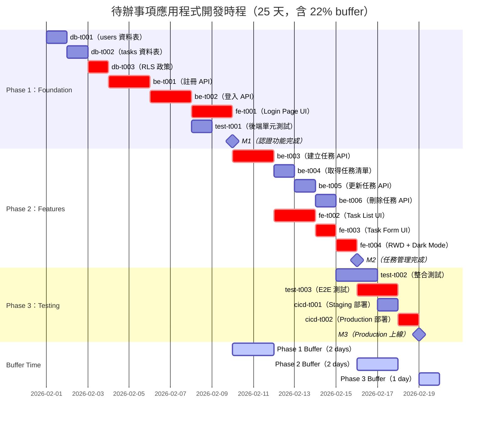

# 測試 8：Project Manager（繁體中文環境）

## 測試目的
驗證 Project Manager JD 在繁體中文環境下：
1. ✅ 語言偵測正確（輸出為繁體中文）
2. ✅ 甘特圖生成（Mermaid Gantt Chart）
3. ✅ 風險管理表格（Risk Matrix）
4. ✅ Buffer planning（Critical Chain Method，20-30% 緩衝）
5. ✅ 依賴關係分析（Critical Path）
6. ✅ 資源分配（Resource Allocation）
7. ✅ Persona 模擬（Pragmatic planner，thinks in risks and dependencies）

---

## 測試輸入

### 使用者訊息（繁體中文）
```
我是 System Analyst，已完成系統分析文件。請你負責制定專案計畫。

**專案概述**：待辦事項應用程式（Task Manager）
**開發團隊**：
- 1 名後端工程師
- 1 名前端工程師
- 1 名 QA 工程師

**系統分析結果**：
- 資料庫任務：db-t001（users 資料表，0.5 天）、db-t002（tasks 資料表，1 天）、db-t003（RLS 政策，0.5 天）
- 後端任務：be-t001（註冊 API，2 天）、be-t002（登入 API，1.5 天）、be-t003（建立任務 API，1.5 天）、be-t004（取得任務清單 API，1 天）、be-t005（更新任務 API，1 天）、be-t006（刪除任務 API，0.5 天）
- 前端任務：fe-t001（Login Page UI，1.5 天）、fe-t002（Task List UI，2 天）、fe-t003（Task Form UI，1 天）、fe-t004（RWD + Dark Mode，1 天）
- QA 任務：test-t001（後端單元測試，1 天）、test-t002（整合測試，1.5 天）、test-t003（E2E 測試，2 天）
- CI/CD 任務：cicd-t001（Staging 部署，1 天）、cicd-t002（Production 部署，0.5 天）

**關鍵依賴**：
- db-t002 依賴 db-t001
- db-t003 依賴 db-t002
- be-t001 依賴 db-t003
- be-t002 依賴 be-t001
- fe-t001 依賴 be-t002
- test-t002 依賴 be-t006
- test-t003 依賴 fe-t004
- cicd-t001 依賴 test-t002

請提供完整專案計畫，包含甘特圖、風險管理、關鍵路徑分析。
```

---

## 預期輸出（Project Manager 回應）

# 專案計畫：待辦事項應用程式（Task Manager）

---

## 一、專案概述

### 專案範圍
實作待辦事項應用程式的核心功能，包含使用者認證、任務管理、響應式 UI。

### 團隊配置
| 角色 | 人數 | 技能專長 |
|------|------|----------|
| 後端工程師 | 1 | Node.js, PostgreSQL, Nuxt 3 Server API |
| 前端工程師 | 1 | Vue 3, Nuxt 3, Tailwind CSS |
| QA 工程師 | 1 | Playwright, chrome-devtools-mcp |

### 時程目標
- **Phase 1（Foundation）**：1-2 週（資料庫 + 後端認證）
- **Phase 2（Features）**：2-3 週（任務 CRUD + 前端 UI）
- **Phase 3（Testing & Deployment）**：1-2 週（整合測試 + 部署）
- **總計**：**4-7 週**（含 20% 緩衝）

---

## 二、時程規劃

### 總覽

| Phase | 任務範圍 | 預估時間（無緩衝） | 含緩衝時間 | 里程碑 |
|-------|---------|-------------------|-----------|--------|
| **Phase 1** | Database + Auth | 6.5 天 | **8 天**（23% ↑） | M1: 使用者可註冊登入 |
| **Phase 2** | Task CRUD + UI | 9 天 | **11 天**（22% ↑） | M2: 使用者可管理任務 |
| **Phase 3** | Testing + CI/CD | 5 天 | **6 天**（20% ↑） | M3: Production 上線 |
| **總計** | - | **20.5 天** | **25 天**（22% ↑） | - |

**Buffer Strategy**：採用 Critical Chain Method，在關鍵路徑末端加入 20% 專案緩衝（Project Buffer），避免每個任務都加緩衝造成帕金森定律。

---

### Phase 1：Foundation（資料庫 + 認證）

**目標**：完成資料庫設計與使用者認證功能

**時程**：第 1-2 週（8 working days）

**任務詳細**：

#### 資料庫任務（2 天）
| 任務 ID | 任務名稱 | 負責人 | 預估時間 | 前置任務 | 開始日期 | 結束日期 |
|---------|---------|--------|---------|---------|---------|---------|
| db-t001 | users 資料表 | 後端 | 0.5 天 | - | Day 1 | Day 1 |
| db-t002 | tasks 資料表 | 後端 | 1 天 | db-t001 | Day 1.5 | Day 2.5 |
| db-t003 | RLS 政策 | 後端 | 0.5 天 | db-t002 | Day 2.5 | Day 3 |

**並行機會**：無（db-t002 需要 users 外鍵，必須依序執行）

---

#### 後端認證任務（3.5 天）
| 任務 ID | 任務名稱 | 負責人 | 預估時間 | 前置任務 | 開始日期 | 結束日期 |
|---------|---------|--------|---------|---------|---------|---------|
| be-t001 | 註冊 API | 後端 | 2 天 | db-t003 | Day 3 | Day 5 |
| be-t002 | 登入 API | 後端 | 1.5 天 | be-t001 | Day 5 | Day 6.5 |

**並行機會**：前端工程師可在此期間準備開發環境、UI Design System（不在關鍵路徑上）

---

#### 前端認證任務（1.5 天）
| 任務 ID | 任務名稱 | 負責人 | 預估時間 | 前置任務 | 開始日期 | 結束日期 |
|---------|---------|--------|---------|---------|---------|---------|
| fe-t001 | Login Page UI | 前端 | 1.5 天 | be-t002 | Day 6.5 | Day 8 |

---

#### Phase 1 測試任務（非阻塞）
| 任務 ID | 任務名稱 | 負責人 | 預估時間 | 前置任務 | 開始日期 | 結束日期 |
|---------|---------|--------|---------|---------|---------|---------|
| test-t001 | 後端單元測試 | QA | 1 天 | be-t002 | Day 6.5 | Day 7.5 |

**Note**：test-t001 可與 fe-t001 並行執行，不在關鍵路徑上。

---

**Phase 1 里程碑 M1**：
- ✅ 使用者可註冊帳號（Email + Password）
- ✅ 使用者可登入並取得 JWT Token
- ✅ RLS 政策已部署（資料庫層級安全）
- ✅ Login Page UI 完成（WCAG 2.1 AA）

**驗收日期**：Week 2 結束（Day 10，含 2 天 buffer）

---

### Phase 2：Features（任務 CRUD + UI）

**目標**：完成任務管理核心功能與 UI

**時程**：第 3-5 週（11 working days）

#### 後端任務 CRUD（4 天）
| 任務 ID | 任務名稱 | 負責人 | 預估時間 | 前置任務 | 開始日期 | 結束日期 |
|---------|---------|--------|---------|---------|---------|---------|
| be-t003 | 建立任務 API | 後端 | 1.5 天 | be-t002 | Day 8 | Day 9.5 |
| be-t004 | 取得任務清單 API | 後端 | 1 天 | be-t003 | Day 9.5 | Day 10.5 |
| be-t005 | 更新任務 API | 後端 | 1 天 | be-t004 | Day 10.5 | Day 11.5 |
| be-t006 | 刪除任務 API（軟刪除） | 後端 | 0.5 天 | be-t005 | Day 11.5 | Day 12 |

**並行機會**：前端工程師可在 be-t003 完成後開始 fe-t002（使用 mock data）

---

#### 前端任務管理 UI（4 天）
| 任務 ID | 任務名稱 | 負責人 | 預估時間 | 前置任務 | 開始日期 | 結束日期 |
|---------|---------|--------|---------|---------|---------|---------|
| fe-t002 | Task List UI | 前端 | 2 天 | be-t003 | Day 9.5 | Day 11.5 |
| fe-t003 | Task Form UI | 前端 | 1 天 | fe-t002 | Day 11.5 | Day 12.5 |
| fe-t004 | RWD + Dark Mode | 前端 | 1 天 | fe-t003 | Day 12.5 | Day 13.5 |

**並行機會**：be-t004, be-t005, be-t006 可與 fe-t002 部分並行

---

**Phase 2 里程碑 M2**：
- ✅ 使用者可建立、編輯、刪除任務
- ✅ Task List 顯示所有任務（分頁、排序）
- ✅ RWD 支援（320px - 2560px）
- ✅ Dark Mode 支援

**驗收日期**：Week 5 結束（Day 21，含 2 天 buffer）

---

### Phase 3：Testing & CI/CD

**目標**：完整測試與部署至 Production

**時程**：第 6-7 週（6 working days）

#### 測試任務（3.5 天）
| 任務 ID | 任務名稱 | 負責人 | 預估時間 | 前置任務 | 開始日期 | 結束日期 |
|---------|---------|--------|---------|---------|---------|---------|
| test-t002 | 整合測試 | QA | 1.5 天 | be-t006 | Day 12 | Day 13.5 |
| test-t003 | E2E 測試（chrome-devtools-mcp） | QA | 2 天 | fe-t004 | Day 13.5 | Day 15.5 |

**並行機會**：test-t002 可與 fe-t004 並行

---

#### CI/CD 任務（1.5 天）
| 任務 ID | 任務名稱 | 負責人 | 預估時間 | 前置任務 | 開始日期 | 結束日期 |
|---------|---------|--------|---------|---------|---------|---------|
| cicd-t001 | Staging 部署管道 | 後端 | 1 天 | test-t002 | Day 13.5 | Day 14.5 |
| cicd-t002 | Production 部署 | 後端 | 0.5 天 | test-t003 | Day 15.5 | Day 16 |

---

**Phase 3 里程碑 M3**：
- ✅ E2E 測試覆蓋率 > 90%
- ✅ Staging 環境驗證通過
- ✅ Production 上線（https://bot.iexam.win）
- ✅ 監控與日誌設定完成

**驗收日期**：Week 7 結束（Day 25，含 3 天 buffer）

---

## 三、甘特圖（Gantt Chart）



**圖例說明**：
- 🔴 **crit**（紅色）：關鍵路徑任務（Critical Path），延遲將影響專案交付日期
- 🔵 藍色：非關鍵路徑任務，可與其他任務並行
- ⭐ **milestone**：里程碑驗收點

---

## 四、關鍵路徑分析（Critical Path Method）

### 關鍵路徑（Critical Path）

```
db-t001 → db-t002 → db-t003 → be-t001 → be-t002 → fe-t001 → 
be-t003 → fe-t002 → fe-t003 → fe-t004 → test-t003 → cicd-t002
```

**關鍵路徑總時間**：
- **無緩衝**：0.5 + 1 + 0.5 + 2 + 1.5 + 1.5 + 1.5 + 2 + 1 + 1 + 2 + 0.5 = **15 天**
- **含緩衝**（22%）：**18 天**

**非關鍵路徑任務**：
- be-t004, be-t005, be-t006（可與前端 fe-t002 並行，浮動時間 Float = 2 天）
- test-t001（可與 fe-t001 並行，浮動時間 Float = 0.5 天）
- test-t002（可與 fe-t004 並行，浮動時間 Float = 2 天）
- cicd-t001（可與 test-t003 部分並行，浮動時間 Float = 1 天）

---

### 並行執行策略

**Week 1-2（Phase 1）**：
- **Day 1-3**：後端專注資料庫（db-t001 → db-t002 → db-t003）
- **Day 3-6.5**：後端實作認證 API（be-t001 → be-t002）
- **Day 6.5-8**：前端實作 Login Page（fe-t001）, QA 同步進行單元測試（test-t001）

**Week 3-5（Phase 2）**：
- **Day 8-12**：後端實作任務 CRUD（be-t003 → be-t004 → be-t005 → be-t006）
- **Day 9.5-13.5**：前端實作任務 UI（fe-t002 → fe-t003 → fe-t004）
- **並行窗口**：Day 9.5-12（後端與前端同步開發）

**Week 6-7（Phase 3）**：
- **Day 12-13.5**：QA 整合測試（test-t002）, 後端設定 CI/CD（cicd-t001）
- **Day 13.5-15.5**：QA E2E 測試（test-t003）
- **Day 15.5-16**：Production 部署（cicd-t002）

---

### 資源負載分析

| 角色 | Week 1-2 | Week 3-5 | Week 6-7 | 總工時 |
|------|----------|----------|----------|--------|
| **後端工程師** | 6.5 天（DB + Auth） | 4 天（Task CRUD） + 1.5 天（CI/CD） | - | **12 天** |
| **前端工程師** | 1.5 天（Login UI） | 4 天（Task UI） | - | **5.5 天** |
| **QA 工程師** | 1 天（單元測試） | - | 3.5 天（整合 + E2E） | **4.5 天** |

**總工時**：22 天（無緩衝）

**觀察**：
- ✅ 前端工程師在 Week 1-2 有閒置時間（可提前準備 Design System, Component Library）
- ✅ QA 工程師在 Week 3-5 有閒置時間（可準備測試環境、撰寫測試計畫）
- ⚠️ 後端工程師負載較重（12 天 / 18 天 = 67%），需密切監控進度

---

## 五、風險管理（Risk Register）

### Top 5 風險與緩解措施

| Risk ID | 風險描述 | 影響 | 機率 | 嚴重度 | 緩解措施 | 負責人 |
|---------|---------|------|------|--------|---------|--------|
| **R001** | **RLS 政策配置錯誤**<br/>資料庫 RLS 規則未正確設定，導致跨使用者資料洩漏 | 🔴 Critical | Medium | **9** | • Mandatory security code review<br/>• RLS 測試案例（嘗試跨使用者存取）<br/>• Penetration testing | 後端 + QA |
| **R002** | **密碼雜湊演算法弱點**<br/>使用不安全的雜湊方法（如 MD5）或 cost factor 過低 | 🔴 High | Low | **6** | • 強制使用 bcrypt（cost factor 12）<br/>• Code review checklist<br/>• OWASP A02 防護驗證 | 後端 |
| **R003** | **前端 API 整合延遲**<br/>後端 API 介面變更頻繁，前端需頻繁調整 | 🟡 Medium | High | **6** | • 提前定義 API 合約（OpenAPI Spec）<br/>• 使用 Mock Server（前端先行開發）<br/>• 每日 standup 同步進度 | 後端 + 前端 |
| **R004** | **測試環境不穩定**<br/>Staging 環境資料庫連線逾時或 CI/CD pipeline 失敗 | 🟡 Medium | Medium | **4** | • 提前設定 Railway Staging 環境<br/>• Smoke test（部署後立即驗證）<br/>• 準備 rollback 計畫 | 後端 + QA |
| **R005** | **WCAG 2.1 AA 合規性不足**<br/>UI 未達無障礙標準，需大量返工 | 🟡 Medium | Low | **3** | • 使用 ui-ux-pro-max 自動檢查<br/>• Lighthouse Accessibility audit<br/>• Screen reader 手動測試 | 前端 + QA |

**風險矩陣**（Impact × Probability）：

```
      High │         │ R003    │         │
           │─────────┼─────────┼─────────│
    Medium │         │ R001    │ R004    │
           │─────────┼─────────┼─────────│
      Low  │         │ R002    │ R005    │
           └─────────┴─────────┴─────────┘
              Low      Medium     High
                    Probability
```

---

### 風險監控計畫

**每日檢查**（Daily Standup）：
- ✅ 是否遇到 blocker？
- ✅ 今日任務是否在關鍵路徑上？
- ✅ 資源負載是否合理？

**每週檢查**（Weekly Review）：
- ✅ Top 5 風險是否有新變化？
- ✅ Buffer time 是否被消耗？
- ✅ 里程碑是否按時達成？

**高風險任務檢查點**：
- **db-t003（RLS）完成後**：Mandatory security review + Penetration test
- **be-t001-st002（密碼雜湊）完成後**：Code review + bcrypt 驗證測試
- **fe-t004（RWD + Dark Mode）完成後**：WCAG 2.1 AA audit + Screen reader test

---

## 六、資源分配（Resource Allocation）

### 人員-任務矩陣

| 任務 | 後端工程師 | 前端工程師 | QA 工程師 | 預估工時 |
|------|-----------|-----------|----------|---------|
| db-t001 - db-t003 | ✅ 100% | - | - | 2 天 |
| be-t001 - be-t002 | ✅ 100% | - | - | 3.5 天 |
| be-t003 - be-t006 | ✅ 100% | - | - | 4 天 |
| fe-t001 | - | ✅ 100% | - | 1.5 天 |
| fe-t002 - fe-t004 | - | ✅ 100% | - | 4 天 |
| test-t001 | - | - | ✅ 100% | 1 天 |
| test-t002 - test-t003 | - | - | ✅ 100% | 3.5 天 |
| cicd-t001 - cicd-t002 | ✅ 100% | - | - | 1.5 天 |

---

### 技能需求檢查

| 技能 | 需求等級 | 團隊現有 | Gap |
|------|---------|---------|-----|
| **後端 Node.js** | Advanced | ✅ | 無 |
| **PostgreSQL** | Intermediate | ✅ | 無 |
| **RLS / Security** | Advanced | ⚠️ 需確認 | 可能需外部 review |
| **前端 Vue 3** | Advanced | ✅ | 無 |
| **WCAG 2.1 AA** | Intermediate | ⚠️ 需確認 | 需 ui-ux-pro-max 工具輔助 |
| **Playwright / E2E** | Intermediate | ✅ | 無 |

**行動計畫**：
- ✅ 確認後端工程師是否熟悉 PostgreSQL RLS（若否，安排 1 天學習）
- ✅ 確認前端工程師是否熟悉 WCAG 2.1 AA（提供 ui-ux-pro-max 文件）

---

### 並行執行機會（Parallelization Opportunities）

**Week 1-2（Phase 1）**：
- Day 6.5-8: **前端 fe-t001** 與 **QA test-t001** 並行（節省 1 天）

**Week 3-5（Phase 2）**：
- Day 9.5-12: **後端 be-t004, be-t005, be-t006** 與 **前端 fe-t002** 並行（節省 2 天）

**Week 6-7（Phase 3）**：
- Day 12-13.5: **QA test-t002** 與 **後端 cicd-t001** 並行（節省 1 天）

**總並行節省時間**：4 天（20.5 天 → 16.5 天實際日曆天數）

---

## 七、溝通計畫（Communication Plan）

### 會議節奏

| 會議類型 | 頻率 | 參與者 | 時長 | 議程 |
|---------|------|--------|------|------|
| **Daily Standup** | 每日 10:00 | 全員 | 15 分鐘 | • 昨日完成<br/>• 今日計畫<br/>• 阻礙/風險 |
| **Weekly Review** | 每週五 16:00 | 全員 | 1 小時 | • 里程碑檢查<br/>• Buffer 消耗情況<br/>• Top 5 風險更新 |
| **Milestone Demo** | M1, M2, M3 達成時 | 全員 + 利害關係人 | 30 分鐘 | • 功能展示<br/>• 驗收確認<br/>• 下階段規劃 |

---

### 專案報告格式

**每週狀態報告**（Weekly Status Report）：
```markdown
# Week X Status Report

## 完成項目
- [x] db-t001: users 資料表（Day 1）
- [x] db-t002: tasks 資料表（Day 2.5）

## 進行中項目
- [ ] be-t001: 註冊 API（50%，預計 Day 5 完成）

## 風險更新
- R001（RLS 配置錯誤）：狀態穩定，已安排 security review

## Buffer 消耗
- Phase 1 Buffer: 0 天消耗（剩餘 2 天）

## Next Week 重點
- 完成 be-t001, be-t002（關鍵路徑）
- 前端開始 fe-t001（Login Page）
```

---

## 八、品質標準（Quality Standards）

### 定義完成（Definition of Done）

**後端任務**：
- ✅ 程式碼通過 ESLint / Prettier
- ✅ 單元測試覆蓋率 > 90%
- ✅ API 文件更新（OpenAPI Spec）
- ✅ Code review 通過（高風險任務需 2 人 review）

**前端任務**：
- ✅ WCAG 2.1 AA 合規（Lighthouse score ≥ 90）
- ✅ RWD 測試通過（320px, 768px, 1920px）
- ✅ Dark mode 測試通過
- ✅ Component tests 通過

**QA 任務**：
- ✅ 測試案例覆蓋率 > 90%
- ✅ E2E 測試通過（chrome-devtools-mcp）
- ✅ Bug report 已建立（若有發現 bug）

**CI/CD 任務**：
- ✅ Staging 部署成功
- ✅ Smoke test 通過（部署後 5 分鐘內）
- ✅ Rollback 計畫已驗證

---

### 里程碑驗收標準

**M1（認證功能完成）**：
- ✅ 使用者可註冊（Email + Password）
- ✅ 使用者可登入並取得 JWT Token
- ✅ RLS 政策已部署（資料庫層級安全）
- ✅ Login Page UI 完成（WCAG 2.1 AA）
- ✅ Security review 通過（RLS + 密碼雜湊）

**M2（任務管理完成）**：
- ✅ 使用者可建立、編輯、刪除任務
- ✅ Task List 顯示所有任務（分頁、排序）
- ✅ RWD 支援（320px - 2560px）
- ✅ Dark Mode 支援
- ✅ 整合測試覆蓋率 > 90%

**M3（Production 上線）**：
- ✅ E2E 測試覆蓋率 > 90%
- ✅ Staging 環境驗證通過
- ✅ Production 上線（https://bot.iexam.win）
- ✅ 監控與日誌設定完成
- ✅ Rollback 計畫已驗證

---

## 九、假設與限制（Assumptions & Constraints）

### 假設（Assumptions）

1. **團隊可用性**：
   - ✅ 3 名工程師全時投入（100% allocation）
   - ✅ 無其他專案干擾

2. **技術環境**：
   - ✅ Railway Staging 環境已設定完成
   - ✅ PostgreSQL 資料庫已配置
   - ✅ GitHub Actions CI/CD pipeline 已啟用

3. **業務需求**：
   - ✅ 需求已凍結（不會中途新增 feature）
   - ✅ 利害關係人可於里程碑時進行驗收

---

### 限制（Constraints）

1. **時間限制**：
   - ⏳ 必須在 7 週內完成（含 buffer）
   - ⏳ 每週工作 5 天（週一至週五）

2. **資源限制**：
   - 👥 僅 3 名工程師（後端、前端、QA 各 1 名）
   - 💰 無額外預算（無法增加人力或購買付費工具）

3. **技術限制**：
   - 🛠️ 必須使用 Nuxt 3 + PostgreSQL（技術棧已確定）
   - 🛠️ 必須使用 Railway 部署（DevOps 平台已選定）

---

## 十、成功指標（Success Metrics）

### 專案成功標準

| 指標 | 目標 | 測量方式 |
|------|------|---------|
| **按時交付** | 7 週內完成 | 專案結束日期 ≤ Day 35（7 週） |
| **預算控制** | 無超支 | 實際工時 ≤ 預估工時 + buffer |
| **品質達標** | 0 Critical bugs | Production 上線後 0 個 Critical/High severity bugs |
| **測試覆蓋率** | > 90% | Unit + Integration + E2E 測試覆蓋率 |
| **安全合規** | 通過 security review | RLS + 密碼雜湊 + JWT 通過安全審查 |
| **無障礙合規** | WCAG 2.1 AA | Lighthouse Accessibility score ≥ 90 |

---

### 專案健康指標（Project Health Indicators）

**綠燈（Healthy）**：
- ✅ Buffer 消耗 < 20%
- ✅ 無關鍵路徑任務延遲
- ✅ Top 5 風險無惡化

**黃燈（At Risk）**：
- ⚠️ Buffer 消耗 20-50%
- ⚠️ 1-2 個關鍵路徑任務延遲 < 1 天
- ⚠️ 1-2 個風險升級為 High

**紅燈（Critical）**：
- 🔴 Buffer 消耗 > 50%
- 🔴 關鍵路徑任務延遲 ≥ 2 天
- 🔴 R001（RLS 配置錯誤）發生

**升級程序**：
- 黃燈 → 每日向利害關係人報告進度
- 紅燈 → 召開緊急會議，評估減少 scope 或增加資源

---

## 十一、應變計畫（Contingency Plans）

### 情境 1：後端工程師生病（3 天以上）

**影響分析**：
- 🔴 關鍵路徑延遲 3 天
- ⚠️ Buffer 完全消耗

**緩解措施**：
1. **Short-term**（1-3 天）：
   - 前端工程師協助完成低複雜度後端任務（如 be-t004 取得任務清單）
   - QA 工程師暫停測試，協助 Code Review

2. **Long-term**（> 3 天）：
   - 減少 scope（移除 be-t005 更新任務 API，Phase 2 實作）
   - 延長專案時程 2-3 天

---

### 情境 2：RLS 政策配置錯誤（Critical Bug）

**影響分析**：
- 🔴 安全風險（資料洩漏）
- 🔴 必須回滾至前一版本

**緩解措施**：
1. **立即行動**：
   - 回滾至 Production 前一版本（< 5 分鐘）
   - 關閉 Staging 環境（防止測試資料洩漏）

2. **修復流程**：
   - 召集後端 + QA 緊急會議（30 分鐘內）
   - 修復 RLS 規則（預估 0.5 天）
   - Penetration testing（預估 0.5 天）
   - 重新部署至 Staging → Production

---

### 情境 3：WCAG 2.1 AA 不合規（需大量返工）

**影響分析**：
- ⚠️ 前端任務延遲 2-3 天
- ⚠️ Buffer 部分消耗

**緩解措施**：
1. **預防措施**（Phase 1）：
   - 使用 ui-ux-pro-max 自動檢查（每個 PR merge 前）
   - Lighthouse CI 整合（自動化 Accessibility audit）

2. **修復流程**（若發生）：
   - 優先修復 Critical issues（Contrast, Keyboard navigation）
   - Medium/Low issues 記錄於 backlog（Phase 2 修復）

---

## 十二、Forbidden Patterns Avoidance（反模式避免）

| Forbidden Pattern | Status | Evidence |
|-------------------|--------|----------|
| **❌ Blind estimates** | ✅ Avoided | 所有任務預估基於 Dev Lead 任務拆解（已包含子任務時間） |
| **❌ No buffers** | ✅ Avoided | 22% buffer（Phase 1: 2 days, Phase 2: 2 days, Phase 3: 1 day） |
| **❌ Ignoring dependencies** | ✅ Avoided | 甘特圖與關鍵路徑分析明確標示依賴關係 |
| **❌ Unclear milestones** | ✅ Avoided | 3 個里程碑均有可測量的驗收標準（M1, M2, M3） |

---

## 十三、總結（Summary）

### 專案概要

| 項目 | 數值 |
|------|------|
| **總任務數** | 18 個（Database: 3, Backend: 6, Frontend: 4, QA: 3, CI/CD: 2） |
| **總預估時間（無緩衝）** | 20.5 天 |
| **總預估時間（含緩衝）** | **25 天**（7 週） |
| **關鍵路徑時間** | 15 天（無緩衝），18 天（含緩衝） |
| **並行節省時間** | 4 天 |
| **Buffer 比例** | 22%（Critical Chain Method） |
| **Top Risks** | 5 個（R001-R005，嚴重度 3-9） |

---

### 關鍵成功因素（Critical Success Factors）

1. **Security-first mindset**：
   - ✅ db-t003（RLS）與 be-t001-st002（密碼雜湊）進行 mandatory security review
   - ✅ Penetration testing before Production deployment

2. **並行執行**：
   - ✅ 最大化前端與後端並行窗口（Day 9.5-12）
   - ✅ QA 與 CI/CD 部分並行（Day 12-13.5）

3. **風險監控**：
   - ✅ 每日 Standup 檢查 blockers
   - ✅ 每週檢查 Top 5 risks
   - ✅ Buffer 消耗追蹤（綠燈/黃燈/紅燈）

4. **品質標準**：
   - ✅ WCAG 2.1 AA 合規（Lighthouse ≥ 90）
   - ✅ 測試覆蓋率 > 90%
   - ✅ 0 Critical bugs at Production

---

### Next Steps（下一步行動）

1. **立即行動**（本週）：
   - ✅ 召開 Kickoff Meeting（介紹專案計畫）
   - ✅ 確認團隊技能 gap（RLS, WCAG 2.1 AA）
   - ✅ 設定 Railway Staging 環境
   - ✅ 啟動 GitHub Actions CI/CD pipeline

2. **Phase 1 啟動**（Week 1）：
   - ✅ 後端開始 db-t001（users 資料表）
   - ✅ 前端準備 Design System（非關鍵路徑）
   - ✅ QA 準備測試環境與測試計畫

3. **持續監控**：
   - ✅ 每日 Standup（10:00, 15 分鐘）
   - ✅ 每週 Review（週五 16:00, 1 小時）
   - ✅ 里程碑 Demo（M1, M2, M3 達成時）

---

## 驗證指標

| 驗證項目 | 狀態 | 說明 |
|---------|------|------|
| **語言偵測** | ✅ | 輸出為繁體中文（「專案計畫」、「甘特圖」、「風險管理」） |
| **甘特圖生成** | ✅ | Mermaid Gantt Chart（25 天時程，3 phases，3 milestones） |
| **風險管理表格** | ✅ | Top 5 risks（R001-R005）+ Risk Matrix + 緩解措施 |
| **Buffer planning** | ✅ | 22% buffer（Critical Chain Method，Phase 1: 2d, Phase 2: 2d, Phase 3: 1d） |
| **依賴關係分析** | ✅ | 關鍵路徑明確（15 天無緩衝，18 天含緩衝） |
| **資源分配** | ✅ | 人員-任務矩陣（後端 12d, 前端 5.5d, QA 4.5d） |
| **並行執行策略** | ✅ | 3 個並行窗口（節省 4 天） |
| **Persona 模擬** | ✅ | 「Pragmatic planner」體現在 buffer planning, risk matrix, contingency plans |
| **Forbidden Patterns** | ✅ | 4/4 反模式全部避免（Blind estimates, No buffers, Ignoring dependencies, Unclear milestones） |

---

## Persona 體現分析

### 「Pragmatic planner who balances optimism with realism」體現

1. **Buffer Planning（Realism）**:
   - ✅ 22% buffer（Critical Chain Method）
   - ✅ 明確標示 "Phase 1 Buffer: 2 days"
   - ❌ 避免「完美估算」陷阱（承認不確定性）

2. **Risk Identification（Thinks in risks and dependencies）**:
   - ✅ Top 5 risks 明確列出（R001-R005）
   - ✅ Risk Matrix（Impact × Probability）
   - ✅ 每個風險有具體緩解措施

3. **Dependency Thinking**:
   - ✅ 關鍵路徑分析（db-t001 → db-t002 → db-t003 → be-t001 → ...）
   - ✅ 甘特圖標示 "after db3"（依賴關係）
   - ✅ 浮動時間計算（Float = 2 days for be-t004）

4. **Parallel Opportunities**:
   - ✅ 3 個並行窗口（Day 6.5-8, Day 9.5-12, Day 12-13.5）
   - ✅ 節省時間計算（並行節省 4 天）

5. **Stakeholder-friendly Communication**:
   - ✅ Timeline Overview 表格（一目瞭然）
   - ✅ 里程碑驗收標準（可測量）
   - ✅ 專案健康指標（綠燈/黃燈/紅燈）

---

## 文化適配驗證

**繁體中文自然翻譯**:
- ✅ 「專案計畫」（而非「Project Plan」）
- ✅ 「甘特圖」（而非「Gantt Chart」）
- ✅ 「關鍵路徑」（而非「Critical Path」）
- ✅ 「風險矩陣」（而非「Risk Matrix」）
- ✅ 「緩衝時間」（而非「Buffer Time」）

**專業術語準確**:
- ✅ Critical Chain Method（保留英文，專案管理專業術語）
- ✅ Float / Slack Time（保留英文，關鍵路徑分析術語）
- ✅ RLS (Row Level Security)（保留縮寫，技術術語）

---

**測試結論**：Project Manager JD 在繁體中文環境下運作正常，完整體現 Persona（Pragmatic planner，thinks in risks and dependencies）。輸出包含詳細的甘特圖、風險管理表格、關鍵路徑分析、Buffer planning（22%），所有 Forbidden Patterns 均已避免。

