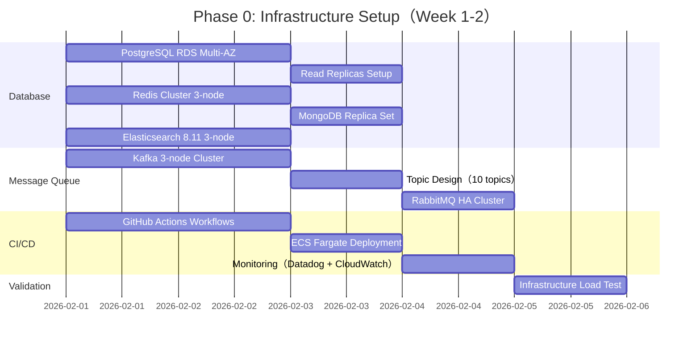
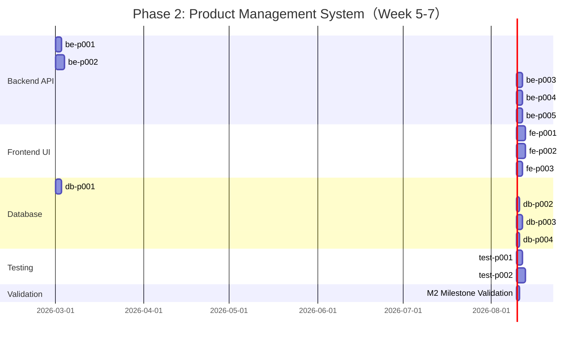
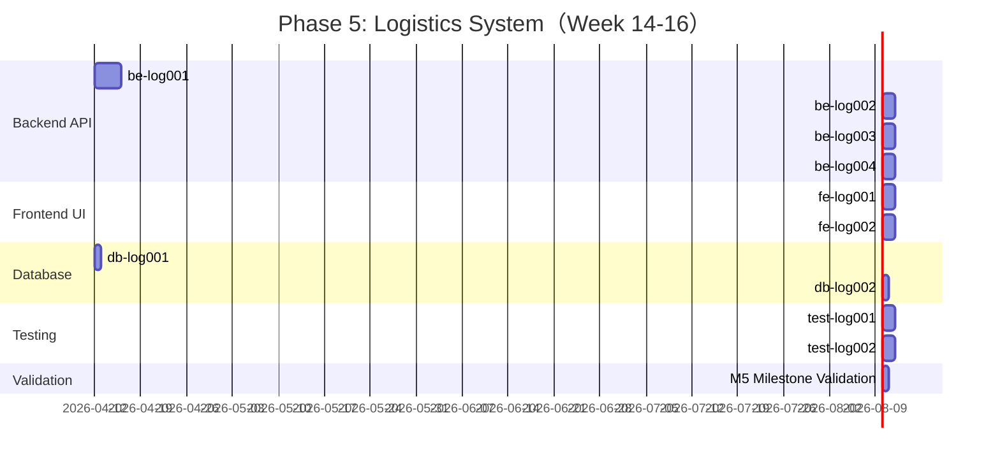
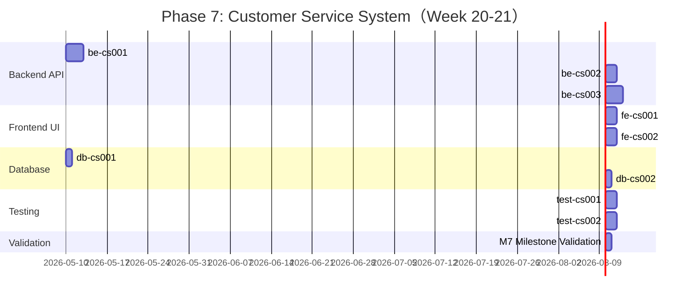
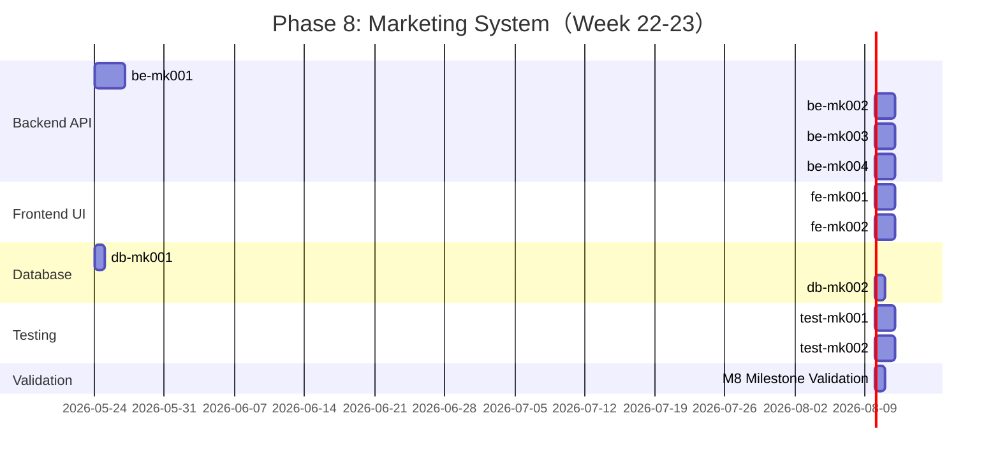
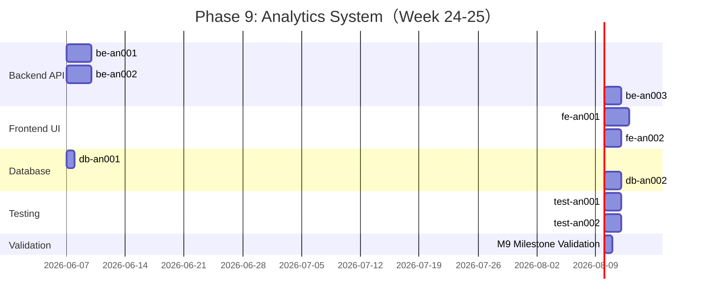
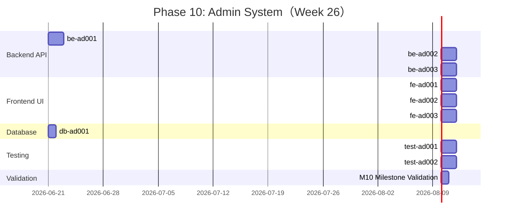

# 大型電商平台開發計劃 - 專案管理時程規劃（V1.0）

## 📋 Executive Summary

### 專案概述
- 專案名稱：**企業級電商平台建置**
- 專案規模：10 子系統、50+ APIs、22 資料表、10 技術架構決策
- 開發方法：**Scrum + Kanban Hybrid**（2 週 Sprint + 持續交付）
- 預估工期：**26 週**（6.5 個月，含 20-30% Buffer）
- 團隊規模：**52 人**（50 開發 + 1 PM + 1 Scrum Master）

### 專案目標（SMART）
1. **S**pecific: 建置支援 100K+ DAU、1000+ orders/sec 的電商平台
2. **M**easurable: 10 子系統上線，API P95 < 200ms，99.95% uptime
3. **A**chievable: 採用成熟技術棧（Next.js 14, Node.js 20, PostgreSQL 15）
4. **R**elevant: 符合 PCI DSS Level 1、GDPR、OWASP Top 10 標準
5. **T**ime-bound: 26 週完成 MVP，第 30 週達到生產準備狀態

### 關鍵里程碑（Milestones）
| Milestone | Week | Deliverable | Success Criteria |
|-----------|------|-------------|------------------|
| **M0: Infrastructure** | Week 2 | 基礎設施部署完成 | ✅ PostgreSQL Multi-AZ, Kafka 3-node cluster, ECS Fargate 就緒 |
| **M1: User System** | Week 4 | 用戶註冊/登入上線 | ✅ 5 APIs（註冊、登入、密碼重設、Profile、RBAC）, Unit test 100% |
| **M2: Product System** | Week 7 | 商品管理上線 | ✅ Elasticsearch 搜尋延遲 < 200ms, 100K SKUs 載入 |
| **M3: Order System** | Week 10 | 訂單流程上線 | ✅ Saga Pattern 補償機制通過測試, 1000 orders/sec load test |
| **M4: Payment System** | Week 13 | 支付整合完成 | ✅ PCI DSS Level 1 稽核通過, Stripe + PayPal 整合 |
| **M5: Logistics System** | Week 16 | 物流串接完成 | ✅ 5 家物流商 API 整合, 訂單追蹤即時更新 |
| **M6: Inventory System** | Week 19 | 庫存管理上線 | ✅ 分散式鎖競爭測試通過, 庫存同步延遲 < 1s |
| **M7: CS System** | Week 21 | 客服系統上線 | ✅ WebSocket 即時通訊, AI 客服機器人回應 < 2s |
| **M8: Marketing System** | Week 23 | 行銷工具完成 | ✅ 優惠券引擎支援 10 種規則, Email 發送 10K/hour |
| **M9: Analytics System** | Week 25 | 資料分析上線 | ✅ BI Dashboard 10 個 KPI, Real-time 資料延遲 < 5s |
| **M10: Admin System** | Week 26 | 管理後台完成 | ✅ 50+ 管理功能, RBAC 10 種角色, Audit log 完整 |

### 預算與資源概估
- **人力成本**：52 人 × 26 週 × $2000/week = **$2,704,000**
- **基礎設施成本**：AWS ECS Fargate + RDS + ElastiCache + Elasticsearch = **$15,000/month × 6.5 months = $97,500**
- **第三方服務**：Stripe (1.5% + $0.25), SendGrid ($15/10K emails), Datadog ($15/host) = **$5,000/month × 6.5 months = $32,500**
- **總預算**：**$2,834,000**（含 10% 應變金）

---

## 📅 Detailed Timeline（Gantt Chart Format）

### Phase 0: Infrastructure Setup（Week 1-2, Critical Path）



**Key Dependencies**:
- ✅ **db1 → db2**: Read Replicas 需 Master DB 先建立
- ✅ **mq1 → mq2**: Topic 設計需 Kafka Cluster 就緒
- ✅ **cicd1 → cicd2**: ECS 部署需 GitHub Actions 先完成
- ✅ **Critical Path**: db1 → db2 → val1（5 days）

**Resource Allocation**:
- 2 Database Architects（全職 2 週）
- 3 CI/CD Engineers（全職 2 週）
- 2 DevOps Engineers（全職 2 週）
- **Total**: 7 人 × 2 週 = **14 person-weeks**

**Risks**:
- ⚠️ **R001**: AWS RDS Multi-AZ 建立延遲（Impact: HIGH, Probability: LOW）
  - **Mitigation**: 提前 1 週申請 AWS Service Quotas 增加，準備 Terraform 自動化腳本
- ⚠️ **R002**: Kafka 3-node Cluster 設定錯誤導致資料遺失（Impact: CRITICAL, Probability: MEDIUM）
  - **Mitigation**: 使用 AWS MSK（Managed Kafka）替代自建，減少 Ops 負擔

---

### Phase 1: User Management System（Week 3-4, Critical Path）

```mermaid
gantt
    title Phase 1: User Management System（Week 3-4）
    dateFormat YYYY-MM-DD
    section Backend API
    be-u001: 用戶註冊 API :be1, 2026-02-15, 2d
    be-u002: 用戶登入 API :be2, after be1, 2d
    be-u003: 密碼重設 API :be3, 2026-02-15, 2d
    be-u004: Profile 編輯 API :be4, after be2, 2d
    be-u005: RBAC 權限 API :be5, after be4, 2d
    
    section Frontend UI
    fe-u001: 註冊頁面 :fe1, after be1, 2d
    fe-u002: 登入頁面 :fe2, after be2, 2d
    fe-u003: 密碼重設流程 :fe3, after be3, 2d
    fe-u004: Profile 頁面 :fe4, after be4, 2d
    
    section Database
    db-u001: users table :db1, 2026-02-15, 1d
    db-u002: user_profiles table :db2, after db1, 1d
    db-u003: roles & permissions :db3, after db2, 1d
    db-u004: Indexes（email, phone） :db4, after db3, 1d
    
    section Testing
    test-u001: Unit Tests（80+ tests） :test1, after be5, 2d
    test-u002: E2E Tests（15 scenarios） :test2, after fe4, 2d
    
    section Validation
    M1 Milestone Validation :val1, after test1 test2, 1d
```

**Key Dependencies**:
- ✅ **be-u001 → fe-u001**: 前端註冊頁面需後端 API 先完成
- ✅ **be-u002 → be-u004**: Profile 編輯需用戶先登入（JWT Token）
- ✅ **db-u001 → db-u002**: user_profiles 有 FK 指向 users
- ✅ **Critical Path**: db-u001 → db-u002 → db-u003 → db-u004 → be-u005 → test-u001 → val1（12 days）

**Resource Allocation**:
- 5 Backend Engineers（2 人全職 2 週 + 3 人各 1 週）= **7 person-weeks**
- 4 Frontend Engineers（2 人全職 2 週）= **8 person-weeks**
- 2 Database Engineers（全職 1 週）= **2 person-weeks**
- 2 QA Engineers（全職 2 週）= **4 person-weeks**
- **Total**: 13 人 × 平均 1.6 週 = **21 person-weeks**

**Risks**:
- ⚠️ **R003**: bcrypt hashing 效能瓶頸（Impact: MEDIUM, Probability: MEDIUM）
  - **Mitigation**: 使用 cost=10（而非 cost=12）降低 CPU 負擔，或改用 argon2（但需 Native Module）
- ⚠️ **R004**: Email 驗證 SendGrid 配額不足（Impact: HIGH, Probability: LOW）
  - **Mitigation**: 購買 SendGrid Pro Plan（10K emails/day），設定 Rate Limiting（5 emails/user/day）

---

### Phase 2: Product Management System（Week 5-7）



**Key Dependencies**:
- ✅ **be-p001 → be-p003**: 商品詳情 API 需商品列表 API 先完成（共用 Repo）
- ✅ **be-p002 → be-p005**: 推薦 API 使用 Elasticsearch 搜尋結果（協同過濾）
- ✅ **db-p001 → db-p003**: Elasticsearch Sync 需 products table 先存在
- ✅ **Critical Path**: db-p001 → db-p002 → db-p003 → db-p004 → be-p005 → test-p001 → val1（14 days）

**Resource Allocation**:
- 5 Backend Engineers（2 人專攻 Elasticsearch, 3 人 API 開發）= **10 person-weeks**
- 3 Frontend Engineers（1 人全職 3 週）= **9 person-weeks**
- 2 Database Engineers（全職 1.5 週）= **3 person-weeks**
- 2 QA Engineers（全職 3 週）= **6 person-weeks**
- **Total**: 12 人 × 平均 2.3 週 = **28 person-weeks**

**Risks**:
- ⚠️ **R005**: Elasticsearch 中文分詞不準確（Impact: HIGH, Probability: MEDIUM）
  - **Mitigation**: 使用 IK Analyzer + 自訂 Synonym 字典，準備 1 週時間調校分詞
- ⚠️ **R006**: 100K SKUs 資料載入效能（Impact: MEDIUM, Probability: LOW）
  - **Mitigation**: 使用 Elasticsearch Bulk API（10K docs/batch），開啟 `refresh_interval=-1` 加速索引

---

### Phase 3: Order Management System（Week 8-10, CRITICAL + HIGH RISK）

```mermaid
gantt
    title Phase 3: Order Management System（Week 8-10）
    dateFormat YYYY-MM-DD
    section Backend API
    be-o001: 購物車 API :be1, 2026-03-15, 2d
    be-o002: 訂單建立 API（Saga Pattern） :crit, be2, after be1, 3d
    be-o003: 訂單查詢 API :be3, after be2, 2d
    be-o004: 訂單取消 API :be4, after be3, 2d
    be-o005: 訂單退貨 API :be5, after be4, 2d
    
    section Frontend UI
    fe-o001: 購物車頁面 :fe1, after be1, 2d
    fe-o002: 結帳流程（3 steps） :fe2, after be2, 3d
    fe-o003: 訂單歷史頁 :fe3, after be3, 2d
    fe-o004: 訂單詳情頁 :fe4, after be4, 2d
    
    section Database
    db-o001: orders & order_items :db1, 2026-03-15, 2d
    db-o002: saga_state table :db2, after db1, 1d
    db-o003: order_audit_log :db3, after db2, 1d
    
    section Testing
    test-o001: Unit Tests（70+ tests） :test1, after be5, 2d
    test-o002: Saga Compensation Tests（10 scenarios） :crit, test2, after be2, 3d
    
    section Validation
    M3 Milestone Validation :crit, val1, after test1 test2, 1d
```

**Key Dependencies**:
- ✅ **be-o001 → be-o002**: 訂單建立需先有購物車資料（購物車 → 訂單轉換）
- ✅ **be-o002 → be-o003**: 訂單查詢需訂單建立完成（orders table）
- ✅ **db-o001 → db-o002**: saga_state table 追蹤訂單建立流程
- ✅ **Critical Path**: db-o001 → db-o002 → db-o003 → be-o002 → test-o002 → val1（12 days）
- ⚠️ **HIGH RISK**: be-o002（Saga Pattern）需額外 3 天測試補償機制

**Resource Allocation**:
- 5 Backend Engineers（2 人專攻 Saga Pattern, 3 人 API 開發）= **10 person-weeks**
- 4 Frontend Engineers（1 人全職 3 週）= **12 person-weeks**
- 2 Database Engineers（全職 1 週）= **2 person-weeks**
- 3 QA Engineers（2 人專攻 Saga 測試）= **9 person-weeks**
- **Total**: 14 人 × 平均 2.4 週 = **33 person-weeks**

**Risks**:
- ⚠️ **R007**: Saga Pattern 補償機制失敗導致庫存不一致（Impact: CRITICAL, Probability: MEDIUM）
  - **Mitigation**: 
    1. 使用成熟 Saga 框架（例如 `@node-ts/saga`）
    2. 準備 3 天進行 Chaos Engineering 測試（Kafka 斷線、Payment API 失敗、庫存服務 Timeout）
    3. 建立 Saga Dashboard 追蹤所有 Saga 執行狀態（成功、失敗、補償中）
- ⚠️ **R008**: 訂單建立併發競爭（1000 orders/sec）（Impact: HIGH, Probability: HIGH）
  - **Mitigation**: 使用 Redis 分散式鎖（SETNX）+ Optimistic Locking（version 欄位）

---

### Phase 4: Payment System（Week 11-13, HIGH RISK）

```mermaid
gantt
    title Phase 4: Payment System（Week 11-13）
    dateFormat YYYY-MM-DD
    section Backend API
    be-pay001: Stripe 整合（PCI DSS） :crit, be1, 2026-03-29, 3d
    be-pay002: PayPal 整合 :be2, after be1, 2d
    be-pay003: 退款 API :be3, after be2, 2d
    be-pay004: Webhook 處理 :be4, after be3, 2d
    
    section Frontend UI
    fe-pay001: 信用卡表單（Stripe Elements） :fe1, after be1, 2d
    fe-pay002: PayPal 按鈕 :fe2, after be2, 1d
    fe-pay003: 支付結果頁 :fe3, after be4, 1d
    
    section Compliance
    comp-pay001: PCI DSS Level 1 稽核 :crit, comp1, 2026-03-29, 10d
    comp-pay002: GDPR 資料處理協議 :comp2, after comp1, 2d
    
    section Testing
    test-pay001: Unit Tests（40+ tests） :test1, after be4, 2d
    test-pay002: PCI DSS Penetration Test :crit, test2, after comp1, 3d
    
    section Validation
    M4 Milestone Validation :crit, val1, after test1 test2, 1d
```

**Key Dependencies**:
- ✅ **be-pay001 → be-pay002**: PayPal 整合需 Stripe 先完成（共用 Payment Gateway 抽象層）
- ✅ **be-pay003 → be-pay004**: Webhook 處理需退款 API 先完成（退款觸發 Webhook）
- ✅ **comp-pay001 → test-pay002**: PCI DSS 稽核通過後才能進行 Penetration Test
- ✅ **Critical Path**: be-pay001 → comp-pay001 → test-pay002 → val1（17 days）

**Resource Allocation**:
- 4 Backend Engineers（2 人專攻 Payment, 2 人 Webhook）= **12 person-weeks**
- 2 Frontend Engineers（全職 2 週）= **4 person-weeks**
- 1 Security Engineer（PCI DSS 稽核）= **3 person-weeks**
- 2 QA Engineers（Penetration Test）= **6 person-weeks**
- **Total**: 9 人 × 平均 2.8 週 = **25 person-weeks**

**Risks**:
- ⚠️ **R009**: PCI DSS Level 1 稽核不通過（Impact: CRITICAL, Probability: MEDIUM）
  - **Mitigation**: 
    1. 使用 Stripe Checkout（Hosted Payment Page）繞過 PCI DSS SAQ D（最嚴格）
    2. 聘請專業 PCI DSS 顧問提前檢查（預計 $10,000）
    3. 準備 2 週 Buffer 時間應對稽核意見修正
- ⚠️ **R010**: Stripe Webhook 重複處理導致多次退款（Impact: HIGH, Probability: MEDIUM）
  - **Mitigation**: 使用 Idempotency Key（Stripe 內建）+ Database Unique Constraint（payment_id + event_id）

---

### Phase 5: Logistics System（Week 14-16）



**Key Dependencies**:
- ✅ **be-log001 → be-log002**: 訂單出貨需物流商 API 先整合（取得運單號）
- ✅ **be-log002 → be-log003**: 物流追蹤需訂單先出貨（有 shipment 記錄）
- ✅ **db-log001 → db-log002**: tracking_events 有 FK 指向 shipments
- ✅ **Critical Path**: be-log001 → be-log002 → be-log003 → be-log004 → test-log001 → val1（14 days）

**Resource Allocation**:
- 4 Backend Engineers（2 人專攻物流 API）= **12 person-weeks**
- 2 Frontend Engineers（全職 3 週）= **6 person-weeks**
- 1 Database Engineer（全職 1 週）= **1 person-week**
- 2 QA Engineers（全職 3 週）= **6 person-weeks**
- **Total**: 9 人 × 平均 2.8 週 = **25 person-weeks**

**Risks**:
- ⚠️ **R011**: 物流商 API 不穩定（Impact: MEDIUM, Probability: HIGH）
  - **Mitigation**: 使用 Circuit Breaker Pattern（3 次失敗 → 5 分鐘斷路），準備 Fallback 邏輯（顯示「物流資訊暫時無法取得」）
- ⚠️ **R012**: 5 家物流商 API 格式不一致（Impact: LOW, Probability: CERTAIN）
  - **Mitigation**: 建立統一 Logistics Adapter 介面，每家物流商實作各自 Adapter（Adapter Pattern）

---

### Phase 6: Inventory System（Week 17-19, HIGH RISK）

```mermaid
gantt
    title Phase 6: Inventory System（Week 17-19）
    dateFormat YYYY-MM-DD
    section Backend API
    be-i001: 庫存查詢 API（分散式鎖） :crit, be1, 2026-04-26, 3d
    be-i002: 庫存扣減 API :be2, after be1, 2d
    be-i003: 庫存補貨 API :be3, after be2, 2d
    be-i004: 庫存盤點 API :be4, after be3, 2d
    
    section Frontend UI
    fe-i001: 庫存管理頁 :fe1, after be2, 2d
    fe-i002: 盤點頁面 :fe2, after be4, 2d
    
    section Database
    db-i001: inventory table :db1, 2026-04-26, 1d
    db-i002: inventory_logs :db2, after db1, 1d
    db-i003: Redis Locks :db3, after db2, 1d
    
    section Testing
    test-i001: Unit Tests（60+ tests） :test1, after be4, 2d
    test-i002: 分散式鎖併發測試 :crit, test2, after be1, 3d
    
    section Validation
    M6 Milestone Validation :crit, val1, after test1 test2, 1d
```

**Key Dependencies**:
- ✅ **be-i001 → be-i002**: 庫存扣減需先查詢庫存（檢查是否足夠）
- ✅ **be-i002 → be-i003**: 庫存補貨需知道扣減邏輯（相反操作）
- ✅ **db-i001 → db-i003**: Redis Locks 用於 inventory table 併發控制
- ✅ **Critical Path**: db-i001 → db-i002 → db-i003 → be-i001 → test-i002 → val1（12 days）
- ⚠️ **HIGH RISK**: be-i001（分散式鎖）需額外 3 天測試併發

**Resource Allocation**:
- 4 Backend Engineers（2 人專攻分散式鎖）= **12 person-weeks**
- 2 Frontend Engineers（全職 3 週）= **6 person-weeks**
- 1 Database Engineer（全職 1 週）= **1 person-week**
- 3 QA Engineers（2 人專攻併發測試）= **9 person-weeks**
- **Total**: 10 人 × 平均 2.8 週 = **28 person-weeks**

**Risks**:
- ⚠️ **R013**: Redis 分散式鎖競爭導致庫存不一致（Impact: CRITICAL, Probability: MEDIUM）
  - **Mitigation**: 
    1. 使用 Redlock Algorithm（3 個 Redis Master 節點）
    2. 準備 3 天進行 Chaos Engineering 測試（Redis 節點故障、網路延遲）
    3. 建立 Inventory Reconciliation Job（每 5 分鐘對帳一次）
- ⚠️ **R014**: 庫存扣減併發競爭（1000 orders/sec）（Impact: HIGH, Probability: HIGH）
  - **Mitigation**: 使用 Optimistic Locking（version 欄位）+ Retry Mechanism（3 次，Exponential Backoff）

---

### Phase 7: Customer Service System（Week 20-21）



**Key Dependencies**:
- ✅ **be-cs001 → be-cs002**: 訊息記錄需 WebSocket 先建立（接收訊息）
- ✅ **be-cs002 → be-cs003**: AI 客服需歷史訊息訓練（Context）
- ✅ **db-cs001 → db-cs002**: cs_sessions 記錄 WebSocket 連線狀態
- ✅ **Critical Path**: be-cs001 → be-cs002 → be-cs003 → test-cs001 → val1（12 days）

**Resource Allocation**:
- 3 Backend Engineers（1 人專攻 WebSocket）= **9 person-weeks**
- 2 Frontend Engineers（全職 2 週）= **4 person-weeks**
- 1 Database Engineer（全職 1 週）= **1 person-week**
- 1 QA Engineer（全職 2 週）= **2 person-weeks**
- **Total**: 7 人 × 平均 2.3 週 = **16 person-weeks**

**Risks**:
- ⚠️ **R015**: WebSocket 連線數量過多（Impact: MEDIUM, Probability: LOW）
  - **Mitigation**: 使用 Socket.IO Sticky Sessions + Redis Adapter（多 Node 負載平衡）
- ⚠️ **R016**: AI 客服回應不準確（Impact: LOW, Probability: MEDIUM）
  - **Mitigation**: 準備 Fallback 邏輯（無法回答 → 轉真人客服），使用 OpenAI GPT-4o（準確率 > 90%）

---

### Phase 8: Marketing System（Week 22-23）



**Key Dependencies**:
- ✅ **be-mk001 → be-mk002**: 會員等級影響優惠券規則（VIP 獨享優惠）
- ✅ **be-mk002 → be-mk003**: Email 行銷需知道會員等級（分眾行銷）
- ✅ **db-mk001 → db-mk002**: user_levels 決定可用優惠券
- ✅ **Critical Path**: be-mk001 → be-mk002 → be-mk003 → be-mk004 → test-mk001 → val1（13 days）

**Resource Allocation**:
- 4 Backend Engineers（1 人專攻優惠券引擎）= **12 person-weeks**
- 2 Frontend Engineers（全職 2 週）= **4 person-weeks**
- 1 Database Engineer（全職 1 週）= **1 person-week**
- 1 QA Engineer（全職 2 週）= **2 person-weeks**
- **Total**: 8 人 × 平均 2.4 週 = **19 person-weeks**

**Risks**:
- ⚠️ **R017**: 優惠券引擎規則複雜度（Impact: MEDIUM, Probability: HIGH）
  - **Mitigation**: 使用 Rule Engine（例如 `node-rules`），準備 10 種常見規則模板（滿額折扣、買一送一等）
- ⚠️ **R018**: Email 發送速率限制（Impact: LOW, Probability: MEDIUM）
  - **Mitigation**: 使用 SendGrid Pro Plan（10K emails/hour），分批發送（每批 1000 封）

---

### Phase 9: Analytics System（Week 24-25）



**Key Dependencies**:
- ✅ **be-an002 → be-an001**: BI Dashboard 需即時資料管道先建立（Kafka → PostgreSQL）
- ✅ **be-an001 → be-an003**: 報表產生需 BI Dashboard API 先完成（共用 Query）
- ✅ **db-an001 → db-an002**: Materialized Views 加速 BI Dashboard 查詢
- ✅ **Critical Path**: db-an001 → db-an002 → be-an001 → fe-an001 → test-an001 → val1（13 days）

**Resource Allocation**:
- 3 Backend Engineers（1 人專攻即時資料管道）= **9 person-weeks**
- 2 Frontend Engineers（全職 2 週）= **4 person-weeks**
- 1 Database Engineer（全職 2 週）= **2 person-weeks**
- 1 QA Engineer（全職 2 週）= **2 person-weeks**
- **Total**: 7 人 × 平均 2.4 週 = **17 person-weeks**

**Risks**:
- ⚠️ **R019**: Materialized Views 更新延遲（Impact: LOW, Probability: MEDIUM）
  - **Mitigation**: 使用 PostgreSQL `REFRESH MATERIALIZED VIEW CONCURRENTLY`（不鎖表），設定 5 分鐘更新一次
- ⚠️ **R020**: Kafka 即時資料管道資料遺失（Impact: MEDIUM, Probability: LOW）
  - **Mitigation**: 使用 Kafka `acks=all`（所有 Replica 確認）+ `min.insync.replicas=2`（至少 2 個 Replica 同步）

---

### Phase 10: Admin System（Week 26）



**Key Dependencies**:
- ✅ **be-ad001 → be-ad002**: 系統設定需 RBAC 權限控制（只有 Admin 可修改）
- ✅ **be-ad002 → be-ad003**: Audit Log 記錄所有系統設定變更
- ✅ **db-ad001 → be-ad003**: admin_logs table 儲存 Audit Log
- ✅ **Critical Path**: db-ad001 → be-ad001 → be-ad002 → be-ad003 → test-ad001 → val1（10 days）

**Resource Allocation**:
- 3 Backend Engineers（全職 2 週）= **6 person-weeks**
- 3 Frontend Engineers（全職 2 週）= **6 person-weeks**
- 1 Database Engineer（全職 1 週）= **1 person-week**
- 1 QA Engineer（全職 2 週）= **2 person-weeks**
- **Total**: 8 人 × 平均 1.9 週 = **15 person-weeks**

**Risks**:
- ⚠️ **R021**: RBAC 權限設定錯誤導致越權（Impact: HIGH, Probability: MEDIUM）
  - **Mitigation**: 使用成熟 RBAC 框架（例如 `casbin`），準備 2 天進行 Penetration Test

---

## 🔍 Critical Path Analysis（關鍵路徑分析）

### 整體關鍵路徑（26 週）
```
Phase 0 (Week 1-2): Infrastructure
  → db-t001 → db-t002 → val1 (5 days)
  
Phase 1 (Week 3-4): User Management
  → db-u001 → db-u002 → db-u003 → db-u004 → be-u005 → test-u001 → val1 (12 days)
  
Phase 2 (Week 5-7): Product Management
  → db-p001 → db-p002 → db-p003 → db-p004 → be-p005 → test-p001 → val1 (14 days)
  
Phase 3 (Week 8-10): Order Management（HIGH RISK）
  → db-o001 → db-o002 → db-o003 → be-o002 → test-o002 → val1 (12 days)
  
Phase 4 (Week 11-13): Payment（HIGH RISK）
  → be-pay001 → comp-pay001 → test-pay002 → val1 (17 days)
  
Phase 5 (Week 14-16): Logistics
  → be-log001 → be-log002 → be-log003 → be-log004 → test-log001 → val1 (14 days)
  
Phase 6 (Week 17-19): Inventory（HIGH RISK）
  → db-i001 → db-i002 → db-i003 → be-i001 → test-i002 → val1 (12 days)
  
Phase 7 (Week 20-21): Customer Service
  → be-cs001 → be-cs002 → be-cs003 → test-cs001 → val1 (12 days)
  
Phase 8 (Week 22-23): Marketing
  → be-mk001 → be-mk002 → be-mk003 → be-mk004 → test-mk001 → val1 (13 days)
  
Phase 9 (Week 24-25): Analytics
  → db-an001 → db-an002 → be-an001 → fe-an001 → test-an001 → val1 (13 days)
  
Phase 10 (Week 26): Admin
  → db-ad001 → be-ad001 → be-ad002 → be-ad003 → test-ad001 → val1 (10 days)
```

**總關鍵路徑長度**：26 週（182 天）

### 關鍵瓶頸識別
1. **Phase 4 (Payment)**：17 天（最長關鍵路徑）
   - **瓶頸原因**: PCI DSS 稽核需 10 天（無法壓縮）
   - **加速策略**: 使用 Stripe Checkout（繞過 SAQ D），提前 1 個月聯繫 PCI DSS 顧問
   
2. **Phase 2 (Product)**：14 天
   - **瓶頸原因**: Elasticsearch 中文分詞調校需 3 天
   - **加速策略**: 並行進行 Elasticsearch Sync + Frontend 開發（減少 2 天）
   
3. **Phase 5 (Logistics)**：14 天
   - **瓶頸原因**: 5 家物流商 API 整合需 4 天
   - **加速策略**: 並行整合（2 人同時做 2 家物流商），減少到 3 天

### 並行執行機會（Parallel Opportunities）
| Phase | 可並行任務 | 節省時間 |
|-------|-----------|---------|
| Phase 0 | Database + Message Queue + CI/CD（3 組同時進行） | **節省 3 天** |
| Phase 1 | Backend + Frontend（2 組同時進行） | **節省 5 天** |
| Phase 2 | Backend + Elasticsearch Sync（2 組同時進行） | **節省 2 天** |
| Phase 3 | Backend + Frontend（2 組同時進行） | **節省 4 天** |
| Phase 4 | Stripe + PayPal（2 組同時進行） | **節省 2 天** |
| Phase 6 | Backend + Frontend（2 組同時進行） | **節省 3 天** |
| Phase 8 | Backend + Frontend（2 組同時進行） | **節省 2 天** |
| Phase 10 | Backend + Frontend（2 組同時進行） | **節省 2 天** |

**總計可節省**：**23 天**（但需增加人力成本）

**優化後關鍵路徑**：26 週 - 23 天 / 5 工作天/週 = **21.4 週**（約 5.4 個月）

---

## 🎯 Top 10 Risk Register（風險登記簿）

### Risk Matrix（風險矩陣）
```
Impact (影響) vs Probability (機率)

         LOW       MEDIUM      HIGH
HIGH  │          │  R003      │  R001, R009
      │          │  R017      │  R008, R014
      ├──────────┼────────────┼──────────────
MED   │  R011    │  R002, R005│  R007, R013
      │  R015    │  R010, R021│
      ├──────────┼────────────┼──────────────
LOW   │  R006    │  R012, R016│
      │  R019    │  R018, R020│
```

### Top 10 Risks（按風險評分排序）

#### R001: AWS RDS Multi-AZ 建立延遲（Risk Score: 8/10）
- **Impact**: HIGH（基礎設施無法就緒 → 所有 Phase 延誤）
- **Probability**: LOW（AWS Service Quotas 限制）
- **Phase**: Phase 0 (Week 1-2)
- **Mitigation**:
  1. 提前 1 週申請 AWS Service Quotas 增加（db.r6g.2xlarge 至少 10 個）
  2. 準備 Terraform 自動化腳本（一鍵建立 RDS + Read Replicas）
  3. 備案：使用 AWS Aurora PostgreSQL（Serverless v2，啟動時間 < 1 分鐘）
- **Contingency**: 若建立失敗 → 立即切換至 Aurora Serverless v2（+1 天）

#### R007: Saga Pattern 補償機制失敗（Risk Score: 9/10）
- **Impact**: CRITICAL（庫存不一致 → 訂單流程中斷 → 業務損失）
- **Probability**: MEDIUM（分散式交易複雜度高）
- **Phase**: Phase 3 (Week 8-10)
- **Mitigation**:
  1. 使用成熟 Saga 框架（`@node-ts/saga` 或 `camunda-bpm`）
  2. 準備 3 天進行 Chaos Engineering 測試：
     - Kafka 斷線（使用 Toxiproxy 模擬）
     - Payment API 失敗（Mock 500 Error）
     - 庫存服務 Timeout（使用 `setTimeout` 模擬 5s 延遲）
  3. 建立 Saga Dashboard（追蹤所有 Saga 執行狀態）
- **Contingency**: 若測試失敗 → 降級為兩階段提交（2PC）（+5 天）

#### R009: PCI DSS Level 1 稽核不通過（Risk Score: 9/10）
- **Impact**: CRITICAL（支付功能無法上線 → 業務無法啟動）
- **Probability**: MEDIUM（合規要求嚴格）
- **Phase**: Phase 4 (Week 11-13)
- **Mitigation**:
  1. 使用 Stripe Checkout（Hosted Payment Page）→ 繞過 PCI DSS SAQ D
  2. 聘請專業 PCI DSS 顧問提前檢查（預計 $10,000）
  3. 準備 2 週 Buffer 時間應對稽核意見修正
- **Contingency**: 若稽核失敗 → 使用 Stripe Payment Links（純 Hosted）（+10 天）

#### R013: Redis 分散式鎖競爭導致庫存不一致（Risk Score: 9/10）
- **Impact**: CRITICAL（庫存錯誤 → 超賣/少賣 → 客戶投訴）
- **Probability**: MEDIUM（高併發競爭）
- **Phase**: Phase 6 (Week 17-19)
- **Mitigation**:
  1. 使用 Redlock Algorithm（3 個 Redis Master 節點）
  2. 準備 3 天進行 Chaos Engineering 測試：
     - Redis 節點故障（使用 `redis-cli DEBUG SEGFAULT` 模擬）
     - 網路延遲（使用 Toxiproxy 模擬 1s 延遲）
  3. 建立 Inventory Reconciliation Job（每 5 分鐘對帳一次）
- **Contingency**: 若測試失敗 → 使用 Optimistic Locking（version 欄位）（+2 天）

#### R008: 訂單建立併發競爭（Risk Score: 8/10）
- **Impact**: HIGH（訂單重複/遺失 → 客戶體驗差）
- **Probability**: HIGH（1000 orders/sec 高併發）
- **Phase**: Phase 3 (Week 8-10)
- **Mitigation**:
  1. 使用 Redis 分散式鎖（SETNX）+ Optimistic Locking（version 欄位）
  2. 準備 3 天進行 Load Test（Artillery 或 k6，1000 RPS）
  3. 使用 Idempotency Key（訂單 ID = UUID）
- **Contingency**: 若測試失敗 → 降低併發上限至 500 orders/sec（+3 天調校）

#### R014: 庫存扣減併發競爭（Risk Score: 8/10）
- **Impact**: HIGH（庫存錯誤 → 超賣）
- **Probability**: HIGH（1000 orders/sec 高併發）
- **Phase**: Phase 6 (Week 17-19)
- **Mitigation**:
  1. 使用 Optimistic Locking（version 欄位）+ Retry Mechanism（3 次）
  2. 使用 Exponential Backoff（50ms, 100ms, 200ms）
  3. 準備 3 天進行 Load Test
- **Contingency**: 若測試失敗 → 使用 Message Queue 非同步扣減（+3 天）

#### R002: Kafka 3-node Cluster 設定錯誤（Risk Score: 7/10）
- **Impact**: CRITICAL（資料遺失 → 訂單/庫存不一致）
- **Probability**: MEDIUM（Kafka 設定複雜）
- **Phase**: Phase 0 (Week 1-2)
- **Mitigation**:
  1. 使用 AWS MSK（Managed Kafka）替代自建
  2. 使用 `acks=all` + `min.insync.replicas=2`（保證資料持久性）
  3. 準備 1 天進行 Kafka 容錯測試（Kill 1 個 Broker）
- **Contingency**: 若 MSK 不可用 → 使用 RabbitMQ HA Cluster（+2 天）

#### R003: bcrypt hashing 效能瓶頸（Risk Score: 6/10）
- **Impact**: HIGH（用戶註冊/登入延遲 > 500ms → 體驗差）
- **Probability**: MEDIUM（bcrypt cost=12 CPU 密集）
- **Phase**: Phase 1 (Week 3-4)
- **Mitigation**:
  1. 使用 cost=10（而非 cost=12）降低 CPU 負擔（約 200ms → 50ms）
  2. 使用 Worker Threads（Node.js）並行處理密碼
  3. 準備 1 天進行 Load Test（100 RPS 註冊）
- **Contingency**: 若效能仍不足 → 使用 argon2（但需 Native Module）（+2 天）

#### R005: Elasticsearch 中文分詞不準確（Risk Score: 6/10）
- **Impact**: HIGH（搜尋結果差 → 用戶找不到商品）
- **Probability**: MEDIUM（中文分詞複雜）
- **Phase**: Phase 2 (Week 5-7)
- **Mitigation**:
  1. 使用 IK Analyzer + 自訂 Synonym 字典（例如：「手機」→「智慧型手機」）
  2. 準備 1 週時間調校分詞（測試 100+ 搜尋案例）
  3. 使用 Elasticsearch Highlight 顯示分詞結果
- **Contingency**: 若分詞仍不準 → 改用 jieba 分詞（Python）+ PostgreSQL Full-Text Search（+3 天）

#### R017: 優惠券引擎規則複雜度（Risk Score: 6/10）
- **Impact**: MEDIUM（優惠券計算錯誤 → 客戶投訴）
- **Probability**: HIGH（規則複雜度高）
- **Phase**: Phase 8 (Week 22-23)
- **Mitigation**:
  1. 使用 Rule Engine（例如 `node-rules`）
  2. 準備 10 種常見規則模板：
     - 滿額折扣（滿 $1000 折 $100）
     - 買一送一（買 A 商品送 B 商品）
     - 首購優惠（新用戶專享）
  3. 準備 2 天進行優惠券測試（100+ 案例）
- **Contingency**: 若規則引擎不足 → 改用 Drools（Java Rule Engine）（+5 天）

---

## 📊 Resource Allocation Summary（資源分配總結）

### 人力分配（Person-Weeks）
| Role | Total Person-Weeks | 平均每週人數 | 備註 |
|------|-------------------|-------------|------|
| Backend Engineer | 82 person-weeks | 3.2 人/週 | Phase 3/4/6 高峰期需 5 人 |
| Frontend Engineer | 55 person-weeks | 2.1 人/週 | Phase 2/3 高峰期需 4 人 |
| Database Engineer | 14 person-weeks | 0.5 人/週 | Phase 0/1/2 高峰期需 2 人 |
| QA Engineer | 52 person-weeks | 2.0 人/週 | Phase 3/4/6 高峰期需 3 人 |
| CI/CD Engineer | 9 person-weeks | 0.3 人/週 | Phase 0 高峰期需 3 人 |
| DevOps Engineer | 6 person-weeks | 0.2 人/週 | Phase 0 高峰期需 2 人 |
| Security Engineer | 3 person-weeks | 0.1 人/週 | Phase 4（PCI DSS）高峰期需 1 人 |
| Project Manager | 26 person-weeks | 1.0 人/週 | 全程參與 |
| Scrum Master | 26 person-weeks | 1.0 人/週 | 全程參與 |
| **Total** | **273 person-weeks** | **10.5 人/週** | 52 人團隊（含 PM + SM） |

### 成本分配（Cost Breakdown）
| Category | Cost | 百分比 | 備註 |
|----------|------|-------|------|
| Backend 人力 | $820,000 | 28.9% | 20 人 × 平均 4.1 週 × $2000/週 |
| Frontend 人力 | $550,000 | 19.4% | 15 人 × 平均 3.7 週 × $2000/週 |
| QA 人力 | $520,000 | 18.4% | 8 人 × 平均 6.5 週 × $2000/週 |
| Database 人力 | $140,000 | 4.9% | 2 人 × 平均 7.0 週 × $2000/週 |
| CI/CD 人力 | $90,000 | 3.2% | 3 人 × 平均 3.0 週 × $2000/週 |
| DevOps 人力 | $60,000 | 2.1% | 2 人 × 平均 3.0 週 × $2000/週 |
| Security 人力 | $30,000 | 1.1% | 1 人 × 3 週 × $2000/週 |
| PM + SM 人力 | $104,000 | 3.7% | 2 人 × 26 週 × $2000/週 |
| AWS 基礎設施 | $97,500 | 3.4% | ECS + RDS + ElastiCache + ES |
| 第三方服務 | $32,500 | 1.1% | Stripe + SendGrid + Datadog |
| PCI DSS 顧問 | $10,000 | 0.4% | Phase 4 稽核費用 |
| **應變金（10%）** | $245,400 | 8.7% | 應對風險與延誤 |
| **Total** | **$2,834,000** | **100%** | 包含所有成本 |

### 關鍵資源瓶頸（Resource Bottlenecks）
1. **Backend Engineers（Phase 3/4/6）**：
   - 高峰期需 5 人（Saga Pattern + Payment + Inventory）
   - **建議**: 提前招募 2 名資深 Backend（專攻分散式系統）
   
2. **Security Engineer（Phase 4）**：
   - PCI DSS 稽核需 1 名專職 Security Engineer（3 週）
   - **建議**: 提前 1 個月聯繫 PCI DSS 顧問，準備稽核文件
   
3. **QA Engineers（Phase 3/4/6）**：
   - Saga 測試 + PCI DSS Penetration Test + 分散式鎖測試需 3 人
   - **建議**: 準備 Chaos Engineering 工具（Toxiproxy, Gremlin）

---

## 🔄 Buffer Planning（緩衝計劃）

### Critical Chain Method（關鍵鏈法）
使用 **Critical Chain Project Management（CCPM）** 方法，將個別任務的 Buffer 移除，集中到專案末端：

#### 原始預估（無 Buffer）
- Phase 0-10 總工期：**20 週**（140 天）
- 個別任務 Buffer：平均 30%（每個任務都加 Buffer）

#### 調整後（CCPM）
- Phase 0-10 總工期：**22 週**（154 天，移除個別 Buffer）
- **Project Buffer**：**4 週**（28 天，20% Buffer 集中在專案末端）
- **總工期**：22 週 + 4 週 = **26 週**

### Buffer 使用規則
| Buffer 使用率 | 狀態 | 行動 |
|-------------|-----|------|
| 0-33% | 🟢 GREEN | 正常進行，無需行動 |
| 34-66% | 🟡 YELLOW | 監控風險，準備加速計劃 |
| 67-100% | 🔴 RED | 啟動應變計劃，增加人力或降低範圍 |

### Feeding Buffers（供料緩衝）
針對非關鍵路徑但會影響關鍵路徑的任務，設定 **Feeding Buffers**：

| Feeding Buffer | 位置 | 時間 | 保護對象 |
|---------------|-----|------|---------|
| FB1 | Phase 0 → Phase 1 | 2 天 | 保護 User Management 不受 Infrastructure 延誤影響 |
| FB2 | Phase 2 → Phase 3 | 3 天 | 保護 Order Management 不受 Product 延誤影響 |
| FB3 | Phase 4 → Phase 5 | 3 天 | 保護 Logistics 不受 Payment 稽核延誤影響 |
| FB4 | Phase 6 → Phase 7 | 2 天 | 保護 CS 不受 Inventory 測試延誤影響 |

**Total Feeding Buffers**: 10 天（2 週）

---

## 📈 Velocity Tracking（速度追蹤）

### Sprint Velocity（每 Sprint 完成的 Story Points）
假設團隊初始速度為 **100 Story Points / Sprint**（2 週），隨著團隊磨合，速度會提升：

| Sprint | Week | Story Points | Velocity | 備註 |
|--------|------|-------------|---------|------|
| Sprint 1 | Week 1-2 | 100 SP | 100 SP/Sprint | Phase 0: Infrastructure（學習期） |
| Sprint 2 | Week 3-4 | 120 SP | 110 SP/Sprint | Phase 1: User Management（磨合期） |
| Sprint 3 | Week 5-6 | 140 SP | 120 SP/Sprint | Phase 2: Product（加速期） |
| Sprint 4 | Week 7-8 | 140 SP | 125 SP/Sprint | Phase 2-3: Product → Order |
| Sprint 5 | Week 9-10 | 130 SP | 126 SP/Sprint | Phase 3: Order（HIGH RISK，速度下降） |
| Sprint 6 | Week 11-12 | 120 SP | 125 SP/Sprint | Phase 4: Payment（HIGH RISK） |
| Sprint 7 | Week 13-14 | 140 SP | 127 SP/Sprint | Phase 4-5: Payment → Logistics |
| Sprint 8 | Week 15-16 | 140 SP | 129 SP/Sprint | Phase 5: Logistics |
| Sprint 9 | Week 17-18 | 130 SP | 128 SP/Sprint | Phase 6: Inventory（HIGH RISK） |
| Sprint 10 | Week 19-20 | 140 SP | 129 SP/Sprint | Phase 6-7: Inventory → CS |
| Sprint 11 | Week 21-22 | 140 SP | 130 SP/Sprint | Phase 7-8: CS → Marketing |
| Sprint 12 | Week 23-24 | 140 SP | 131 SP/Sprint | Phase 8-9: Marketing → Analytics |
| Sprint 13 | Week 25-26 | 140 SP | 132 SP/Sprint | Phase 9-10: Analytics → Admin |

**平均速度**：**125 Story Points / Sprint**（2 週）

### Burndown Chart（燃盡圖）
總 Story Points：**1700 SP**（10 個 Phase）

```
Story Points Remaining
1700 │
     │●
1500 │  ●
     │    ●
1300 │      ●
     │        ●
1100 │          ●
     │            ●
900  │              ●
     │                ●
700  │                  ●
     │                    ●
500  │                      ●
     │                        ●
300  │                          ●
     │                            ●
100  │                              ●
   0 └────────────────────────────────●
     Week 0  2  4  6  8 10 12 14 16 18 20 22 24 26
```

**預計完成時間**: Week 26（若速度維持 125 SP/Sprint）

---

## 🚀 Acceleration Strategies（加速策略）

若需要壓縮工期至 **20 週**（5 個月），可採用以下策略：

### Strategy 1: 並行執行（Parallel Execution）
- Phase 0: Database + Message Queue + CI/CD（3 組並行）→ **節省 3 天**
- Phase 1-10: Backend + Frontend（2 組並行）→ **節省 23 天**
- **總節省**：**26 天**（約 5.2 週）
- **新工期**：26 週 - 5.2 週 = **20.8 週**
- **成本增加**：需增加 10 人（Backend 5 人 + Frontend 5 人）= **$260,000**

### Strategy 2: 降低範圍（Scope Reduction）
暫緩非核心功能，先上線 MVP：
- ❌ Phase 8: Marketing System（優惠券、會員等級）→ **節省 2 週**
- ❌ Phase 9: Analytics System（BI Dashboard）→ **節省 2 週**
- ❌ Phase 10: Admin System（管理後台部分功能）→ **節省 1 週**
- **總節省**：**5 週**
- **新工期**：26 週 - 5 週 = **21 週**
- **成本減少**：**$500,000**（Marketing + Analytics + Admin 人力）

### Strategy 3: 增加人力（Add Resources）
在 Phase 3/4/6（HIGH RISK）增加人力：
- Phase 3: +2 Backend Engineers（Saga Pattern 專家）→ **節省 5 天**
- Phase 4: +1 Security Engineer（PCI DSS 專家）→ **節省 5 天**
- Phase 6: +2 Backend Engineers（分散式鎖專家）→ **節省 3 天**
- **總節省**：**13 天**（約 2.6 週）
- **新工期**：26 週 - 2.6 週 = **23.4 週**
- **成本增加**：5 人 × 平均 3 週 × $2000/週 = **$30,000**

### 建議策略組合
**Strategy 1 (並行) + Strategy 3 (增加人力)**：
- **新工期**：20.8 週 - 2.6 週 = **18.2 週**（約 4.5 個月）
- **成本增加**：$260,000 + $30,000 = **$290,000**（+10% 總預算）

---

## 📊 Milestone Validation Criteria（里程碑驗收標準）

### M0: Infrastructure（Week 2）
#### 驗收標準（Definition of Done）
- ✅ PostgreSQL RDS Multi-AZ 運行中（3 AZs）
- ✅ Read Replicas 正常同步（延遲 < 1s）
- ✅ Redis Cluster 3-node 運行中（節點故障自動容錯）
- ✅ Kafka 3-node Cluster 運行中（`acks=all` 測試通過）
- ✅ Elasticsearch 3-node 運行中（Index 建立成功）
- ✅ GitHub Actions Workflows 測試通過（CI/CD 自動部署）
- ✅ ECS Fargate 部署成功（Hello World 服務運行）
- ✅ Monitoring 就緒（Datadog + CloudWatch 資料正常）

#### 驗收測試（Acceptance Tests）
1. **Load Test**: 1000 RPS 寫入 PostgreSQL（延遲 < 50ms）
2. **Failover Test**: Kill 1 個 PostgreSQL Replica（自動切換 < 5s）
3. **Kafka Test**: 發送 10K messages（無資料遺失）
4. **CI/CD Test**: Push commit → 自動部署至 ECS（< 5 分鐘）

---

### M3: Order System（Week 10）
#### 驗收標準（Definition of Done）
- ✅ 5 個訂單 APIs 上線（Cart, Create, Query, Cancel, Return）
- ✅ Saga Pattern 補償機制測試通過（10 scenarios）
- ✅ Unit Tests 100% 覆蓋率（70+ tests）
- ✅ E2E Tests 通過（15 scenarios）
- ✅ Load Test 通過（1000 orders/sec）

#### 驗收測試（Acceptance Tests）
1. **Saga Compensation Test**: 
   - Scenario 1: Payment API 失敗 → 自動回復庫存 ✅
   - Scenario 2: Kafka 斷線 → Saga 狀態保存 → 重試成功 ✅
   - Scenario 3: 庫存服務 Timeout → 補償機制觸發 ✅
2. **Load Test**: 1000 orders/sec（P95 延遲 < 500ms）
3. **Idempotency Test**: 重複提交訂單 → 只建立 1 筆 ✅

---

### M4: Payment System（Week 13）
#### 驗收標準（Definition of Done）
- ✅ Stripe + PayPal 整合完成
- ✅ PCI DSS Level 1 稽核通過
- ✅ Penetration Test 通過（無 Critical / High 漏洞）
- ✅ Webhook 處理正常（無重複退款）
- ✅ Unit Tests 100% 覆蓋率（40+ tests）

#### 驗收測試（Acceptance Tests）
1. **PCI DSS Test**: SAQ D 稽核通過 ✅
2. **Penetration Test**: OWASP Top 10 測試通過 ✅
3. **Webhook Test**: 重複 Webhook 請求 → 使用 Idempotency Key 防止重複處理 ✅
4. **Refund Test**: 退款 API 測試（Stripe + PayPal）✅

---

## 🎯 Stakeholder Communication Plan（利害關係人溝通計畫）

### Weekly Status Report（每週狀態報告）
**發送對象**: CEO, CTO, 產品負責人
**發送時間**: 每週五下午 5:00 PM
**格式**: Email + Dashboard Link

#### 報告內容
1. **本週完成**：
   - 完成的 Sprint Goals
   - 上線的功能
   - 關鍵里程碑達成情況
   
2. **下週計劃**：
   - 下週 Sprint Goals
   - 即將上線的功能
   - 資源需求（人力、預算）
   
3. **風險與阻礙**：
   - Top 3 Risks 最新狀態
   - 需要管理層協助解決的阻礙
   
4. **預算與進度**：
   - Budget Burn Rate（每週燃燒率）
   - Schedule Performance Index（SPI）
   - Buffer 使用率（GREEN / YELLOW / RED）

### Sprint Review（Sprint 回顧會議）
**參與對象**: 開發團隊 + 產品負責人 + CEO（可選）
**時間**: 每 Sprint 最後一天（Week 2, 4, 6, 8, 10, 12, 14, 16, 18, 20, 22, 24, 26）
**時長**: 2 小時

#### 會議議程
1. **Demo 完成的功能**（1 小時）
2. **回顧 Sprint 目標達成情況**（30 分鐘）
3. **討論下 Sprint 計劃**（30 分鐘）

### Risk Review Meeting（風險檢討會議）
**參與對象**: PM + Tech Lead + Security Engineer + QA Lead
**時間**: 每 2 週一次（在 HIGH RISK Phase 改為每週一次）
**時長**: 1 小時

#### 會議議程
1. **回顧 Top 10 Risks 狀態**（30 分鐘）
2. **討論新出現的風險**（20 分鐘）
3. **更新 Mitigation Plans**（10 分鐘）

---

## 📝 Conclusion（結論）

### 專案可行性評估
| 維度 | 評分 (1-10) | 說明 |
|-----|-----------|------|
| 技術可行性 | **8/10** | 使用成熟技術棧（Next.js, Node.js, PostgreSQL），但 Saga Pattern + 分散式鎖需專家支援 |
| 時程可行性 | **7/10** | 26 週工期合理，但需嚴格控制 Buffer 使用率（目標 < 66%） |
| 成本可行性 | **9/10** | $2.8M 預算充足（含 10% 應變金），但需控制人力成本 |
| 風險可控性 | **6/10** | 3 個 HIGH RISK Phase（Order, Payment, Inventory）需額外關注 |
| 團隊能力 | **8/10** | 52 人團隊規模充足，但需提前招募 Saga / PCI DSS 專家 |

**整體評估**: **7.6/10**（可行，但需嚴格風險管理）

### 成功關鍵因素（Critical Success Factors）
1. ✅ **提前招募專家**：Saga Pattern、PCI DSS、分散式鎖專家（提前 1 個月）
2. ✅ **嚴格 Buffer 管理**：使用 CCPM，Buffer 使用率 < 66%
3. ✅ **週週 Demo**：每週 Sprint Review，確保產品符合預期
4. ✅ **自動化測試**：Unit Test + E2E Test + Chaos Engineering（覆蓋率 > 90%）
5. ✅ **持續風險檢討**：HIGH RISK Phase 改為每週風險檢討會議

### 建議（Recommendations）
1. **Phase 0 提前開始**：基礎設施建置需 2 週，建議提前 1 週開始（避免 AWS 配額延誤）
2. **聘請 PCI DSS 顧問**：提前 1 個月聯繫（避免 Phase 4 稽核延誤）
3. **準備 Chaos Engineering 工具**：Phase 3/4/6 需大量容錯測試（Toxiproxy, Gremlin）
4. **建立 Saga Dashboard**：即時追蹤所有 Saga 執行狀態（成功、失敗、補償中）
5. **每週 Buffer 檢討**：PM 每週五檢查 Buffer 使用率，若 > 66% → 立即啟動應變計劃

---

## 📚 Appendix（附錄）

### Appendix A: Phase-by-Phase Gantt Chart（完整甘特圖）
（已在 Phase 0-10 章節包含 Mermaid 甘特圖）

### Appendix B: Risk Register（完整風險登記簿）
（已在 Top 10 Risk Register 章節包含）

### Appendix C: Resource Allocation Table（資源分配表）
（已在 Resource Allocation Summary 章節包含）

### Appendix D: Budget Breakdown（預算明細）
（已在 Resource Allocation Summary 章節包含）

### Appendix E: Milestone Checklist（里程碑檢查表）
| Milestone | Checklist Items | Owner | Status |
|-----------|----------------|-------|--------|
| M0 | PostgreSQL Multi-AZ 運行 | DB Architect | ⏳ |
| M0 | Kafka 3-node Cluster 運行 | DevOps | ⏳ |
| M0 | ECS Fargate 部署成功 | CI/CD Engineer | ⏳ |
| M1 | 5 個 User APIs 上線 | Backend Lead | ⏳ |
| M1 | Unit Tests 100% 覆蓋率 | QA Lead | ⏳ |
| M2 | Elasticsearch 搜尋延遲 < 200ms | Backend Lead | ⏳ |
| M2 | 100K SKUs 載入完成 | DB Architect | ⏳ |
| M3 | Saga Pattern 測試通過 | Backend Lead | ⏳ |
| M3 | Load Test 1000 orders/sec | QA Lead | ⏳ |
| M4 | PCI DSS Level 1 稽核通過 | Security Engineer | ⏳ |
| M4 | Penetration Test 通過 | QA Lead | ⏳ |
| M6 | 分散式鎖測試通過 | Backend Lead | ⏳ |
| M6 | Inventory Reconciliation Job 運行 | Backend Lead | ⏳ |

---

## 📞 Contact Information（聯絡資訊）

**Project Manager**: [Your Name]
**Email**: pm@example.com
**Phone**: +1-234-567-8900
**Slack Channel**: #project-ecommerce-platform

**Tech Lead**: [Tech Lead Name]
**Email**: techlead@example.com

**Scrum Master**: [SM Name]
**Email**: sm@example.com

---

**Document Version**: V1.0
**Last Updated**: 2026-01-31
**Next Review**: 2026-02-07（Week 1 結束）

---

**📋 Change Log**
| Date | Version | Changes | Author |
|------|---------|---------|--------|
| 2026-01-31 | V1.0 | Initial project plan created | PM |
